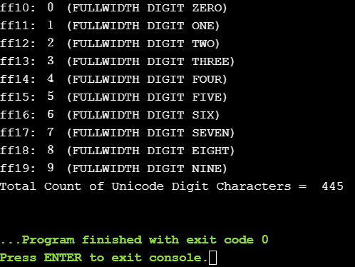

# Python 字符串 isdigit()函数

> 原文：<https://www.askpython.com/python/string/python-string-isdigit-function>

Python String isdigit()函数检查字符串中的数字字符，如果字符串只包含数字字符，则返回 True。

**要点:**

*   **返回类型:**布尔型，即真或假
*   **参数值:**is digit()函数中不需要解析任何参数
*   数字之间的空格会导致返回 False
*   空字符串也会返回 False

* * *

## String isdigit() Syntax

```py
str_name.isdigit()

```

这里的 str_name 指的是输入字符串。并且，isdigit()是 python 中内置的字符串函数。

```py
str_name = "12345"
print(str_name.isdigit())   # True

```

* * *

## String isdigit()示例

下面给出不同的案例。

### 案例 1:字符串包含空格

```py
str_name = "12 34"
print(str_name.isdigit())   # False

```

### 案例 2:字符串包含字母

```py
str_name = "Abc123"
print(str_name.isdigit())   # False

str_name = "Abc"
print(str_name.isdigit())   # False

```

### 情况 3:字符串包含特殊字符

```py
str_name = "@123"
print(str_name.isdigit())   # False

str_name = "@$&"
print(str_name.isdigit())   # False

```

### 案例 4:字符串包含小数

```py
str_name = "16.7"
print(str_name.isdigit())   # False

```

### 情况 5:字符串为空

```py
str_name = ' '
print(str_name.isdigit())   # False

```

* * *

## 用 Python 打印所有可能的数字字符列表的程序

Unicode 模块可用于检查数字字符。该计划是打印所有的数字 Unicode 字符。

```py
import unicodedata

total_count = 0
for i in range(2 ** 16):
    charac = chr(i)
    if charac.isdigit():
        print(u'{:04x}: {} ({})'.format(i, charac, unicodedata.name(charac, 'UNNAMED')))
        total_count = total_count + 1
print("Total Count of Unicode Digit Characters = ",total_count)

```



Output All Digit Unicode Characters

这只是输出的一瞥，因为实际输出很长。Unicode 中有 445 个数字字符。

* * *

## 参考

*   Python String isdigit()
*   [Python 内置的字符串函数](https://docs.python.org/3/library/stdtypes.html)