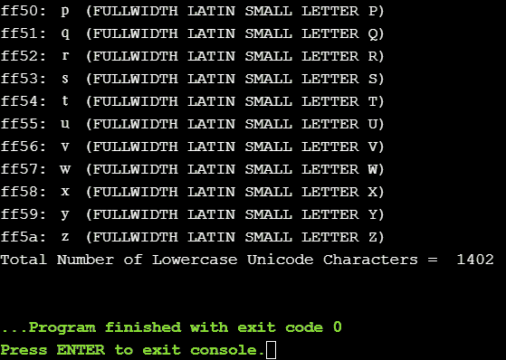

# Python 字符串 islower()函数

> 原文：<https://www.askpython.com/python/string/python-string-islower-function>

Python String islower()函数检查一个字符串中的所有字符是否都是小写，然后返回 True，否则返回 False。

**要点:**

*   **返回类型:**布尔型，即真或假
*   **参数值:**不需要参数
*   它不区分空间，但区分大小写
*   空字符串也会返回 False。

* * *

## String islower()语法

```py
str_name.islower()

```

这里的 str_name 指的是输入字符串。islower()是 python 中内置的字符串函数。

```py
str_name = "welcome"
print(str_name.islower())   # True

```

* * *

## String islower()示例

下面给出不同的案例。

### 情况 1:字符串中的每个字符都是小写的，还包含空格/数字/特殊字符

```py
str_name = "welcome python user"
print(str_name.islower())   # True

str_name = "welcome 2019"
print(str_name.islower())   # True

str_name = "welcome @ 2020"
print(str_name.islower())   # True

```

### 情况 2:字符串中的每个字符都是大写的，也包含空格/数字/特殊字符

```py
str_name = "WELCOME PYTHON USER"
print(str_name.islower())   # False

str_name = "WELCOME 2019"
print(str_name.islower())   # False

str_name = "WELCOME @ 2020"
print(str_name.islower())   # False

```

### 情况 3:字符串只包含数字或特殊字符

```py
str_name = "2020"
print(str_name.islower())   # False

str_name = "@$&"
print(str_name.islower())   # False

```

### 情况 4:只有每个单词的第一个字符是大写的，还包含空格/数字/特殊字符

```py
str_name = "Welcome"
print(str_name.islower())   # False

str_name = "Welcome Python User"
print(str_name.islower())   # False

str_name = "Welcome 2019"
print(str_name.islower())   # False

str_name = "Welcome @ 2020"
print(str_name.islower())   # False

```

### 情况 5:字符串为空

```py
str_name = ' '
print(str_name.islower())   # False

```

* * *

## 用 Python 打印所有可能的小写字符列表的程序

Unicode 模块可用于检查小写字符。该计划是打印所有小写 Unicode 字符。

```py
import unicodedata

total_count = 0
for i in range(2 ** 16):
    charac = chr(i)
    if charac.islower():
        print(u'{:04x}: {} ({})'.format(i, charac, unicodedata.name(charac, 'UNNAMED')))
        total_count = total_count + 1
print("Total Number of Lowercase Unicode Characters = ",total_count)

```



Output All Lowercase Unicode Characters

这只是输出的一瞥，因为实际输出很长。Unicode 中有 1402 个小写字符。

* * *

## 参考

*   Python 字符串 islower()
*   [Python 内置函数](https://docs.python.org/3/library/stdtypes.html)