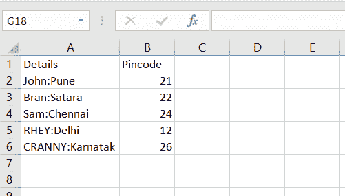
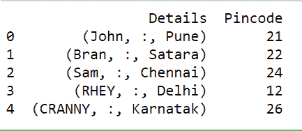

# Python 字符串分区()方法

> 原文：<https://www.askpython.com/python/string/python-string-partition>

在本文中，我们将看看 **Python string partition()方法的功能。** [Python String](https://www.askpython.com/python/string/python-string-functions) 引入了大量的内置函数来操作输入的字符串/数据。

## Python 字符串分区入门()

Python String `partition()`方法用于在输入分隔符最开始/第一次出现时分割输入字符串。

**语法:**

```py
input_string.partition(separator)

```

**说明:**

一旦解释器发现输入字符串中作为参数提供的分隔符，Python string partition()函数就会完成剩下的工作。它在一个元组中将字符串分成三个部分:

*   **字符串在分隔符之前的部分**
*   **分隔符**
*   **分隔符后的字符串**

**例 1:**

```py
inp_str = "Evan and Norah are good friends and they study in the same college."

res1 = inp_str.partition('friends')
print(res1,'\n') 

```

在上面的代码片段中，inp_str 在分隔符处进行分区: **friends** 。

**输出:**

```py
('Evan and Norah are good ', 'friends', ' and they study in the same college.') 

```

**例 2:**

```py
inp_str = "Evan and Norah are good friends and they study in the same college."

res2 = inp_str.partition('black')
print(res2,'\n') 

```

在上面的代码片段中，我们试图在分隔符处分割字符串:**黑色**。

但是，正如我们可以观察到的，字符串' black '不在输入字符串中，所以在这种情况下，**函数返回一个包含整个输入字符串和两个空字符串**的元组。

**输出:**

```py
('Evan and Norah are good friends and they study in the same college.', '', '') 

```

**例 3:**

```py
inp_str = "Evan and Norah are good friends and they study in the same college."

res3 = inp_str.partition('and') 
print(res3,'\n') 

```

在上面的例子中，分隔符'**和**'在输入字符串中出现了两次。在这种情况下，**partition()函数在输入分隔符**的`first occurrence`周围分割输入字符串。

**输出:**

```py
('Evan ', 'and', ' Norah are good friends and they study in the same college.') 

```

* * *

## Python NumPy partition()方法

**[NumPy 模块](https://www.askpython.com/python-modules/numpy/python-numpy-arrays)** 为我们提供了 numpy.partition()方法对输入数组进行相应的拆分。

`numpy.partition()`方法在参数列表中提供的第 n 个元素周围拆分输入数组，

*   一调用 numpy.partition()方法，**它首先创建输入数组的副本，`sorts`创建数组元素**
*   比第 n 个元素小的元素**被放置在它之前**
*   等于或大于第 n 个元素的元素**被放置在其之后**

**语法:**

```py
numpy.partition(input_array, nth position, axis=-1, kind_of_sort='introselect', order=None)

```

*   `nth position`:需要对其进行分区的元素的索引。
*   `kind_of_sort`:您想要执行的排序类型。默认值为'**选择**。
*   `axis`:元素排序的轴。默认值为 **-1** 。

**举例:**

```py
import numpy

inp = numpy.array([10, 90, 0, 50, 12, 100, -87]) 
print ("Elements of input array before partition:\n", inp) 

res = numpy.partition(inp, 1) 
print ("Elements of array after partition:\n", res) 

```

在上面这段代码中，partition()方法创建了一个输入数组的副本，并在内部对其进行排序。

排序后，输入数组看起来像:-87，0，10，12，50，90，100。

**其中，围绕排序数组**第一个位置的元素进行划分，即 **0** 。

之后，所有小于 0 的元素被放置在 0 的前面/左边，所有大于 0 的元素被放置在分隔符元素(0)的右边。

**注**:数组中元素出现的顺序没有定义。

**输出:**

```py
Elements of input array before partition:
 [ 10  90   0  50  12 100 -87]
Elements of array after partition:
 [-87   0  90  50  12 100  10]

```

* * *

## Python Pandas partition()方法

**[熊猫模块](https://www.askpython.com/python-modules/pandas/python-pandas-module-tutorial)** 为我们提供了`Series.str.partition()`方法来拆分**输入分隔符**周围的字符串。

**语法:**

```py
Series.str.partition(delimiter='', expand=True/False)

```

*   `delimiter`:包含数据值被分割的分隔符。
*   `expand`:如果为 false，则以元组的形式返回分隔后的字符串。否则，它返回分隔符周围两个单独列中的值。默认值为**真**。

**输入 csv 文件:**



**Input file**

**举例:**

```py
import pandas

res = pandas.read_csv("C:\\Users\\HP\\Desktop\\Book1.csv") 

res["Details"]= res["Details"].str.partition(":",False) 

print(res)

```

**输出:**



Output Partition

* * *

## 结论

在本文中，我们已经了解了 Python partition()方法在不同场景下的工作方式。

* * *

## 参考

*   **Python 字符串分割()方法**