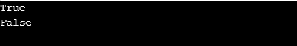
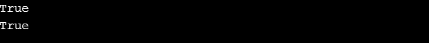

# Python 字符串 startswith()函数

> 原文：<https://www.askpython.com/python/string/python-string-startswith-function>

Python 中的 String 有内置的函数，可以对字符串执行几乎所有的操作。Python String startswith()函数检查字符串中的特定前缀，否则返回 True else。

**要点**:

*   **返回类型:**布尔型，即真或假
*   **参数值:**有 3 个参数:前缀、开始、结束

| 前缀 | 它可以是要检查的字符串或字符串元组。它区分大小写 |
| 开始 | 它是可选的，用于指定开始检查的起始索引 |
| 结束 | 它是可选的，用于指定检查结束的结束索引 |

* * *

## Python 字符串 startswith()语法

`str_name.startswith()`

这里的 str_name 指的是要检查前缀的字符串，strartwith()是一个内置函数。

* * *

## 以()开头的字符串示例

**例 1:**

```py
text_string = "Engineering and Management are altogether diferent verticals."

resultant = text_string.startswith('Engineering')

print(resultant)

resultant = text_string.startswith('Management ')

print(resultant)

```

**输出:**



*Output-startswith() Example1*

**例 2:**

```py
text_string = "Engineering and Management are altogether different verticals."

resultant = text_string.startswith('Engineering',0)

print(resultant)

resultant = text_string.startswith('Management',16,60)

print(resultant)

```

**输出**:



*Output-startswith() Example2*

**例 3:**

```py
str = "Engineering Discipline"

string=str.startswith("Discipline")

print (string)

```

**输出:**

`False`

## 结论

在本文中，我们已经了解了 substring()函数在各种输入环境下的工作和实现。

## 参考

*   Python 字符串
*   Python startswith()函数
*   [Python 字符串文档](https://docs.python.org/2/library/string.html)