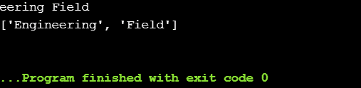
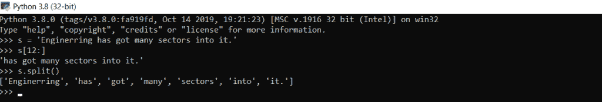
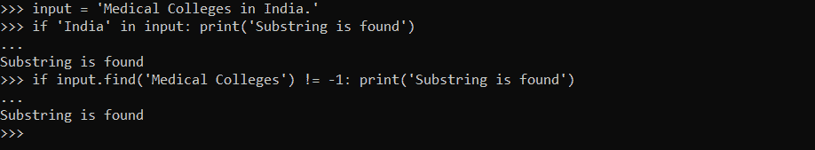
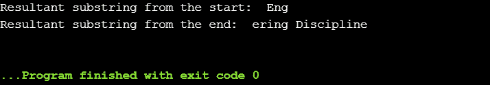
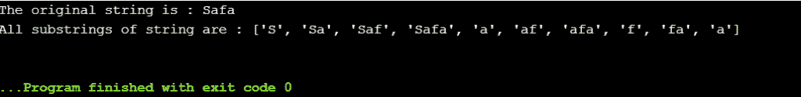
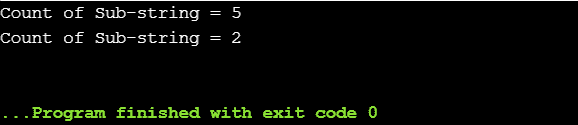
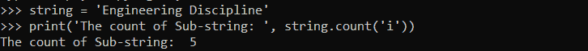

# Python 字符串子串

> 原文：<https://www.askpython.com/python/string/python-string-substring>

Substring 是字符串的一部分，可以提取并表示为新字符串。在本教程中，我们将学习如何在 Python 中使用子字符串。

## 1.创建 Python 字符串子字符串

可以使用以下任一方法创建子字符串:

*   `**Slicing**`
*   `**split()**`方法

```py
input = 'Engineering Field'

#substring using slice
result = input[5:]
print(result)

#substring using split
result1 = input.split()
print(result1)

```

**输出**:



*Creation-Substring*



*Substring Creation Example*

* * *

## 2.检查字符串中是否存在子字符串

可以通过以下方法之一检查字符串中是否存在子字符串:

*   通过使用`**in**`运算符
*   通过使用`**find()**`方法

```py
input = 'Medical Colleges in India.'
#using in operator
if 'India' in input:
    print('Substring is present in the input.')
#using find() method
if input.find('Medical Colleges') != -1:
    print('Substring is present in the input.')

```

**输出**:

`Substring is present in the input.
Substring is present in the input.`



*Substring Presence Example*

* * *

## 3.用 Python 从字符串中获取子串

以下是从给定字符串中获取子字符串的一些方法:

*   通过使用`**list slicing**`
*   通过使用`**itertools.combinations()**`方法

**例 1:** *利用列表切片*

```py
str = 'Engineering Discipline'

sub1 = str[:3] 
sub2 = str[6:] 

print ("Resultant substring from the start: ", sub1) 
print ("Resultant substring from the end: ", sub2) 

```

**输出**:



*Output-Fetch Substring*

**例 2** : *使用 itertools.combinations()方法*

```py
from itertools import combinations 

str1 = "Safa"

print("The original string is : " + str(str1)) 

result = [str1[a:b] for a, b in combinations( 
            range(len(str1) + 1), r = 2)] 

print("All substrings of string are : " + str(result)) 

```

**输出**:



*Output-Fetch Substring 1*

* * *

## 4.子字符串在字符串中出现的次数

count()函数用于表示给定字符串中字符/子字符串的数量。

```py
string = 'Engineering Discipline'

print('Count of Sub-string =', string.count('i'))

string1 = 'Aroma Arena'
print('Count of Sub-string =', string1.count('Ar'))

```

**输出:**



*Output Count Substring*



*Count Substring*

* * *

## 5.获取所有子串的索引

```py
def find_index(str1, substring):
    l2 = []
    length = len(str1)
    index = 0
    while index < length:
        x = str1.find(substring, index)
        if x == -1:
            return l2
        l2.append(x)
        index = x + 1
    return l2

string = 'Aroma Arena at the desert Arone.'
print(find_index(string, 'Ar'))

```

上面的代码片段给出了一个字符串中所有特定子字符串的索引/位置。

**输出**:

[0, 6, 26]

* * *

## 参考

*   Python 子串
*   [Python 字符串函数文档](https://docs.python.org/3.8/library/string.html)