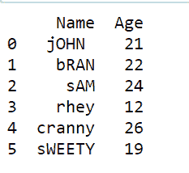

# Python 字符串交换()方法

> 原文：<https://www.askpython.com/python/string/python-string-swapcase>

在本文中，我们将详细介绍 **Python String swapcase()函数**。 [**Python String**](https://www.askpython.com/python/string/python-string-functions) 为我们提供了许多内置的方法来操纵输入数据进行进一步的操作。让我们开始了解这个方法。

## Python String swapcase()方法入门

Python 字符串`swapcase()`函数**转换输入字符串**中每个字符的大小写。它将所有的**小写**字符转换成**大写**字符，反之亦然。

**语法:**

```py
input_string.swapcase()

```

**例 1:**

```py
input_str = "Amazon Prime is a great platform."
res=input_str.swapcase()
print(res)

```

**输出:**

```py
aMAZON pRIME IS A GREAT PLATFORM.

```

**例 2:**

```py
input_str = "AMAZON PRIME IS A GREAT PLATFORM!!"
res=input_str.swapcase()
print(res)

```

**输出:**

```py
amazon prime is a great platform!!

```

* * *

## NumPy 字符串交换()函数

Python 的 [**NumPy 模块**](https://www.askpython.com/python-modules/numpy/python-numpy-arrays) 为我们提供了转换输入字母大小写的功能。

`numpy.char.swapcase()`函数以元素方式转换输入数据字符的大小写。

**语法:**

```py
numpy.char.swapcase(input_array) 

```

**举例:**

```py
import numpy 

inp_arr = numpy.array(['Engineering', 'Science', 'Commerce', 'A5Z']) 

print ("Elements of Input array:\n", inp_arr) 

res = numpy.char.swapcase(inp_arr) 
print ("Elements of array after swapping the case of each one:\n", res)

```

**注意** : Python `numpy.array()`函数创建输入元素的数组。

**输出:**

```py
Elements of Input array:
 ['Engineering' 'Science' 'Commerce' 'A5Z']
Elements of array after swapping the case of each one:
 ['eNGINEERING' 'sCIENCE' 'cOMMERCE' 'a5z']

```

* * *

## 熊猫系列 swapcase()函数

Python **[Pandas 模块](https://www.askpython.com/python-modules/pandas/python-pandas-module-tutorial)** 包含各种数据结构来表示数据。一种这样的数据结构是**系列**。

Pandas 的 Series `swapcase()`函数使我们能够改变/转换系列中每个字符串的大小写。与 Python string swapcase()函数相比，Pandas swapcase()也可以处理文件，如下例所示。

**语法:**

```py
<Series>.str.swapcase()

```

**输入。csv 文件:**


**Input CSV file**

**举例:**

```py
import pandas

inp_file = pandas.read_csv("C://Users//HP//Desktop//Book1.csv") 

inp_file["Name"] = inp_file["Name"].str.swapcase() 

print(inp_file) 

```

`pandas.read_csv(file_path)`方法用于输入和读取文件。csv 扩展名。

**InP _ file[" Name "]. str . swap case()**方法将出现在的**名称**列下的每个字符串的大小写进行转换。csv 文件。

**输出:**



**Output CSV file**

* * *

## 结论

在本文中，我们已经了解了 Python swapcase()方法与 String、NumPy 和 Pandas 模块的工作原理。

* * *

## 参考

*   **Python swapcase()函数**