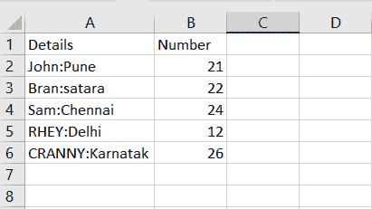

# Python 字符串 title()方法

> 原文：<https://www.askpython.com/python/string/python-string-title>

在本文中，我们将了解 **String title()** 方法的功能。 **[Python 字符串](https://www.askpython.com/python/string/python-string-functions)** 包含了大量处理数据的内置函数。我们最近还研究了确认字符串标题大小写的方法 [istitle()](https://www.askpython.com/python/string/python-string-istitle-method) 。

* * *

## Python String title()方法入门

**Python String title()** 方法基本上是将输入字符串转换为标题大小写，即它只将输入字符串中每个单词的第一个字符**转换为**大写**，其余字符转换为**小写**。**

**语法:**

```py
input_string.title()

```

**举例:**

```py
inp1 = 'Amazon is a wonderful platform.'
res1 = inp1.title() 
print(res1) 

```

在这个例子中，如上所示，只有输入字符串中每个单词的第一个字符被转换为大写。

**输出:**

```py
Amazon Is A Wonderful Platform.

```

**例 2:**

```py
inp1 = 'AMAZON IS A WONDERFUL PLATFORM.'
print("Input String:\n",inp1)
res1 = inp1.title() 
print("Converted String:\n",res1)

```

除了第一个字母以外的所有其他字符都被转换成小写，如上所示。

**输出:**

```py
Input String:
 AMAZON IS A WONDERFUL PLATFORM.
Converted String:
 Amazon Is A Wonderful Platform.

```

**例 3:**

```py
inp1 = '21wellness'
print("Input String:\n",inp1)
res1 = inp1.title() 
print("Converted String:\n",res1)

```

单词前有数字或编号不会影响功能的运行。数字后面的字符被认为是第一个字符。

**输出:**

```py
Input String:
 21wellness
Converted String:
 21Wellness

```

* * *

## NumPy title()方法

**[NumPy 模块](https://www.askpython.com/python-modules/numpy/python-numpy-arrays)** 有 **numpy.char.title()** 函数向**标题格**输入数据。

`**numpy.char.title()**`方法将输入数组中每个元素的第一个字母转换成大写，并将每个单词的其余字符转换成小写。

**语法:**

```py
numpy.char.title(input_array)

```

**举例:**

```py
import numpy

inp = numpy.array(['TAJ', 'mahaL', '4$road', 'senTosA']) 
print ("Input Array:\n", inp) 

res = numpy.char.title(inp) 
print ("Resultant Array:\n", res) 

```

**输出:**

```py
Input Array:
 ['TAJ' 'mahaL' '4$road' 'senTosA']
Resultant Array:
 ['Taj' 'Mahal' '4$Road' 'Sentosa']

```

* * *

## 熊猫标题()方法

**[熊猫模块](https://www.askpython.com/python-modules/pandas/python-pandas-module-tutorial)** 内置了 **Series.str.title()** 方法来对输入数据集的每一项进行标题 case。

**语法:**

```py
Series.str.title()

```

`Series.str.title()`方法将数据集每个元素的第一个字母转换成大写，并将每个单词的其余字符转换成小写。

**输入 csv 文件:**



**Input file-title()**

**举例:**

```py
import pandas
inp = pandas.read_csv("C:\\Users\\HP\\Desktop\\Book1.csv") 
inp["Details"]= inp["Details"].str.title() 
inp 

```

**输出:**

```py
        Details	        Number
0	John:Pune	21
1	Bran:Satara	22
2	Sam:Chennai	24
3	Rhey:Delhi	12
4	Cranny:Karnatak	26

```

* * *

## 结论

在本文中，我们已经了解了 Python title()函数的工作原理。

* * *

## 参考

**Python String title()方法**