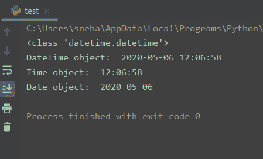
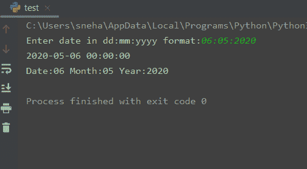

# 使用 Python strptime()将字符串转换为日期时间

> 原文：<https://www.askpython.com/python/python-strptime>

所以今天，我们将讨论如何使用 Python strptime()方法将字符串转换成日期时间。

让我们开始吧。

## Python strptime()方法

Python 的`strptime()`方法在`datetime`和`time`模块中都可用。它用于根据指定的**格式**将给定的字符串解析成 datetime 或 time 对象。

对于这两个模块来说，这个函数的用法是相同的，唯一的区别是返回的对象的类型。让我们仔细看看使用它的语法。

对于**日期时间**模块，下面给出了使用`strptime()`方法的语法。

```py
datetime.strptime(date_string, format)

```

上面的语句返回一个按照指定格式解析的`date_string`对应的`datetime`对象。

对于**时间**模块，使用`strptime()`的语法非常相似。

```py
time.strptime(string[, format])

```

在这里，该方法做同样的工作，只是这里返回值是一个由`gmtime()`或`localtime()`返回的`struct_time`对象。

对于这两种情况，格式参数使用的指令与 [strftime()](https://www.askpython.com/python-modules/python-strftime) 使用的指令相同，如下表格式所示。**格式**参数必须是字符串，并且有默认值`"%a %b %d %H:%M:%S %Y"`。如果字符串不能按照给定的格式进行解析，或者解析后有多余的数据，就会引发一个`ValueError`。

## 格式化表格

指定格式参数时，必须遵循下面给出的格式表来使用适当的指令。

| 指示的 | 指令的含义 | 示例输出 |
| --- | --- | --- |
| %A | Weekday 作为区域设置的全名。 | 星期三 |
| %a | 工作日作为区域设置的缩写名称。 | 杀了他，Wed |
| %w | 以十进制数表示的工作日，其中 0 表示星期日，6 表示星期六。 | 0,1,2,3,4…6 |
| %d | 一个月中的某一天，以零填充的十进制数表示。 | 01,02,03…31 |
| %-d | 十进制数字表示的一个月中的某一天。(特定于平台) | 1,2,3… |
| %b | 月份作为区域设置的缩写名称。 | 瑕疵 |
| %B | 月份作为区域设置的全名。 | 三月 |
| %m | 以零填充的十进制数表示的月份。 | 01,02…12 |
| %-m | 十进制数形式的月份。(特定于平台) | 1,2,…12 |
| %y | 没有世纪作为零填充十进制数的年份。 | 20(2020 年) |
| %Y | 以世纪为小数的年份。 | 2020，2021 等等。 |
| %H | 以零填充的十进制数表示的小时(24 小时制)。 | 01, 02, … |
| %-H | 十进制数形式的小时(24 小时制)。(特定于平台) | 1,2,3,… |
| %I | 以零填充的十进制数表示的小时(12 小时制)。 | 01, 02, 03, … |
| %-我 | 十进制数形式的小时(12 小时制)。(特定于平台) | 1, 2, 3 … |
| %p | 等同于 AM 或 PM 的区域设置。 | 上午，下午 |
| %M | 以零填充的十进制数表示的分钟。 | 01, 02, …59 |
| %-M | 十进制数形式的分钟。(特定于平台) | 1,2,3,…59 |
| %S | 秒，以零填充的十进制数表示。 | 01, 02,…59 |
| %-S | 秒为十进制数。(特定于平台) | 1, 2, …59 |
| %f | 微秒作为十进制数，左边补零。 | 000000 |
| %z | +HHMM 或-HHMM 形式的 UTC 偏移量(如果对象是简单的，则为空字符串)。 | (空)，+0000，-0400，+1030 |
| %Z | 时区名称(如果对象是简单的，则为空字符串)。 | (空)、UTC、is、CST |
| %j | 以零填充的十进制数表示的一年中的某一天。 | 1, 2, 3, … 366 |
| %-j | 以十进制数表示的一年中的某一天。(特定于平台) | 1, 2, 3, … 366 |
| %U | 一年中的周数(星期日是一周的第一天)，以零填充的十进制数表示。新年中第一个星期日之前的所有日子都被视为第 0 周。 | 1, 2, 3,… 53 |
| %W | 以十进制数表示的一年中的周数(星期一是一周的第一天)。新年中第一个星期一之前的所有日子都被视为第 0 周。 | 1, 2, 3,… 53 |
| %c | 区域设置的适当日期和时间表示。 | 2020 年 5 月 6 日星期三 12 时 23 分 56 秒 |
| %x | 区域设置的适当日期表示。 | 05/06/20 |
| %X | 区域设置的适当时间表示。 | 12:23:56 |
| %% | 文字“%”字符。 | % |

Source: [Strftime() Official Homepage](https://strftime.org/)

## 使用 strptime()方法

现在我们已经熟悉了对 datetime 和 time 模块使用`strptime()`方法的语法，让我们看看如何使用它。

### 1\. time.strptime()

在下面的例子中，我们将把一个给定的字符串转换成一个 **time** 对象。

```py
import time

time_string = "06/05/2020 12:06:58"

obj = time.strptime(time_string, "%d/%m/%Y %H:%M:%S")

print(type(obj))
print(obj)

#parsing using default formatting: %a %b %d %H:%M:%S %Y

def_obj = time.strptime("Wed May 06 12:06:58 2020")
print(def_obj)

```

**输出:**

```py
<class 'time.struct_time'>
time.struct_time(tm_year=2020, tm_mon=5, tm_mday=6, tm_hour=12, tm_min=6, tm_sec=58, tm_wday=2, tm_yday=127, tm_isdst=-1)
time.struct_time(tm_year=2020, tm_mon=5, tm_mday=6, tm_hour=12, tm_min=6, tm_sec=58, tm_wday=2, tm_yday=127, tm_isdst=-1)

```

这里，`time_string`是包含相应时间参数的给定字符串。我们使用 strptime()函数按照 **"%d/%m/%Y %H:%M:%S"** 格式将这个字符串解析到变量`obj`中。正如所料，obj 的类型是`time.struct_time`。

接下来，我们还使用默认格式解析了另一个字符串(没有指定 format 参数)。如前所述，在这种情况下默认格式设置为`%a %b %d %H:%M:%S %Y`。这证明了输出的合理性。

### 2\. datetime.strptime()

现在让我们使用`strptime()`方法将一个给定的字符串转换成一个**日期时间**对象。

```py
from datetime import datetime

dt_string = "06//05//2020 12:06:58"

obj = datetime.strptime(dt_string, "%d//%m//%Y %H:%M:%S")

print(type(obj))
print("DateTime object: ", obj)
print("Time object: ", obj.time())
print("Date object: ", obj.date())

```

**输出:**



datetime strptime() Output

从上面的输出可以看出，`dt_string`被成功地转换成了**日期时间**对象。我们还可以对这个对象使用`time()`和`date()`函数来分别获得 **datetime.time** 和 **datetime.date** 对象。

让我们看另一个例子，我们使用用户的 input()函数获取日期和时间。

```py
from datetime import datetime

dt_string = str(input("Enter date in dd:mm:yyyy format:"))

try:
    obj = datetime.strptime(dt_string, "%d:%m:%Y")
    print(obj)
    print(obj.strftime("Date:%d Month:%m Year:%Y")) #strftime to format datetime obj
except ValueError as ex:
    print("ValueError: ", ex)

```

**输出:**



strptime() ValueError

在本例中，我们将`dt_string`作为用户输入，并使用`strptime()`方法将其转换为 datetime 对象。我们再次使用`strftime()`方法将这个对象打印成我们想要的格式。

如果我们不为 strptime()方法提供一个与指定格式匹配的字符串会怎么样？在这种情况下，会引发一个`ValueError`。看看下面的输出(对于相同的代码),我们这样做了。

```py
Enter date in dd:mm:yyyy format:6/5/20
ValueError:  time data '6/5/20' does not match format '%d:%m:%Y'

```

## 总结

所以我们今天学习了使用`strptime()`方法在 Python 中将字符串转换成各种类型。

关于这个主题的任何进一步的问题，请随意使用下面的评论。

## 参考

*   [什么是 Python strftime()函数？](https://www.askpython.com/python-modules/python-strftime)，
*   [Python 时间模块](https://www.askpython.com/python-modules/python-time-module)，
*   [time strptime()](https://docs.python.org/3/library/time.html#time.strptime)–Python 文档，
*   [datetime strptime()](https://docs.python.org/3/library/datetime.html#datetime.datetime.strptime)–Python 文档。