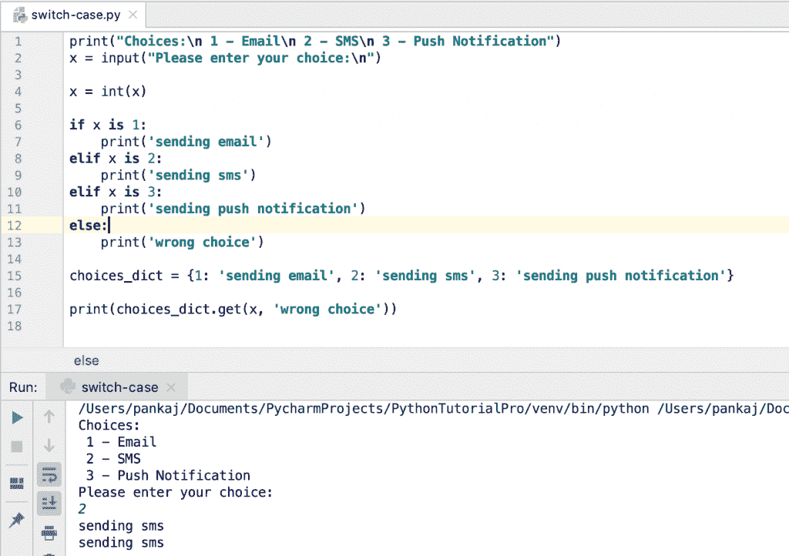

# Python 开关案例:2 个备选实现

> 原文：<https://www.askpython.com/python/python-switch-case-implementation>

Python 不支持 switch-case 语句。有人提议在 [PEP-3103](https://peps.python.org/pep-3103/) 中引入 Python switch case 语句，但遭到拒绝，因为它没有增加太多价值。

我们可以使用 [if-else-elif 语句](https://www.askpython.com/python/python-if-else-elif-statement)轻松实现 switch-case 语句逻辑。然而，我们可以使用定制代码在 Python 中实现类似开关情况的行为。

* * *

## 用 Python 实现 Switch-Case

在 Python 中有两种方法来实现切换情况行为。

1.  使用字典
2.  动态功能

* * *

### 1.使用字典实现 Python 开关 Case

我们可以创建一个[字典](https://www.askpython.com/python/dictionary/python-dictionary-dict-tutorial)，其中键是大小写，值是结果。我们将使用默认值调用 dictionary get()方法来实现没有匹配案例时的场景。

假设我们有一个 if-else 块。

```py
print("Choices:\n 1 - Email\n 2 - SMS\n 3 - Push Notification")
x = input("Please enter your choice:\n")

x = int(x)

if x is 1:
    print('sending email')
elif x is 2:
    print('sending sms')
elif x is 3:
    print('sending push notification')
else:
    print('wrong choice')

```

现在，我们想使用字典将它转换成开关情况行为。

```py
print("Choices:\n 1 - Email\n 2 - SMS\n 3 - Push Notification")
x = input("Please enter your choice:\n")

x = int(x)

choices_dict = {1: 'sending email', 2: 'sending sms', 3: 'sending push notification'}

print(choices_dict.get(x, 'wrong choice'))

```



Python Switch Case Implementation

* * *

### 2.用动态函数实现 Python 开关盒

上述实现适用于简单的打印语句。但是，大多数情况下，我们在 if-else 块中执行一些方法，然后字典将不会作为开关情况替换。

假设我们有下面的 if-else 块来对输入整数执行一些操作。

```py
import math

x = input("Please enter an integer:\n")
x = int(x)

print("Choices:\n 1 - Square\n 2 - Cube\n 3 - Square Root")
choice = input("Please enter your choice:\n")

choice = int(choice)

if choice is 1:
    print(math.pow(x, 2))
elif choice is 2:
    print(math.pow(x, 3))
elif choice is 3:
    print(math.sqrt(x))

```

我们可以创建一个动态方法来实现类似 switch-case 的行为。

```py
import math

x = input("Please enter an integer:\n")
x = int(x)

print("Choices:\n 1 - Square\n 2 - Cube\n 3 - Square Root")
choice = input("Please enter your choice:\n")

choice = int(choice)

def switch_func(value, i):
    return {
        1: lambda val: math.pow(val, 2),
        2: lambda val: math.pow(val, 3),
        3: lambda val: math.sqrt(val),
    }.get(value)(i)

print(switch_func(choice, x))

```

这里，选择被映射到字典键，输入整数被映射到λ函数。最后，lambda 函数的输出从 switch_func()调用返回。

* * *

## 结论

试验 switch-case 语句的实现是很好的。但是，这非常令人困惑，而且我们不能在 if-else 块中用多个语句实现复杂的场景。所以，坚持简单的 if-else 语句，保持代码简单易读。

* * *

## 参考资料:

*   [StackOverflow 问题](https://stackoverflow.com/questions/60208/replacements-for-switch-statement-in-python)