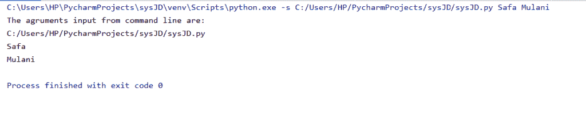
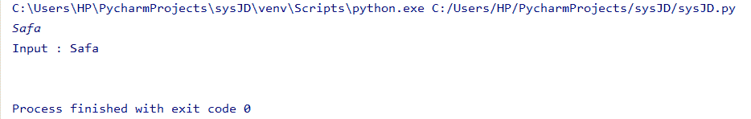
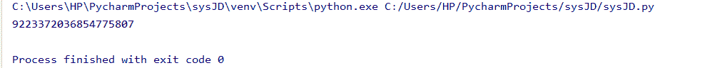
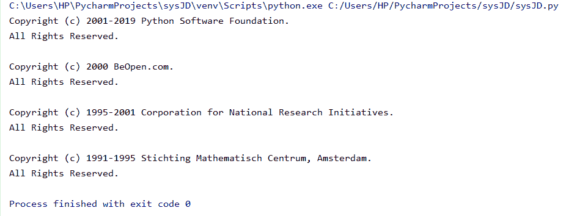
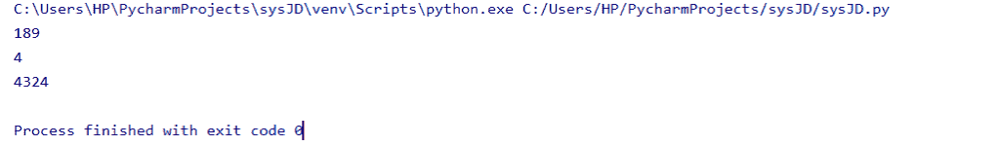

# Python 系统模块

> 原文：<https://www.askpython.com/python-modules/python-sys-module>

Python sys 模块处理系统和环境特定的变量和参数。我们可以用它来读取传递给 Python 脚本的 PATH 变量和命令行参数列表。

* * *

## 在 Python 中导入 sys 模块

在使用任何模块之前，都需要将其导入。

**语法**:

导入模块名称

**举例**:

导入系统

* * *

## Python sys.modules

这个变量让我们知道当前 shell 存在或导入的现有模块。

**语法**:

```py
>>> sys.modules.keys()
dict_keys(['sys', 'builtins', '_frozen_importlib', '_imp', '_thread', '_warnings', '_weakref', 'zipimport', '_frozen_importlib_external', '_io', 'marshal', 'posix', 'encodings', 'codecs', '_codecs', 'encodings.aliases', 'encodings.utf_8', '_signal', '__main__', 'encodings.latin_1', 'io', 'abc', '_abc', 'site', 'os', 'stat', '_stat', 'posixpath', 'genericpath', 'os.path', '_collections_abc', '_sitebuiltins', '_bootlocale', '_locale', 'types', 'importlib', 'importlib._bootstrap', 'importlib._bootstrap_external', 'warnings', 'importlib.util', 'importlib.abc', 'importlib.machinery', 'contextlib', 'collections', 'operator', '_operator', 'keyword', 'heapq', '_heapq', 'itertools', 'reprlib', '_collections', 'functools', '_functools', 'mpl_toolkits', 'readline', 'atexit', 'rlcompleter'])
>>>

```

* * *

## Python sys.argv

这为我们提供了传递给 python 脚本的命令行参数列表

**例** **1** :

```py
import sys
print('The agruments input from command line are:')
for x in sys.argv:
    print(x)

```

**输出**:



*Python-sys.argv*

* * *

## Python sys.path

此变量显示当前系统或环境的路径。

**语法:**

sys.path

**举例**:

```py
import sys
sys.path

```

```py
['', 'C:\Users\HP\AppData\Local\Programs\Python\Python38-32\python38.zip', 'C:\Users\HP\AppData\Local\Programs\Python\Python38-32\DLLs', 'C:\Users\HP\AppData\Local\Programs\Python\Python38-32\lib', 'C:\Users\HP\AppData\Local\Programs\Python\Python38-32', 'C:\Users\HP\AppData\Local\Programs\Python\Python38-32\lib\site-packages']

```

* * *

## Python sys.stdin

sys 模块的该功能用于接受用户输入提示程序的输入。

**语法**:

sys . STD . readline()方法

**举例:**

```py
import sys
input = sys.stdin.readline()
print("Input : " + input)

```

**输出**:



*Python sys.stdin*

如上所述，上面的例子接受来自用户的输入并显示它。

* * *

## Python sys.maxsize

此变量返回变量可以接受和存储的最大整数值。

**语法**:

sys.maxsize

**举例:**

```py
import sys
sys.maxsize

```

**输出**:



*Python sys.maxsize*

* * *

## Python sys.copyright

此变量显示系统上安装的当前 Python 版本的版权。

**语法**:

sys .版权所有

**举例**:

```py
import sys
print(sys.copyright)

```

**输出**:



*Python sys.copyright*

* * *

## Python sys.getrefcount

sys 模块的这个函数返回在特定代码块中使用的特定对象的引用计数。

**举例**:

```py
import sys

input = "Engineering"

print(sys.getrefcount(0))
print(sys.getrefcount(input))
print(sys.getrefcount(None))

```

**输出**:



*Python sys.getrefcount*

* * *

## Python sys.exit

sys 模块的这个功能使得 Python 解释器突然结束当前程序的执行。它用于从特定的代码控制流中退出程序。

**语法**:

sys.exit()

**举例**:

```py
import sys
print("Engineering")
sys.exit(1)
print("Discipline")

```

**输出**:

工程

在上面的例子中，一旦遇到 exit()函数，它就从特定程序的执行中出来。因此，“纪律”不会打印在输出中。

* * *

## 参考

*   Python 系统模块
*   [Python 系统模块文档](https://docs.python.org/3.8/library/sys.html)