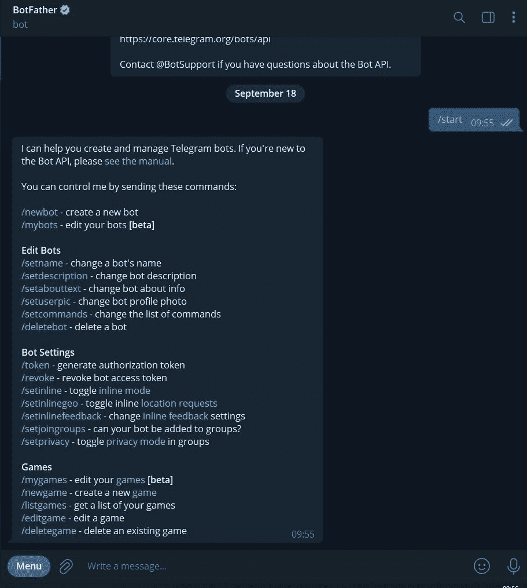
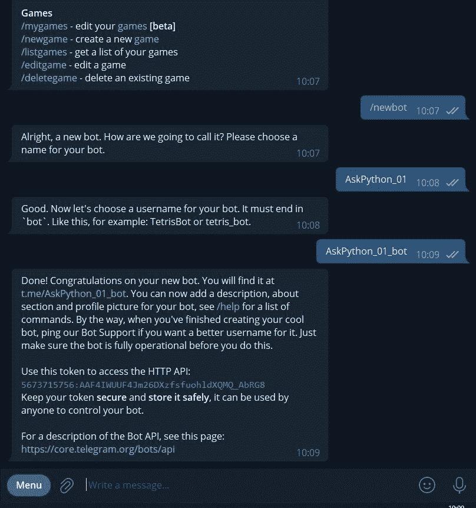
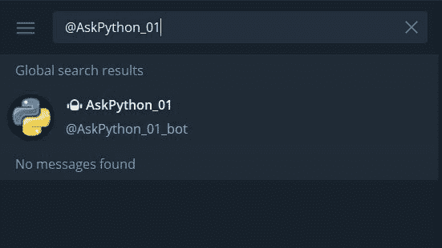
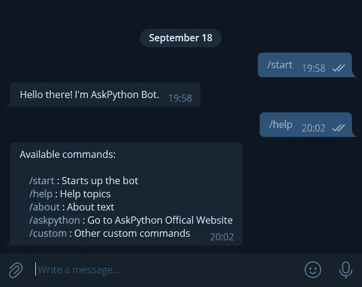
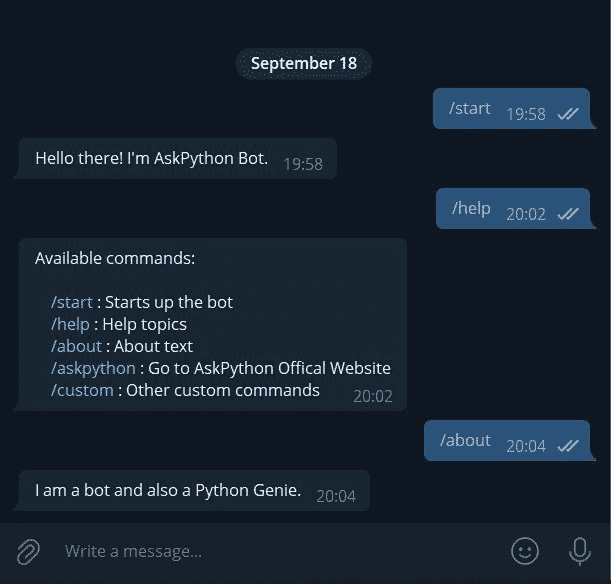
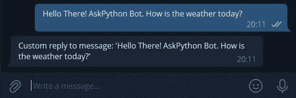

# 创建 Python 电报机器人

> 原文：<https://www.askpython.com/python/examples/python-telegram-bot>

当访问任何现代网页时，我们很可能会看到一个自动聊天机器人在屏幕上弹出一些关于网站及其服务的信息。我们可以在聊天应用程序中输入我们的问题并得到回复，就好像我们正在和另一边的一个真人交谈一样。

我们与之互动的这些机器人通常由一些试图模仿人类行为的人工智能应用程序驱动。我们从他们那里收到的回复是根据网站提供的服务定制的。它们通常被设计为向询问者提供第一手信息，并试图解决一个人最常见的问题。

它们部署在一些云服务上，这使得它们在任何时候都可用。据我们所知，几乎每家公司都有这种东西。

一些知名的电子商务公司使用自动化机器人来解决客户问题。其他的例子包括预约医疗专业人员或获取某人感兴趣的一些在线课程的信息。如果自动机器人无法解决我们的问题，它会让我们联系到该公司客户服务部门的一个人。

## 使用 Python 为电报信使创建一个机器人

机器人也可以在聊天消息服务上实现。在本文中，我们将在 Telegram Messenger 应用程序上使用 Python 编写一个机器人。我们将使用一些基本的命令，并看到我们的机器人在行动。那么，我们开始吧。

### **步骤–1:****将电报应用程序安装到我们的智能手机和工作站上**

首先，我们需要从谷歌 Play 商店或苹果商店将 telegram 应用程序下载到我们的智能手机上。该应用程序需要使用我们的联系号码进行认证。在我们的手机上设置应用程序后，我们需要将 telegram 应用程序下载到我们的工作站，并通过提供对桌面应用程序的访问权限来连接手机应用程序，以使用相同的凭据。

***也读作:[Python PIP–包经理](https://www.askpython.com/python-modules/python-pip)***

### **步骤–2:****为 Python 安装报文模块**

现在，转到代码编辑器的终端，使用 Python 和 pip 或 conda install 安装电报模块。下面是两种安装类型的代码。

```py
# using pip
pip install python-telegram-bot

```

```py
# using conda 
conda install -c conda-forge python-telegram-bot

```

***也读: [Python Anaconda 教程——Anaconda 入门](https://www.askpython.com/python-modules/python-anaconda-tutorial)***

### **第三步:** **设置我们的 Telegram 桌面应用程序并创建一个新的机器人**

接下来，我们需要启动我们的桌面应用程序并对其进行配置，以便我们的自定义代码可以访问它。我们的代码使用 API 密钥访问电报应用程序。在将我们的应用程序连接到我们的代码之前，我们需要通过桌面应用程序本身设置基本的 bot 功能，并获得用于连接的唯一 API 密钥。

在我们的桌面上打开应用程序后，在应用程序搜索选项卡中搜索 **BotFather** 。这将弹出一个包含基本设置的新屏幕，为我们的应用程序启动一个新的 bot。


BotFather Search

### **步骤–4:设置基本功能**

接下来，我们需要点击位于机器人父亲页面底部的**开始**按钮，将我们带到另一个包含新机器人预定义命令的屏幕，如使用 **`/newbot`** 命令启动新机器人，命名我们的机器人，设置描述，设置个人资料图片，等等。



BotFather Settings

### **步骤–5:设置基本功能和 API 密钥生成**

接下来，我们需要为我们的机器人提供一个**名称/别名**和一个**唯一用户名**。*注意，根据电报指示，机器人的用户名应以***“bot”**结尾。我们还可以为我们的机器人提供描述和其他信息。稍后，我们还将设置我们的*自定义命令*，如 **`/about, /help,`** 以及其他一些在使用时提供自定义回复的命令。

当我们完成设置我们的机器人时，会生成一个特定于我们的机器人的 **API 键**,它会将机器人连接到我们的 Python 代码文件。现在，复制 API 键并将其粘贴到 Python 文件中，以将其作为模块导入来访问它。

**注意:***API 密匙提供了控制我们的 bot 的完全权限。确保将该键作为环境变量。如果上传任何代码到 **GitHub** ，不要忘记将 env vars 文件包含到你的 **gitignore** 文件中。*



Basics

### **第六步:代码实现:导入**

现在，我们有了一个带有 API 密钥的基本应用程序设置，我们开始导入 python 的 **telegram.ext** **模块**，以及存储在名为“ **secret.py** 的 Python 文件中的 API 密钥。

我们将使用“ ***** ”从 **telegram.ext** 模块导入所有内容。为了查看在终端中运行的 bot 服务器代码，我们还可以在代码的开头包含一个 print 语句。

```py
from telegram.ext import *
import secret

print("Server is running.... ")

```

### **步骤–7:设置自定义命令功能**

接下来，我们编写了多个函数来处理我们的机器人的定制命令。它们是来自我们代码的固定回复，可以使用 **/about、/help、**等调用。这些函数稍后将由 **telegram.ext 模块**提供的**处理函数**和代码中稍后出现的**调度器** **函数**使用，它们将调用这些函数并相应地提供响应**。**

```py
def start_function(update, context):
    update.message.reply_text("Hello there! I'm AskPython Bot.")

def help_function(update, context):
    update.message.reply_text(
        """
    Available commands:

    /start : Starts up the bot
    /help : Help topics
    /about : About text
    /askpython : Go to AskPython Offical Website
    /custom : Other custom commands 

    """
    )

def about_function(update, context):
    update.message.reply_text("I am a bot and also a Python Genie.")

def ask_python_function(update, context):
    update.message.reply_text("AskPython Website: https://www.askpython.com/")

def custom_function(update, context):
    update.message.reply_text("Some other custom reply")

```

**解释**:

在上面的代码中，我们定义了帮助我们调用命令的定制函数，如**`/start, /help, /about, /askpython,`**`**/custom**.` 一旦我们定义了函数，我们需要向它传递两个参数，即 **`update`** 和 **`context`** 。

1.  **Update** :这个参数在函数被调用时立即使用，并由它提供一个定义的文本回复。
2.  上下文:这个参数虽然没有在我们的函数中直接使用，但是在代码内部使用，不把它作为一个参数会使程序抛出错误。当我们为消息使用 dispatcher 时，在代码的后面会用到它。

### **步骤–8:输入文本和错误处理功能**

接下来，我们定义另外两个函数。第一个名为 message_handler_function 的函数将回复从我们的机器人传入的文本输入消息。这个函数可以由某个 AI 应用程序来处理输入的文本，并根据该应用程序中包含的文本处理算法提供合适的回复。对于本文，我们将只提供一个占位符来输出输入到我们的 bot 中的相同文本。

*注意，该功能的调用方式与其他功能不同。*

第二个函数是一个简单的错误处理函数，如果我们的应用程序遇到任何错误，就会调用这个函数。

**代码:**

```py
def message_handler_function(update, context):
    update.message.reply_text(f"Custom reply to message: '{update.message.text}'")

def error_handler_function(update, context):
    print(f"Update: {update} caused error: {context.error}")

```

### **步骤–9:通过 API 连接并处理先前定义的函数**

接下来，我们需要将我们的应用程序与我们之前在代码中导入的 API 键连接起来，并为我们之前在代码中定义的所有函数添加处理程序。代码块后面有解释。

**代码:**

```py
# Connecting our app with the Telegram API Key and using the context
updater = Updater(secret.API_KEY, use_context=True)
my_dispatcher = updater.dispatcher

# Adding CommandHandler from telegram.ext to handle defined functions/commands
my_dispatcher.add_handler(CommandHandler("start", start_function))
my_dispatcher.add_handler(CommandHandler("help", help_function))
my_dispatcher.add_handler(CommandHandler("about", about_function))
my_dispatcher.add_handler(CommandHandler("askpython", ask_python_function))
my_dispatcher.add_handler(CommandHandler("custom", custom_function))

# Handing Incoming Messages
my_dispatcher.add_handler(MessageHandler(Filters.text, message_handler_function))

# Error Handling if any
my_dispatcher.add_error_handler(error_handler_function)

```

**解释:**在代码的这一部分中，我们实现了带有某些参数的函数，这些参数是先前在代码中定义的。下面是一个简单的概述。

1.  **Updater:** 这个函数来自 telegram.ext 模块正在接受两个参数。第一个参数是我们通过“ **secret.py** ”文件访问的 API Key，该文件带有**变量**名称 **API_KEY** ，第二个参数指导应用程序使用上下文。然后，这个更新器函数与 **dispatcher** **方法**链接，并存储在 **my_dispatcher** 变量中，该变量最后提供将由以下处理程序使用的方法。
2.  **CommandHandler** :这个函数负责处理我们使用第一组函数定义的定制命令。
3.  **MessageHandler** :这个是用 args **Filters.txt** 和 **message_handler_function** 处理动态回复输入文本的函数。Filters.txt 由 telegram.ext 模块提供。
4.  **add_error_handler** :顾名思义，这个方法可以捕捉运行代码时遇到的任何错误。

### **步骤 10:完成并运行我们的机器人**

这一步标记了启动我们的机器人的最后代码行。它使用了**轮询(1.0)** ，这意味着通过电报服务器启动机器人，并每 1 秒检查一次消息。然后是 **idle()** 函数，如果应用程序中没有提供任何输入，它将保持机器人空闲。

这两种方法都是使用 updater 函数调用的，该函数确实为我们的 bot 提供了 API 键和上下文

```py
# Starting the bot using polling() function and check for messages every sec
updater.start_polling(1.0)
updater.idle()

```

## 完整的代码

```py
from telegram.ext import *
import secret

print("Server is running.... ")

def start_function(update, context):
    update.message.reply_text("Hello there! I'm AskPython Bot.")

def help_function(update, context):
    update.message.reply_text(
        """
    Available commands:

    /start : Starts up the bot
    /help : Help topics
    /about : About text
    /askpython : Go to AskPython Offical Website
    /custom : Other custom commands 

    """
    )

def about_function(update, context):
    update.message.reply_text("I am a bot and also a Python Genie.")

def ask_python_function(update, context):
    update.message.reply_text("AskPython Website: https://www.askpython.com/")

def custom_function(update, context):
    update.message.reply_text("Some other custom reply")

def message_handler_function(update, context):
    update.message.reply_text(f"Custom reply to message: '{update.message.text}'")

def error_handler_function(update, context):
    print(f"Update: {update} caused error: {context.error}")

# Connecting our app with the Telegram API Key and using the context
updater = Updater(secret.API_KEY, use_context=True)
my_dispatcher = updater.dispatcher

# Adding CommandHandler from telegram.ext to handle defined functions/commands
my_dispatcher.add_handler(CommandHandler("start", start_function))
my_dispatcher.add_handler(CommandHandler("help", help_function))
my_dispatcher.add_handler(CommandHandler("about", about_function))
my_dispatcher.add_handler(CommandHandler("askpython", ask_python_function))
my_dispatcher.add_handler(CommandHandler("custom", custom_function))

# Handing Incoming Messages
my_dispatcher.add_handler(MessageHandler(Filters.text, message_handler_function))

# Error Handling if any
my_dispatcher.add_error_handler(error_handler_function)

# Starting the bot using polling() function and check for messages every sec
updater.start_polling(1.0)
updater.idle()

```

## 测试 Python 电报机器人

现在我们已经准备好测试我们的电报机器人了。

*   运行代码，启动 telegram 桌面应用程序，并使用我们提供的用户名搜索我们的 bot。在我们的例子中，它是 **@AskPython_01_bot**



Search Our Bot With Username

*   只要我们点击我们的机器人，它就会用我们输入到启动命令函数中的文本进行响应


start Bot

*   让我们输入我们的 **`/help`** 命令，看看反应



help Command

*   使用 **`/about`** 命令



about Command

*   使用 **`/askpython`** 命令


Askpython Command

*   现在，让我们尝试输入一些东西，看看我们的机器人反应



Text Reply

## 摘要

在本文中，我们介绍了使用 Python 设置电报机器人的基本步骤。它不是一个非常复杂的机器人，不像我们在互联网上看到的那样，使用一些伟大的人工智能工具让它听起来像人。但是它展示了用一小块 Python 代码就可以轻松地创建并运行这样一个机器人。使用机器人为不断扩大的技术领域提供了一些伟大的功能和用例。

## 参考

[Python 电报机器人文档](https://docs.python-telegram-bot.org/en/v20.0a4/)