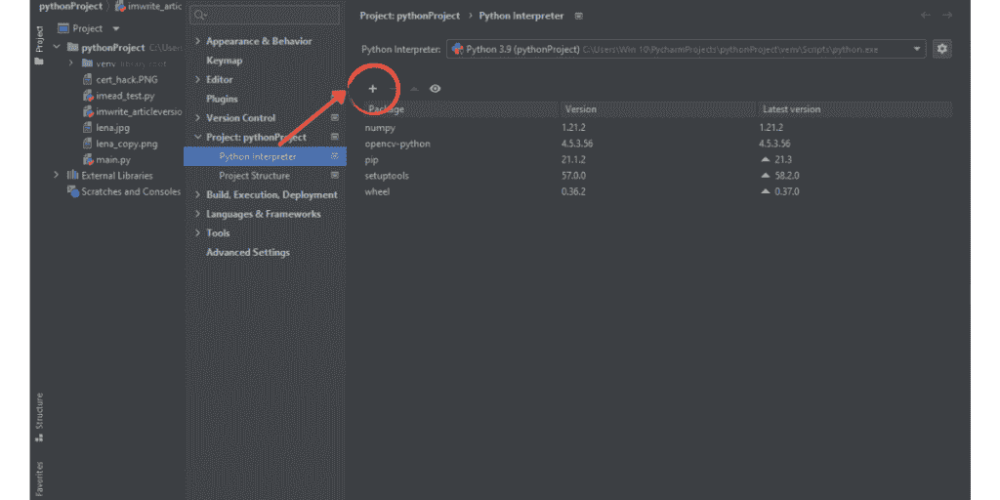
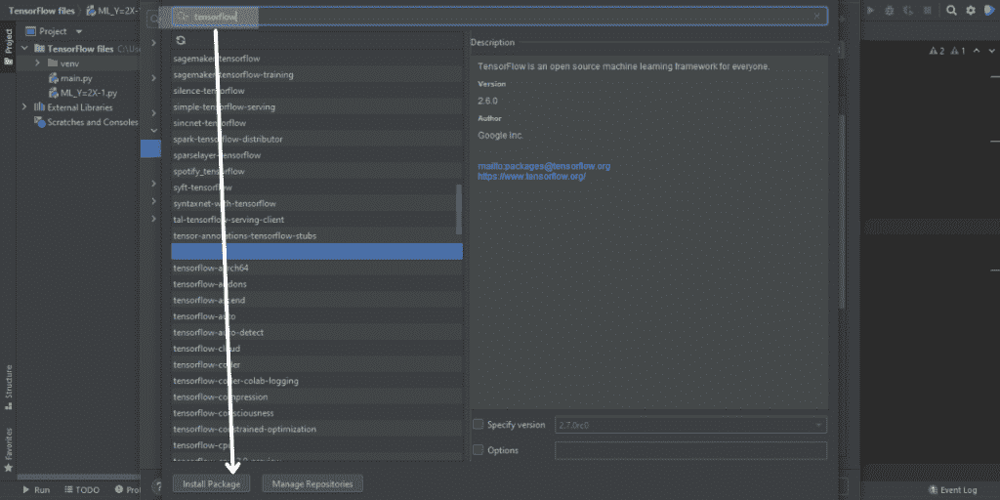
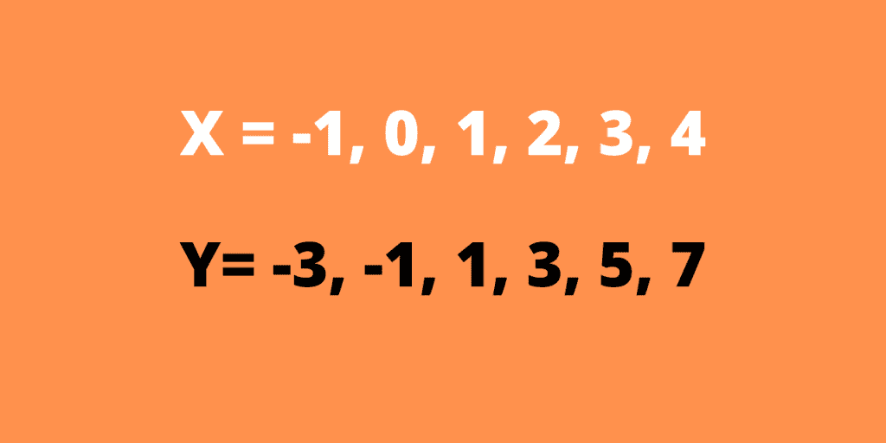
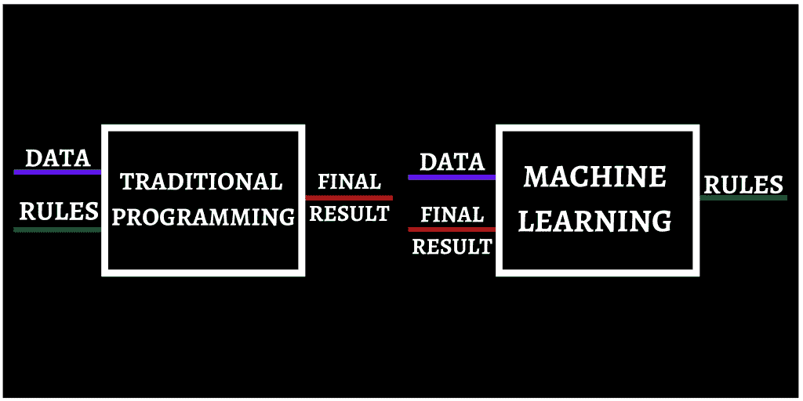
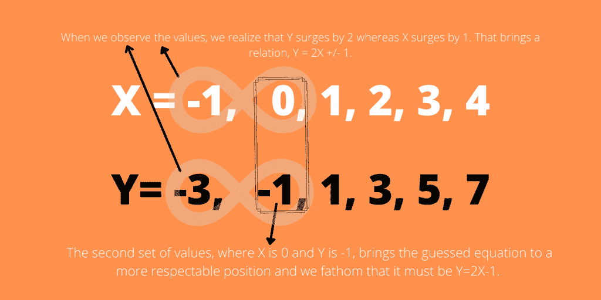
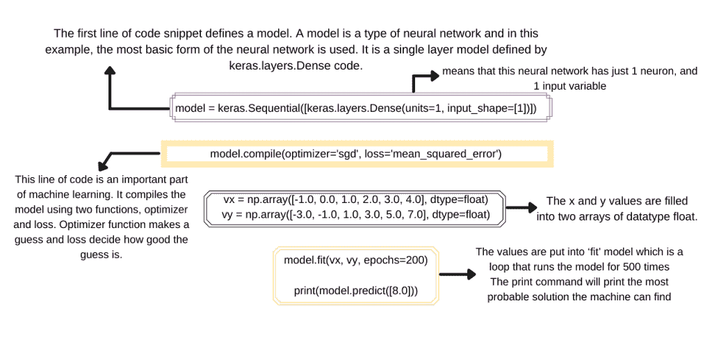

# python tensor flow–初学者入门

> 原文：<https://www.askpython.com/python-modules/python-tensorflow-introduction>

[TensorFlow](https://www.tensorflow.org/) 是一个数学库包，旨在为机器学习创建模型。与其他传统方法相比，使用 TensorFlow 可以更有效地设计这些模型。该软件由谷歌在开源环境中创建，用于设计 ML 和人工智能系统，以及深度神经网络。

但首先，在我们深入更复杂的东西之前，让我们了解什么是人工智能或人工智能或神经网络。

***从:[Python 中的机器学习——初学者简易指南](https://www.askpython.com/python/machine-learning-introduction)***

## 什么是机器学习？

机器学习是通过向计算机输入成千上万个真实世界的例子来为计算机制作自我学习模型的过程，就像人类学习一样。通过机器学习，软件系统可以通过获取真实世界的例子并从中导出规则和参数来学习和进化。自我学习是 ML 的核心，也是通向人工智能的路径。

## 什么是人工智能？

人工智能简单地说就是，计算机表现得像人类一样。通俗地说，人工智能系统是能够独立承担人类任务并以相同或更高的效率执行这些任务的程序。

例如，人工智能控制的测速仪扫描速度高于限速的汽车，然后自动拍摄车牌。参与同一过程的人一次只能专注于 1-2 辆汽车，而人工智能可以轻松地一次处理十几辆汽车的车牌。

## What Is TensorFlow?

虽然存在如此复杂的人工智能软件系统，但“我们如何训练计算机利用摄像头来理解和识别汽车，然后识别它们的速度，并拍下它们的牌照，所有这些都是实时的？”

一种方法是使用**张量流**。

它的深度学习系统和卷积神经网络使得计算机完成这样的任务成为可能。

例如，TensorFlow 包含称为 MNIST 的大型图像库，其中包含成千上万张日常事物的 2×2 像素图像，以训练计算机识别现实世界的物体。

使用 MNIST，可以创建模型来训练计算机系统汽车看起来是什么样的，以及如何识别摄像头馈送中的高速汽车。但是为了简单起见，我们将从基础开始。

在最开始，我们将了解 TensorFlow 是如何安装的，然后我们将进一步创建一个机器学习模型，教会计算机系统从一组数据中破译一个公式。

## 安装和设置 TensorFlow

由于 TensorFlow 是第三方库函数，因此在任何 python IDE 中都没有预装它。因此，首先，您需要学习安装和配置 TensorFlow，以便将其用作导入包。在这个例子中，我们使用 Pycharm IDE 来安装和使用 TensorFlow，因为它比其他 IDE 更简单。

将最新版本的 PyCharm IDE、python 和 pip 包安装到您的系统中。安装后，按照以下步骤进行配置:

*   打开 cmd 并编写命令' pip install tensorflow' **注意:**包含 pip 的脚本文件夹应该包含在#PATH 中
*   安装后，前往 PyCharm IDE。
*   创建一个新项目，并在该项目中创建一个 python 文件(使用。py 扩展)
*   然后进入文件>设置，在左窗格中点击你创建的项目的名称。在下拉菜单中，您会发现一个名为 Python 解释器的选项。



*   Python 解释器包含了该项目所需的所有解释器。您需要找到并点击“Package”栏上方的+号。
*   点击它会打开一个新窗口，里面有一个很棒的 python 解释器列表。你需要搜索“张量流”并选择一个名为“张量流”的，不要其他的



*   点击底部的安装包。这将在您的 PyCharm 系统中安装 TensorFlow。
*   安装完成后，现在我们将看到模型是如何创建的。下面是分配给 X 和 y 的一组值的示例。



Values 1.1

起初，上面这组 X，Y 值看起来像随机数据集，但如果我们仔细观察，我们会发现 X 是 Y 的函数，可以得出一个关系，Y = 2X–1。

但是我们如何到达那里呢？因为在学校接受了多年的数学辅导后，我们已经习惯了使用数据模式。或者我们只是出于习惯去寻找模式，我们可能已经做过好几次了。

向一个使用微芯片和比特来计算数字的系统教授同样的东西是另一回事。这似乎很难，甚至是不可能的。

这是因为传统的编程通过跟随参数来获取数据并产生结果。然而，传统的编程方法无法让程序通过只查看数据和最终结果来预测规则。



Traditional Programming v/s Machine Learning

但是传统编程无法解决的问题，机器学习可以轻松解决。它使用一种试错的方法来解决问题，就像一个正常人会做的那样，但使用了数字触摸。让我们来了解如何。



Values 1.2

现在，当其他数据集进入等式时，我们的猜测变得更加可靠。上述方式是人类如何找到问题的解决方案，机器学习模型以同样的方式进行训练，以产生类似的结果。

下面是使用 TensorFlow 构建的机器学习程序如何学习问题并找到解决方案的代码片段

```py
import keras
import tensorflow
import numpy as np

model = keras.Sequential([keras.layers.Dense(units=1, input_shape=[1])])

model.compile(optimizer='sgd', loss='mean_squared_error')

vx = np.array([-1.0, 0.0, 1.0, 2.0, 3.0, 4.0], dtype=float)
vy = np.array([-3.0, -1.0, 1.0, 3.0, 5.0, 7.0], dtype=float)

model.fit(vx, vy, epochs=200)

print(model.predict([8.0]))

```



Values 1.3

当这个过程完成时，系统将被训练得足以计算出公式，并猜测给定 X 值的 Y 值。这里提供了 8.0 作为 X 值，它应该给出 15 作为答案，但是当程序运行时，输出显示 14.990。

是因为，X 和 Y 的第一组 6 个值是一条直线，程序只针对那组值进行训练。但是对于任何超出该参数的给定数据，系统无法预测它是否是一条直线，只会给出最接近的值。

## 结论

所以，在这篇文章中，我们学习了什么是张量流，机器学习的基础知识，以及人工智能。

我们还学习了如何在您的系统中安装 TensorFlow，并从头开始创建机器学习模型。

还提供了对代码的详尽深入的解释，因此您不会对本文中的任何一点感到困惑。

如果你开始学习机器学习或 TensorFlow，这篇文章可以作为一个很好的锚，因为它为你的 ML 基础奠定了基础。