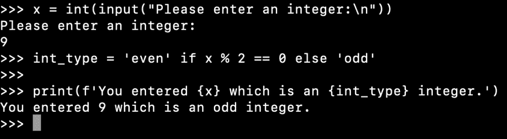

# Python 三元运算符示例

> 原文：<https://www.askpython.com/python/python-ternary-operator>

Python 没有三元运算符。但是，它支持编写一个 [if-else 语句](https://www.askpython.com/python/python-if-else-elif-statement)，这样它就像 Python 三元运算符一样工作。

* * *

## 为什么 Python 没有专门的三元运算符？

许多编程语言都有三元运算符。但是，它们的主要目的是通过删除简单的 if-else 块来减少代码量。Python 改进了 if-else 语句本身以减少代码大小，而不是增加一个额外的操作符。

* * *

## Python 三元运算符实现

在 Python 中模仿三元运算符的语法是:

```py
[when_true] if [condition] else [when_false]

```

如果条件被评估为真，则返回`when_true`值，否则返回`when_false`。

* * *

## Python 三元运算符示例

假设我们有一个简单的代码来检查一个整数是奇数还是偶数。我们要求用户输入数字并打印它是奇数还是偶数。我们将使用 if-else 块实现它。

```py
x = int(input("Please enter an integer:\n"))

if x % 2 == 0:
    int_type = 'even'
else:
    int_type = 'odd'

print(f'You entered {x} which is an {int_type} integer.')

```

整个代码片段有 6 行，其中 4 行是 if-else 块。这是使用改进的 if-else 三元运算符支持的最佳场合。

```py
x = int(input("Please enter an integer:\n"))

int_type = 'even' if x % 2 == 0 else 'odd'

print(f'You entered {x} which is an {int_type} integer.')

```



Python Ternary Operator

* * *

## 带元组的三元算子

[Python 元组](https://www.askpython.com/python/tuple/python-tuple)也支持三元运算符。它的语法是:

```py
(when_false, when_true)[condition]

```

如果条件为真，则返回第一个值。否则，返回第二个值。

让我们将上面的例子转换成使用三元运算符和元组。

```py
x = int(input("Please enter an integer:\n"))

int_type = ('even', 'odd')[x % 2]

print(f'You entered {x} which is an {int_type} integer.')

```

* * *

## 哪个更好？if-else 还是 tuple？

当我们使用基于 if-else 的三元运算符时，首先计算条件。

在基于元组的实现中，首先评估元组元素，然后评估条件。

因此，如果在生成这两个可能的值时涉及到一些处理，那么 if-else 会更有效。

让我们通过一个简单的代码片段来理解这一点。

```py
def foo(s):
    print(f'foo called with parameter {s}')
    return s

flag = True

if flag:
    result = foo('if')
else:
    result = foo('else')

result = foo('ternary-if') if flag else foo('ternary-else')

result = (foo('tuple-true'), foo('tuple-false'))[flag]

print('Done')

```

**输出:**

```py
foo called with parameter if
foo called with parameter ternary-if
foo called with parameter tuple-true
foo called with parameter tuple-false
Done

```

从输出可以清楚地看出，基于 if-else 的三元运算符实现更好使用。

* * *

## 参考资料:

*   [StackOverflow 问题](https://stackoverflow.com/questions/394809/does-python-have-a-ternary-conditional-operator)