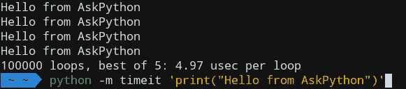
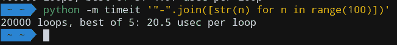
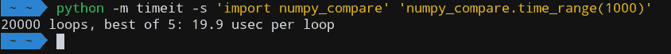

# Python timeit 模块

> 原文：<https://www.askpython.com/python-modules/python-timeit-module>

Python **timeit** [模块](https://www.askpython.com/python-modules/python-modules)是一个简单的接口，可以快速测量小代码块的执行时间。

当您创建应用程序时，您可能想知道这段代码将如何执行，并希望在不同的场景下测试它。

为此，`timeit`模块为这个问题提供了一个非常简单的解决方案。让我们看看如何使用它来为我们的代码片段计时！

我们将会看到**命令行接口**和**可调用接口**。

* * *

## python time it–命令行界面

命令行界面非常类似于运行 Python 程序的界面。

您需要使用-m 选项导入外部模块`timeit`，并将其应用到您的代码中。

```py
python -m timeit 'print("Hello from AskPython")'

```

这将使用`timeit`运行作为字符串传递的片段。

默认情况下，这将在 Linux 上运行代码 100 万次，在 Windows 上运行 2000 万次，并在这些值中测量最佳时间。以下输出来自我的 Linux 系统。



请注意，如果您的代码片段中已经有一个 for 循环，该模块将确保总迭代次数接近 100 万次，因此您的整个循环将不会运行 100 万次！



## Python time it–Python 接口

我们还可以通过 Python 解释器使用`timeit`，并使用以下方式导入它:

```py
import timeit

```

要找到执行时间，将代码作为字符串传递给`timeit.timeit()`。

```py
execution_time = timeit.timeit(code, number)

```

我们可以使用`number`参数来控制迭代的次数。

```py
>>> import timeit
>>> timeit.timeit('"-".join(str(n) for n in range(100))', number=10000)
0.19053685299877543
>>> timeit.timeit('"-".join([str(n) for n in range(100)])', number=10000)
0.172546762998536
>>> timeit.timeit('"-".join(map(str, range(100)))', number=10000)
0.13625987299747067
>>> 

```

* * *

## 使用 timeit 模块

现在让我们看看如何在我们的程序中使用`timeit`来为一个片段计时。

但在此之前，你可能会想知道一些事情。如果您的代码需要完成一些预先的设置，该怎么办？如果你也需要导入某些模块呢？

这个问题的解决方案是使用一个 **setup** 代码块，它将完成设置所有必需的模块和变量的所有必要工作。

```py
setup_code = "import math"

```

编写安装程序块非常简单。您只需编写您需要的任何代码，并将其作为字符串传递给变量。

在这之后，你可以使用`setup`和`stmt`参数编写你的主代码块并将其传递给`timeit.timeit()`。

```py
execution_time = timeit.timeit(setup = setup_code, stmt = main_block, number = 100)

```

`timeit`将确保在测量主循环之前完成设置，因此只执行一次！

现在让我们快速看一个例子。

这段代码试图从一个 **numpy** 数组的开始元素获取所有子数组。请注意，安装程序块只运行一次。

```py
import timeit

# Setup is run only once
setup_code = '''
import numpy as np
a = np.arange(0, 1000)
print(a.shape)
def print_subarrays(a):
    op = []
    for i in range(a.shape[0]):
        op.append(a[:i])
'''

main_block = '''
print_subarrays(a)
'''

# Main Block is run 1000 times
print('Best execution Time among 1000 iterations:', timeit.timeit(setup=setup_code, stmt=main_block, number=1000))

```

**输出**

```py
(1000,)
Best execution Time among 1000 iterations: 0.3830194959991786

```

* * *

## 比较代码块的性能

我们可以使用`timeit`轻松比较多个代码块的性能。

为此，我们将使用一个计时器，使用`timeit.default_timer()`。

代码块所用的时间将是当前时间减去作为参考的初始时间，可以通过变量传递。

```py
import timeit

start_time = timeit.default_timer()
function_1()
time_1 = timeit.default_timer() - start_time

start_time = timeit.default_timer()
function_2()
time_2 = timeit.default_timer() - start_time

print('Function 1 took', time_1)
print('Function 2 took', time_2)

```

让我们在 numpy 数组`range()`和`np.arange()`上测试两个函数，看看它们是如何比较的。

```py
import timeit
import numpy as np

def time_range(size):
    for i in range(size):
        pass

def time_arange(size):
    np.arange(size)

if __name__ == '__main__':
    # For smaller arrays
    print('Array size: 1000')

    start_time = timeit.default_timer();
    time_range(1000)
    range_time_1 = timeit.default_timer() - start_time

    start_time = timeit.default_timer();
    time_arange(1000)
    arange_time_1 = timeit.default_timer() - start_time

    # For large arrays
    print('Array size: 1000000')

    start_time = timeit.default_timer();
    time_range(1000000)
    range_time_2 = timeit.default_timer() - start_time

    start_time = timeit.default_timer();
    time_arange(1000000)
    arange_time_2 = timeit.default_timer() - start_time

    print(f'size 1000: range() took {range_time_1}')
    print(f'size 1000: arange() took {arange_time_1}')
    print(f'size 1000000: range() took {range_time_2}')
    print(f'size 1000000: arange() took {arange_time_2}')

```

**输出**

```py
Array size: 1000
Array size: 1000000
size 1000: range() took 2.2970001737121493e-05
size 1000: arange() took 8.393999451072887e-06
size 1000000: range() took 0.02567379199899733
size 1000000: arange() took 0.0031752489994687494

```

因此，我们可以很容易地使用`timeit`来比较不同函数的性能。

* * *

## 为特定功能计时

我们还可以只对脚本中特定函数的性能计时，而不运行其他代码块。

如果之前的文件名为 **numpy_compare.py** ，我们可以使用下面的调用找到执行时间:

```py
python -m timeit -s 'import numpy_compare' 'numpy_compare.time_range(1000)'

```

**输出**



Python Timeit Test On Function

* * *

## 结论

希望您现在已经熟悉了这个模块的基础知识，所以是时候开始使用它并提高您的工作效率了！

* * *

## 参考

*   [Python timeit 模块文档](https://docs.python.org/3/library/timeit.html)
*   [关于 timeit 模块的 StackOverflow 问题](https://stackoverflow.com/questions/8220801/how-to-use-timeit-module/29512249)
*   关于 Python timeit 模块的 JournalDev 文章

* * *