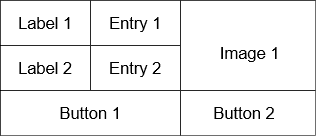
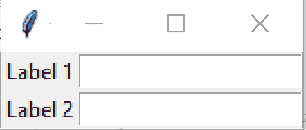
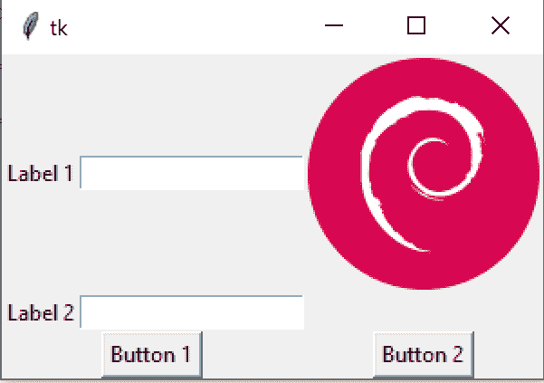

# python–Tkinter 格网示例

> 原文：<https://www.askpython.com/python-modules/tkinter/python-tkinter-grid-example>

大家好！在之前关于 Tkinter 的教程部分，我们介绍了 [Tkinter 文本小部件](https://www.askpython.com/python-modules/tkinter/tkinter-text-widget-tkinter-scrollbar)。现在让我们看一个使用 Tkinter 网格管理器的例子。

但是，你可能有一个问题要问，尤其是在看到很多人使用`pack`管理器之后。

* * *

## 为什么使用 Tkinter 网格管理器？

在我们之前的教程中，我们一直使用**包**几何管理器来管理我们的应用程序的几何。但是让它顺利地处理大量对象是一项艰巨的任务。

因此，Tkinter 引入了其他包装管理器，使我们的生活变得更加轻松，并且在何时使用什么方面也有一定的灵活性。

Tkinter 网格管理器实际上是最容易学习的，如果您开始构建 Tkinter 应用程序，那么它是最值得推荐的。

现在我们已经讨论了这个问题，让我们继续在我们的应用程序中实际使用网格管理器！

**注意**:切勿在同一个 Tkinter 应用程序中使用多个包装管理器。这将导致意想不到的错误，根本不建议这样做。一个应用只使用一个包装管理器。

## 使用 Tkinter 网格几何图形管理器

让我们使用网格管理器来设计下面的布局。



Layout

这个布局将有两个[入口部件](https://www.askpython.com/python-modules/tkinter/tkinter-entry-widget)，每个都有一个标签，下面还有一个按钮部件。

我们还将在右侧添加一个图像，并为该图像添加一个按钮部件。

虽然使用`pack`很难管理这种类型的布局，但是我们可以使用`grid`轻松地做到这一点！

步骤很简单。我们只需要创建所有需要的小部件，并告诉`grid`管理器如何放置它们。

我们将首先创建我们的主对象。

```py
import tkinter as tk

master = tk.Tk()

```

现在，让我们先创建两个标签，因为我们需要将它们放在最左侧，并告诉`grid`管理器将它们放在各自的行号上。

我们需要第 0 列的标签，由第 0 和第 1 行索引。创建标签后，我们可以使用`grid`通过使用:

```py
label_object.grid(row, col)

```

所以，我们可以直接把它写成这样:

```py
tk.Label(master, text="Label 1").grid(row=0, column=0)
tk.Label(master, text="Label 2").grid(row=1, column=0)

```

现在让我们为这两个标签各添加一个条目。

```py
e1 = tk.Entry(master)
e2 = tk.Entry(master)

```

我们已经创建了入口对象，但是现在，我们需要告诉`grid`将它们放置在各自的位置。

干脆叫`entry_obj.grid()`！这类似于 pack，但总的来说，使用起来更流畅。

```py
e1.grid(row=0, column=1)
e2.grid(row=1, column=1)

```

之后，我们可以使用`tk.mainloop()`添加 tkinter 主循环。

至此，我将发布完整的代码。

```py
import tkinter as tk

# Create the master object
master = tk.Tk()

# Create the label objects and pack them using grid
tk.Label(master, text="Label 1").grid(row=0, column=0)
tk.Label(master, text="Label 2").grid(row=1, column=0)

# Create the entry objects using master
e1 = tk.Entry(master)
e2 = tk.Entry(master)

# Pack them using grid
e1.grid(row=0, column=1)
e2.grid(row=1, column=1)

# The mainloop
tk.mainloop()

```

**输出**



Tkinter Grid Sample

好吧！这似乎像预期的那样工作。现在，让我们给它添加一个按钮，就在下面！

```py
button1 = tk.Button(master, text="Button 1")
button1.grid(columnspan=2, row=2, column=0)

```

现在，我们已经覆盖了我们的左侧。

让我们添加图像和另一个按钮到右边。

正如我们在之前的教程中讨论的关于显示图像的问题，我们必须持有对 **PhotoImage** 对象的引用，以避免自动垃圾收集！

```py
from PIL import Image, ImageTk

# Create the PIL image object
image = Image.open("debian.png")
photo = ImageTk.PhotoImage(image)

# Create an image label
img_label = tk.Label(image=photo)
# Store a reference to a PhotoImage object, to avoid it
# being garbage collected! This is necesary to display the image!
img_label.image = photo

img_label.grid(row=0, column=2)

```

最后，我们在底部加一个按钮。

```py
# Create another button
button2 = tk.Button(master, text="Button 2")
button2.grid(columnspan=2, row=2, column=2)

```

现在，我将在这里张贴完整的程序。

```py
import tkinter as tk
from PIL import Image, ImageTk

# Create the master object
master = tk.Tk()

# Create the label objects and pack them using grid
tk.Label(master, text="Label 1").grid(row=0, column=0)
tk.Label(master, text="Label 2").grid(row=1, column=0)

# Create the entry objects using master
e1 = tk.Entry(master)
e2 = tk.Entry(master)

# Pack them using grid
e1.grid(row=0, column=1)
e2.grid(row=1, column=1)

button1 = tk.Button(master, text="Button 1")
button1.grid(columnspan=2, row=2, column=0)

# Create the PIL image object
image = Image.open("debian.png")
photo = ImageTk.PhotoImage(image)

# Create an image label
img_label = tk.Label(image=photo)
# Store a reference to a PhotoImage object, to avoid it
# being garbage collected! This is necesary to display the image!
img_label.image = photo

img_label.grid(row=0, column=2)

# Create another button
button2 = tk.Button(master, text="Button 2")
button2.grid(columnspan=2, row=2, column=2)

# The mainloop
tk.mainloop()

```

**输出**



Tkinter Grid Complete Layout

最后，我们已经完成了我们的布局！就像创建小部件并告诉`grid`将它们放在正确的位置一样简单！

* * *

## 结论

在本教程中，我们学习了如何将小部件添加到 Tkinter 应用程序中，并使用 Tkinter Grid Geometry Manager 设计布局。

敬请关注更多 Tkinter 内容！

* * *