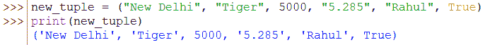
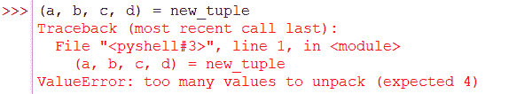

# Python 元组解包:解包元组的两种快速方法

> 原文：<https://www.askpython.com/python/tuple/python-tuple-unpacking>

本文将阐明解包元组的不同方法，下面是我们代码片段中的一些例子。让我们开始吧，不要浪费时间。

在入门之前，首先我们来了解一下 **[在 python](https://www.askpython.com/python/tuple/python-tuple) 中什么是 Tuple。**

元组是 Python 中列表、集合和字典中四种流行的内置集合之一。它用于存储有序的、索引的数据集合，与数据类型无关。

**与数组类似，元组中的第一个值的索引为[0]，第二个值的索引为[1]，依此类推。可以通过以下命令创建元组。**

```py
new_tuple = ("New Delhi", "Tiger", 5000, "5.285", "Rahul", True)

```

我们的 new_tuple 将被创建如下。

```py
print(new_tuple)
 ('New Delhi', 'Tiger', 5000, '5.285', 'Rahul', True)

```



Sample Tuple

Python 中元组的一些关键特性如下。

*   这在本质上是不可改变的。一旦创建了元组，就不能修改它的元素，也不能删除。
*   从元组中删除元素是不可能的。**但是删除一个元组就是。**
*   元组可以存储**重复值**。
*   我们可以创建一个空元组。
*   我们可以用单个元素创建一个元组。
*   **两个或更多元组之间的串联**是可能的。
*   元组**不支持调整大小**方法:`**append(),** **remove()**, **pop()**`等。

众所周知，元组本质上是不可变的。它的值或内容一旦创建就不能更改。但是我们可以做的一件事是，我们可以解开一个元组的内容。解包元组意味着将元组的内容拆分成单独的变量。我们将在这里学习三种方法来做同样的事情，然后是一些例子。让我们也来理解他们。

### 通过重新分配来解包 Python 元组

```py
#Let's create a tuple
new_tuple = ("New Delhi", "Tiger", 5000, "5.285", "Rahul", True)

#We can unpack the tuple by assigning each content of the tuple to individual variables 
(a, b, c, d, e, f) = new_tuple

```

在上面的例子中，我们将元组的每个内容分配给单独的变量。让我们通过下面的代码片段来看看每个变量的内容。

```py
#printing each variable 
print(a)
'New Delhi'
print(b)
'Tiger'
print(c)
5000
print(d)
'5.285'
print(e)
Rahul
print(f)
True

```

在使用这种方法时，我们必须记住，我们需要将变量的数量与元组中内容的数量相同。否则，它将抛出如下错误。

```py
(a, b, c, d) = new_tuple
Traceback (most recent call last):
  File "<pyshell#3>", line 1, in <module>
    (a, b, c, d) = new_tuple
ValueError: too many values to unpack (expected 4)

```



Error( Two Many Values to Unpack )

### 使用星号*符号解包元组

在这个例子中，我们将使用星号`(*)`操作符。**如果变量的数量小于元组中内容的数量，我们可以在变量名中添加一个`*`,变量的值将作为一个列表分配给这个变量。**让我们试试下面的代码片段。

```py
#taking the same tuple created in method 1
print(new_tuple)
 ('New Delhi', 'Tiger', 5000, '5.285', 'Rahul', True)

#no. of variables (=3) is less than no. of contents (=6).
#adding * to y
(x, *y, z) = new_tuple

```

现在，我们可以通过单独打印变量来查看结果。

```py
print(x)
New Delhi
print(y)
['Tiger', 5000, '5.285', 'Rahul']
print(z)
True

```

我们可以看到，中间的四个内容创建了一个列表，赋给 y，这样，这个方法就起作用了。通过下面代码片段中的例子，我们可以更好地理解。

```py
#Example 1 
(x, y, *z) = new_tuple
print(x)
'New Delhi'
print(y)
'Tiger'
print(z)
[5000, '5.285', 'Rahul', True]

#Example 2 
(*x, y, z) = new_tuple
print(x)
['New Delhi', 'Tiger', 5000, '5.285']
print(y)
'Rahul'
print(z)
True

#Example 3
(x, y, *z, w) = new_tuple
print(x)
New Delhi
print(z)
[5000, '5.285', 'Rahul']
print(w)
True
print(y)
Tiger

```

**注意:**使用这种方法时，仅将*运算符添加到单个变量中。否则，它将抛出如下错误。

```py
(*x, *y, z) = new_tuple
SyntaxError: multiple starred expressions in assignment

```


Multisigned Error

## 结论

在本文中，我们介绍了如何在 Python 中解包元组。当用于用例时，元组是有优势的，就像 Python 中的其他元素一样。希望你一定喜欢它。我们必须带着一些更令人兴奋的话题再次访问。