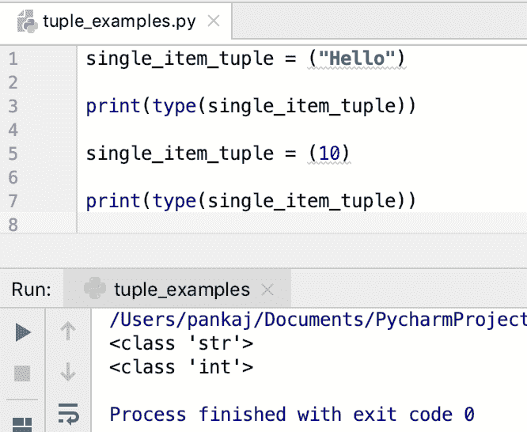
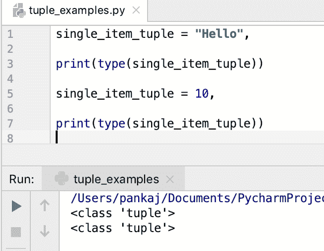
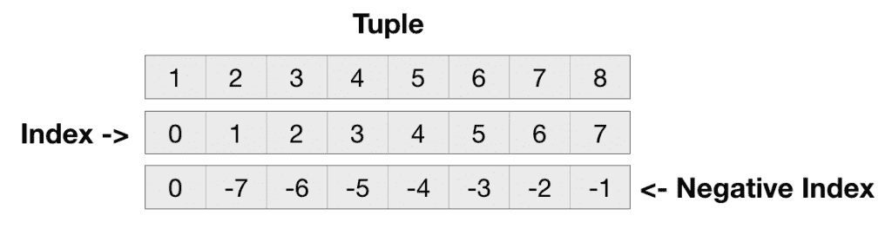
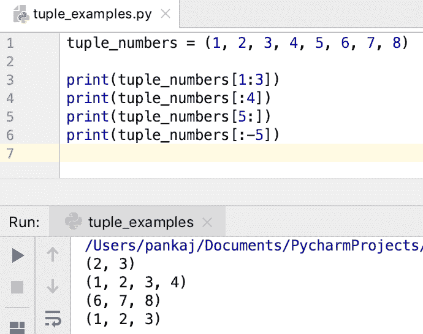
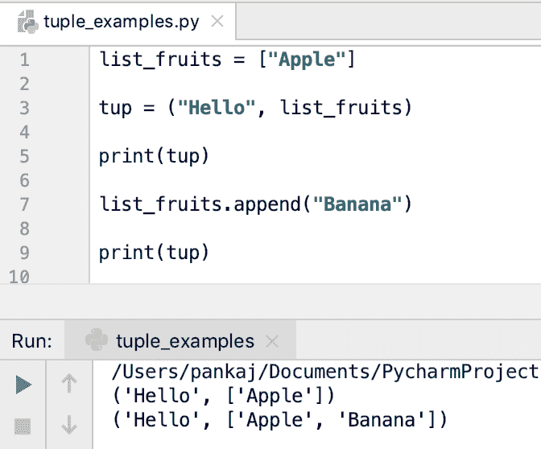

# Python 元组——不可变的序列

> 原文：<https://www.askpython.com/python/tuple/python-tuple>

*   Python 元组是不可变的序列。
*   元组是用逗号分隔的值创建的。
*   因为元组是不可变的，所以我们不能添加或删除它的元素。
*   如果元组元素不是不可变的，它们的属性可以被改变。但是，我们不能直接改变一个元组元素。
*   我们可以创建嵌套元组。
*   我们可以通过元组元素的索引来访问它们。它还支持从末尾到开始引用元素的负索引。
*   我们还可以将元组元素解包为逗号分隔的值。
*   创建元组通常是为了存储异构元素。他们也可以有**无**。
*   元组支持两个[操作符](https://www.askpython.com/python/python-operators) : +用于连接，而*用于重复元素。
*   元组支持切片以从源元组创建另一个元组。
*   我们可以对元组使用“in”和“not in”操作符来检查元组中是否存在该项目。
*   由于 tuple 是一个序列，我们可以使用循环中的[遍历它的元素。](https://www.askpython.com/python/python-for-loop)
*   Python tuple 类有两个[函数](https://www.askpython.com/python/python-functions)–`count()`和`index()`。

* * *

## 如何用 Python 创建一个 Tuple？

我们可以通过将元组的所有元素放在用逗号分隔的括号内来创建元组。

```py
tuple_numbers = (1, 2, 3, 1)

```

我们可以在一个元组中保存不同类型的对象。

```py
tup = 1, 2, 3, 1, None, "Hello"

```

让我们看一个嵌套元组的例子。

```py
nested_tuple = ((1, 2), ("Hello", "Hi"), "Python")

```

我们可以通过在括号中不包含任何元素来创建空元组。

```py
empty_tuple = ()

```

使用括号创建元组的边界是可选的。但是，使用它是最佳实践。如果打印元组，元素总是打印在括号内。

```py
>>> tup = 1, 2, "Hello"
>>> print(tup)
(1, 2, 'Hello')
>>>

```

创建单个条目元组有点棘手。如果你把一个值放在括号里，它不会创建一个元组。它将创建值类型的对象。让我们用一个简单的例子来检验这种行为。

```py
single_item_tuple = ("Hello")

print(type(single_item_tuple))

single_item_tuple = (10)

print(type(single_item_tuple))

```

**输出:**



我们可以在值后添加一个逗号来创建一个只有一个元素的元组。

```py
single_item_tuple = "Hello",

print(type(single_item_tuple))

single_item_tuple = 10,

print(type(single_item_tuple))

```



Python Tuple With Single Element

* * *

## 如何访问元组元素？

我们可以通过元组元素的索引来访问它们。索引值从 0 开始到元组的长度–1。

```py
tuple_numbers = (1, 2, 3, 4)

print(f'First element in tuple is {tuple_numbers[0]}')
print(f'Third element in tuple is {tuple_numbers[3]}')

```

如果元组大小小于指定的索引，则抛出“ **IndexError:元组索引超出范围**”。

```py
>>> tuple_numbers = (1, 2, 3, 4)
>>> tuple_numbers[10]
Traceback (most recent call last):
  File "<stdin>", line 1, in <module>
IndexError: tuple index out of range
>>>

```

元组也支持负索引。在这种情况下，元组元素是从末尾到开头检索的。负索引从-1 开始到-(元组的长度)。

```py
tuple_numbers = (1, 2, 3, 4)

print(f'Last element in tuple is {tuple_numbers[-1]}')
print(f'Second Last element in tuple is {tuple_numbers[-2]}')
print(f'First element in tuple is {tuple_numbers[-4]}')

```

如果我们有一个嵌套元组，我们可以通过嵌套索引访问它的元素。

```py
>>> nested_tuple = (1, 2, (3, 4), (5, 6, 7))
>>> nested_tuple[2][0]
3
>>> nested_tuple[2][1]
4
>>> nested_tuple[3][0]
5
>>> nested_tuple[3][1]
6
>>> nested_tuple[3][2]
7
>>>

```

我们也可以对嵌套元组使用负索引。

```py
>>> nested_tuple = (1, 2, (3, 4), (5, 6, 7))
>>> 
>>> nested_tuple[-1][-1]
7
>>> nested_tuple[-2][1]
4
>>> nested_tuple[-2][-1]
4
>>> nested_tuple[3][-2]
6
>>> 

```

下图显示了索引在元组中的工作方式。



Python Tuple Index

* * *

## 对元组切片

我们可以使用切片来创建元组的子集。这在从源元组创建新元组时很有用。切片技术包含两个用冒号分隔的索引。结果中包括左索引，不包括右索引。

```py
tuple_numbers = (1, 2, 3, 4, 5, 6, 7, 8)

print(tuple_numbers[1:3])
print(tuple_numbers[:4])
print(tuple_numbers[5:])
print(tuple_numbers[:-5])

```

**输出:**



Slicing Tuple in Python

* * *

## 元组是不可变的

元组本质上是不可变的。所以我们不能添加、更新或删除它的元素。然而，如果元素是可变的，那么它的属性可以改变。

```py
>>> tup = (1,2)
>>> tup[0] = 10
Traceback (most recent call last):
  File "<stdin>", line 1, in <module>
TypeError: 'tuple' object does not support item assignment

```

让我们看一个例子，其中元组元素是可变的，我们改变它们的属性。

```py
list_fruits = ["Apple"]

tup = ("Hello", list_fruits)

print(tup)

list_fruits.append("Banana")

print(tup)

```

**输出:**



Python Tuple With Mutable Elements

* * *

## 删除元组

我们不能删除元组的元素。但是，我们可以使用 **del** 语句删除元组本身。

```py
>>> tup = (1,2)
>>> print(tup)
(1, 2)
>>> del tup
>>> print(tup)
Traceback (most recent call last):
  File "<stdin>", line 1, in <module>
NameError: name 'tup' is not defined
>>>

```

* * *

## 元组串联(+运算符)

我们可以使用+运算符连接元组元素来创建一个新的元组。

```py
>>> tuple1 = (1, 2)
>>> tuple2 = (3, 4)
>>> tuple3 = (5, 6, 7)
>>> 
>>> tuple_all = tuple1 + tuple2 + tuple3
>>> print(tuple_all)
(1, 2, 3, 4, 5, 6, 7)
>>> 

```

* * *

## 重复元组元素(*运算符)

Tuple 还支持*操作符创建一个新的 tuple，其中的元素重复给定的次数。

```py
>>> tup = (1, 2, (3, 4))
>>> 
>>> tup1 = tup * 3
>>> 
>>> print(tup1)
(1, 2, (3, 4), 1, 2, (3, 4), 1, 2, (3, 4))
>>> 

```

* * *

## Python 元组函数

tuple 类有两个功能。

1.  **count(x)** :返回给定元素出现的次数。
2.  **index(x，start，end)** :返回值的第一个索引。我们可以指定开始和结束索引来查找元组中的值。如果没有找到该值，则引发 **ValueError** 。

```py
>>> tup = (1, 2, 3, 1, 2, 1, 3, 2, 1)
>>> 
>>> tup.count(1)
4
>>> tup.count(2)
3
>>> tup.index(2)
1
>>> tup.index(2, 2)
4
>>> tup.index(2, 2, 6)
4
>>> tup.index(20)
Traceback (most recent call last):
  File "<stdin>", line 1, in <module>
ValueError: tuple.index(x): x not in tuple
>>> 

```

* * *

## 元组成员资格测试(in，not in 运算符)

我们可以使用“in”操作符检查元组是否包含元素。类似地，我们可以使用“not in”操作符来测试元素是否不在元组中。

```py
>>> vowels = ("a", "e", "i", "o", "u")
>>> 
>>> "a" in vowels
True
>>> "x" in vowels
False
>>> 
>>> "a" not in vowels
False
>>> "x" not in vowels
True

```

* * *

## 遍历一个元组

我们可以使用 for 循环来遍历元组的元素。

```py
vowels = ("a", "e", "i", "o", "u")

for v in vowels:
    print(v)

```

如果想以逆序遍历元组，可以使用 reversed()函数。

```py
for v in reversed(vowels):
    print(v)

```

* * *

## 元组与列表

*   元组是不可变的，而列表是可变的。
*   元组优于列表，用于在序列中存储不同类型的数据类型。
*   因为元组是不可变的，所以遍历元组比遍历列表稍微快一点。
*   元组比列表更能优化内存和空间。
*   如果要添加，请从序列中删除元素，然后使用 List。

* * *

## Python tuple()内置函数

我们还可以使用 tuple()函数来创建一个元组。它接受一个可迭代的参数，比如 List 和 String。这在将其他序列类型转换为元组时很有用。

### 1.Python 列表到元组

```py
list_numbers = [1, 2, 3]

tuple_numbers = tuple(list_numbers)
print(tuple_numbers)  # (1, 2, 3)

```

### 2.Python 字符串到元组

```py
s = "ABCD"
tuple_str = tuple(s)
print(tuple_str)  # ('A', 'B', 'C', 'D')

```

### 3.Python 范围到元组

```py
r = range(1, 10)
tuple_range = tuple(r)
print(tuple_range)

```

* * *

## 结论

元组是 Python 中不可变的序列。当您想要一个只读序列时，请使用元组。

* * *

## 参考资料:

*   [tuple()内置函数](https://docs.python.org/3/library/functions.html#func-tuple)
*   [元组数据结构](https://docs.python.org/3/tutorial/datastructures.html#tuples-and-sequences)