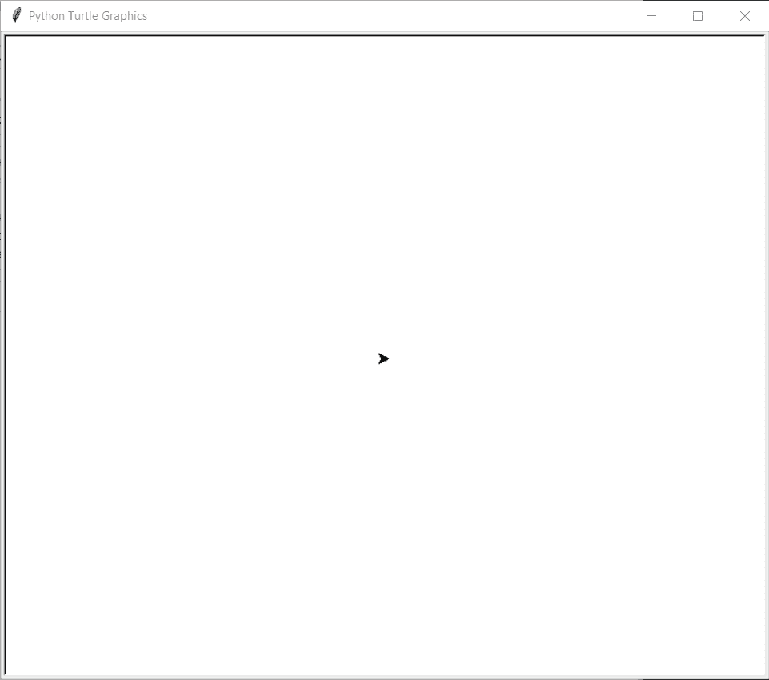
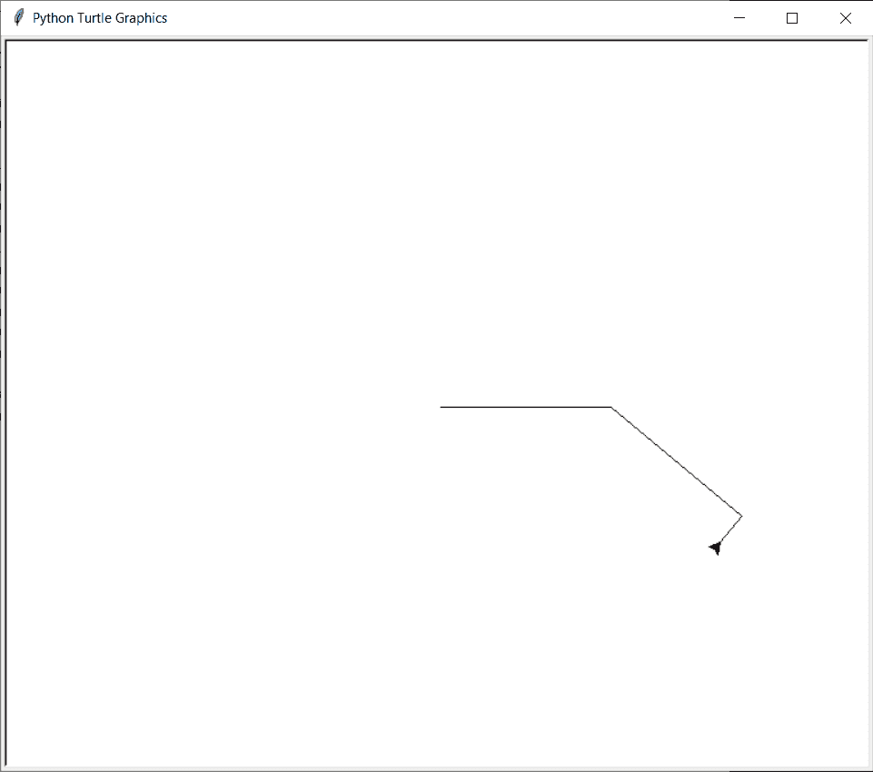
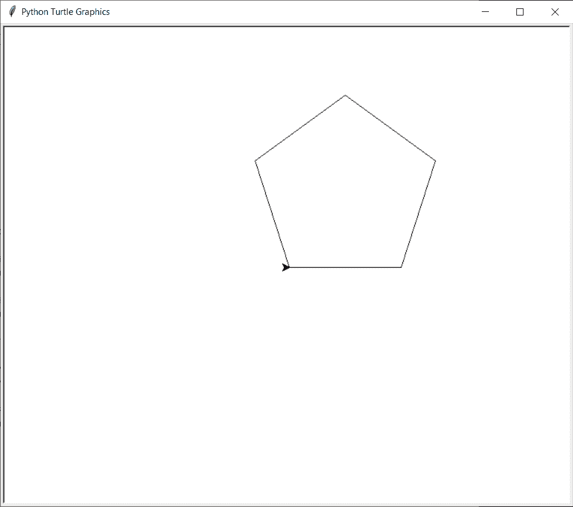
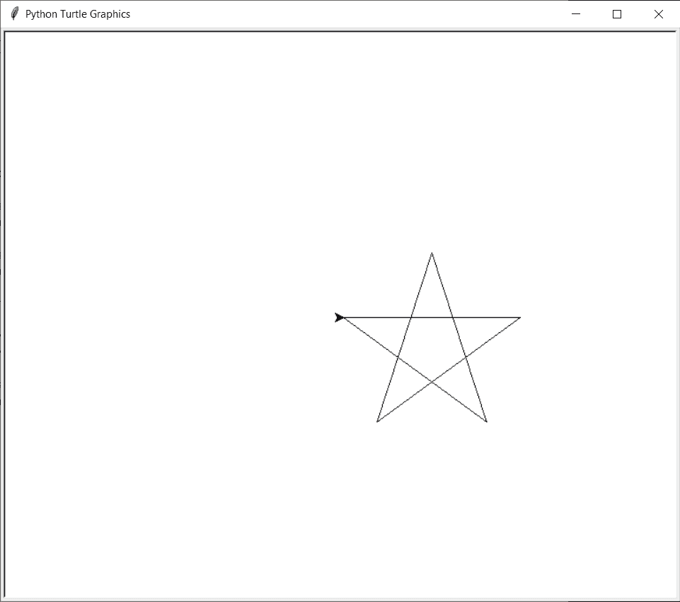
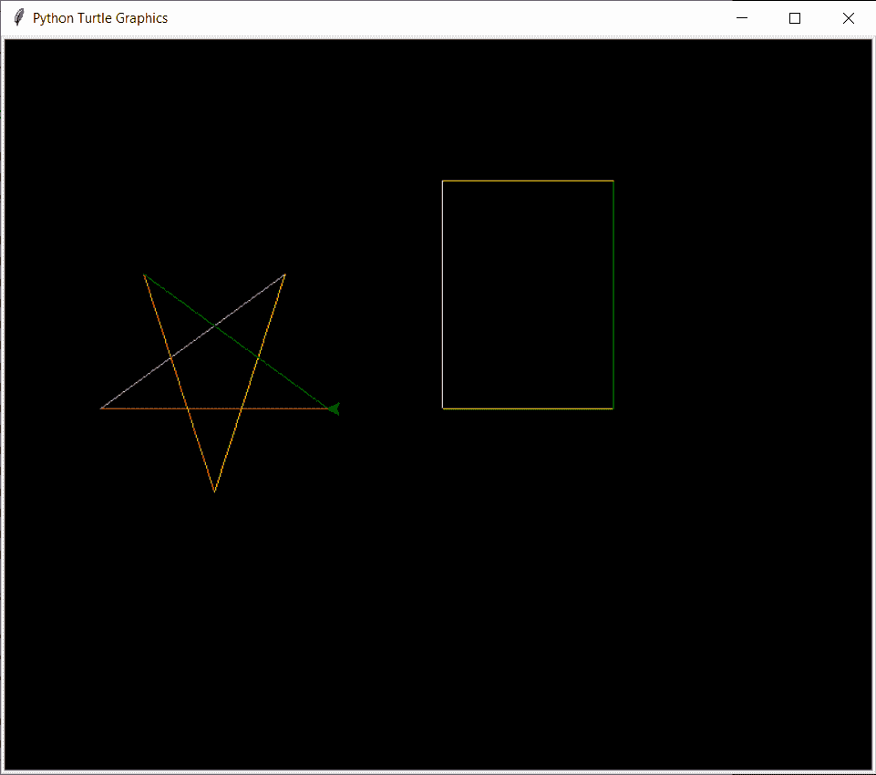

# Python 海龟:向编码界的海龟问好！

> 原文：<https://www.askpython.com/python-modules/python-turtle>

你好，学习伙伴！今天，我们将向您介绍 Python Turtle，它是编码世界中的一只乌龟，只需一些简单的步骤，它就可以在您的屏幕上创建有趣的图形和形状。

我们开始吧！

## **Python 海龟库简介**

**Python Turtle** 通过在虚拟画布上绘制各种东西，帮助用户更好地与编程语言进行交互。

它使用了一种虚拟笔，也就是众所周知的海龟 T1。

在 python turtle 库的帮助下，人们可以绘制和制作不同的形状和图片。大多数情况下，海龟库是用来绘制形状、创造设计和制作图像的。但它也有助于创建迷你游戏和动画。

## **Python Turtle 入门**

您需要导入`turtle`库来使用它的方法和功能。它还附带了一个 Python 标准工具包，因此不需要额外安装。

下一步是创建虚拟画布，在上面绘制各种对象。我们可以根据我们的需要和兴趣来命名画布/屏幕并显示它。下面的代码为用户创建和显示屏幕。

```py
#Importing Module
import turtle as tur

# Creating Screen
wind = tur.Screen()

# Displaying Screen
sc = tur.getscreen()
tur.mainloop()

```

上面提到的代码的输出会产生如下所示的屏幕:



Initial Turtle Window

人们可以在这个屏幕上看到代码的输出，屏幕中间的黑色小三角形被称为乌龟，它可以用来绘制所需的形状和对象。

首先，需要创建海龟，然后在海龟上使用定位功能。Turtle 支持四种基本运动，即向前、向后、向左和向右。向前和向后功能需要距离作为参数，另一方面，向左和向右功能需要旋转角度作为参数。下面的代码有助于显示海龟的基本运动操作。

```py
import turtle

# Creating Screen
my_window = turtle.Screen()

# Creating turtle to draw
my_pen = turtle.Turtle()      

# Moving Forward
my_pen.forward(150)           
# Turning Right
my_pen.right(40)
# Moving Forward
my_pen.forward(150)
#Moving Left
my_pen.left(90)
#Moving Backward
my_pen.backward(30)

# Displaying Window
my_window.mainloop()

```

代码的输出显示在下图中。



Basic Turtle Movement Visualization

## **使用 Python Turtle 创建形状**

利用海龟运动的基本功能，人们可以创造一些基本的形状，如三角形、正方形和长方形。人们也可以创造像星星一样的形状。

### 1.**用乌龟创造五边形**

下面的代码在一只蟒蛇龟的帮助下在屏幕上显示了一个五边形。对于正五边形，所有的边都等长，所有的角都等于 72 度。

```py
import turtle

# Creating Screen
my_window = turtle.Screen()

# Creating turtle to draw
my_pen = turtle.Turtle()      

#Creating a Pentagon
for i in range(5):
    my_pen.forward(150)
    my_pen.left(72)

# Displaying Window
my_window.mainloop()

```

下图显示了上面代码的输出结果，结果是一个五边形。



Making Pentagon Using Turtle

### 2.**和乌龟一起造星**

下面的代码在一只乌龟的帮助下在屏幕上显示一颗星星。对于规则的星形，所有的边都等长，所有的角都等于 144 度。

```py
import turtle

# Creating Screen
my_window = turtle.Screen()

# Creating turtle to draw
my_pen = turtle.Turtle()      

#Creating a Star Shape
for i in range(5):
    my_pen.forward(200)
    my_pen.right(144)

# Displaying Window
my_window.mainloop()

```

下面的图片显示了上面代码的输出结果，得到了一个星形。



Making Star Using Turtle

## **用蟒蛇龟改变颜色**

人们可以改变屏幕、海龟和线条的颜色，使形状看起来更好。下面的代码用不同的颜色显示了一个矩形和一个星形。

```py
import turtle

# Creating Screen
my_window = turtle.Screen()
turtle.bgcolor('black')

# Creating turtle to draw
my_pen = turtle.Turtle()
my_pen.color('yellow')
my_pen.forward(150)
my_pen.color('green')
my_pen.left(90)
my_pen.forward(200)
my_pen.color('orange')
my_pen.left(90)
my_pen.forward(150)
my_pen.color('pink')
my_pen.left(90)
my_pen.forward(200)
my_pen.right(90)
my_pen.color('black')
my_pen.forward(100)

colors = ['red','magenta','yellow','orange','green']
for i in range(5):
    my_pen.color(colors[i])
    my_pen.forward(200)
    my_pen.right(144)

# Displaying Window
my_window.mainloop()

```

下图显示了代码的输出。



Making Colorful Turtle Shapes

## 结论

恭喜你！你现在知道蟒蛇龟了！这个海龟库还可以创建非常复杂的形状，并且有很多颜色。

编码快乐！

希望你学到了一些东西！