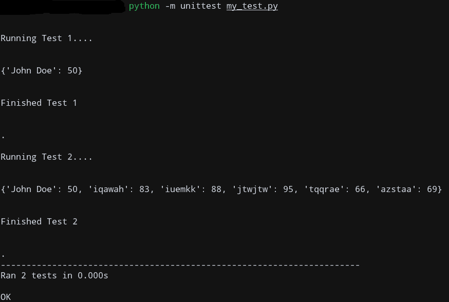

# Python 单元测试模块

> 原文：<https://www.askpython.com/python-modules/python-unittest-module>

在本文中，我们将介绍 Python 单元测试模块及其一些常见用例。

但在此之前，我们先了解一下为什么我们需要这个模块。

* * *

## 为什么应该使用 unittest 模块？

当您处理大型代码库时，应用程序开发通常分为两个阶段。

1.  发展阶段
2.  测试阶段

第一阶段是你的*开发阶段*，在这里你将你的核心思想构建成一个基本的应用程序。

但是，如果你真的想经常使用它，这是不够的。可能有一些你可能没有注意到的情况，这实际上会导致你的程序意外地工作。

为了最大限度地减少这种错误，还有另一个阶段叫做**测试阶段**，它旨在测试应用程序的不同可能场景，并检查它是否正常工作。

通常，如果您没有为该阶段建立的框架，您可能需要手动验证所有场景，这很繁琐。

为了减少开发人员的麻烦，我们可以使用 Python `unittest`模块，通过使用自动化测试来解决这个问题。

### 测试类型

对于应用程序，有两种类型的测试:

*   综合测试
*   单元测试

**集成测试**是那些检查一个应用程序的模块是否能一起正常工作的测试。

**单元测试**是检查应用程序中的小组件。

虽然我们可以编写集成测试和单元测试，但是集成测试非常依赖于您的应用程序，并且可以组合多个单元测试。

至此，让我们来看看如何使用这个模块！

* * *

## Python 单元测试模块

这个模块内置在你的 **Python 3+** 安装中，所以没有必要使用 **pip** 来安装它。

您可以通过键入以下命令来导入该模块:

```py
import unittest

```

## Python 单元测试方法

这个模块有几个方法可以用来执行单元测试。

下表列出了最常见的方法。

| 方法 | 断言检查 |
| **assertEqual(a，b)** | a == b |
| **assertNotEqual(a，b)** | 答！= b |
| **assertTrue(x)** | bool(x) is True |
| **assertFalse(x)** | bool(x)为 False |
| **资产(a，b)** | a 是 b |
| **断言 IsNot(a，b)** | a 不是 b |
| **阿松酮(x)** | x 是零 |
| **assertinotone(x)** | x 不是没有 |
| **assertIn(a，b)** | b 中的 a |
| **assertNotIn(a，b)** | a 不在 b |
| **资产实例(a，b)** | isinstance(a，b) |
| **assertNotIsInstance(a，b)** | not isinstance(a，b) |

* * *

## 编写单元测试

我们需要一个程序来进行测试。所以我们写一个吧！

我将编写一个程序，简单地验证列表中元素的总和。我们将为此编写一个**单元测试**程序。

现在，为了编写一个单独的测试用例，我们需要继承`unittest.TestCase`类，然后使用一些特定的方法覆盖它。

我会叫我的班级`MyTestClass`。

```py
import unittest

def list_sum(my_list):
    # Sums the elements of the list
    return sum(my_list)

class MyTestClass(unittest.TestCase):
    def test_list(self):
        # Checks if the sum of the below list is as expected
        my_list = [1, 2, 3, 4, 5]
        self.assertEqual(list_sum(my_list), 15, "Should be 15")

    def test_string(self):
        # Checks if the string is 'Hello from AskPython'
        my_str = 'Hi'
        self.assertEqual(my_str, 'Hello from AskPython', "Should be 'Hello from AskPython'")

if __name__ == '__main__':
    # Main module
    unittest.main()

```

**注意**:为了编写一个测试方法，我们**必须**在方法名前面加上`test_`。因此，任何测试方法都必须是`test_xyz()`的形式

我正在编写一个方法`test_list()`来检查列表中元素的总和是否等于 15，以及类似的另一个方法来检查给定的字符串。

我正在使用 **unittest** 的`assertEqual()`方法，它将运行 unittest 并检查这个断言是否成立。

现在让我们使用 Python 来执行这个文件。

```py
[email protected] $ python my_test.py 
.F
======================================================================
FAIL: test_string (__main__.MyTestClass)
----------------------------------------------------------------------
Traceback (most recent call last):
  File "my_test.py", line 16, in test_string
    self.assertEqual(my_str, 'Hello from AskPython', "Should be 'Hello from AskPython'")
AssertionError: 'Hi' != 'Hello from AskPython'
- Hi
+ Hello from AskPython
 : Should be 'Hello from AskPython'

----------------------------------------------------------------------
Ran 2 tests in 0.000s

FAILED (failures=1)

```

如您所见，第一个测试通过了，而第二个测试失败了，因为字符串不匹配。

您现在已经编写了您的第一个单元测试方法！

* * *

## 对应用程序运行单元测试

现在让我们在另一个程序上运行*单元测试，因为你不会在一个单元测试文件中编写整个应用程序！*

让我们编写一个简单的应用程序，并对其进行单元测试。

我将编写一个程序，作为一个非常简单的数据库来存储学生的名字和分数。

将下面的文件另存为`test_example.py`，因为我们将在下一段代码中引用它。

```py
class MyClass:
    # Database of {'Name': 'Marks'} dict pairs
    db = dict()
    num_students = 0

    def add_db(self, name, marks):
        self.db[name] = marks
        self.num_students += 1

    def rm_db(self, name):
        # Removes key value pair corresponding
        # to student name
        if name in self.db:
            del self.db[name]
        else:
            return f'Student with Name:{name} not in Database'

    def get_marks(self, name):
        if name in self.db:
            return self.db[name]
        else:
            return f'Student with Name:{name} not in Database'

if __name__ == '__main__':
    my_class = MyClass()
    my_class.add_db('John', 47)
    my_class.add_db('Mary', 34)
    print(my_class.get_marks('John'))

```

### 运行单元测试的推荐方法

将测试模块与核心应用程序分开是一种常见的做法。

所以我们将只在测试阶段导入`unittest`模块*。*

Python 允许我们这样做，通过指定`-m MODULE_NAME`选项。所以，我们的命令是:

```py
python -m unittest -v my_test.py

```

我们将使用`-v` verbose 选项来显示所有有用的消息。

现在，你不需要在你的申请上写`import unittest`！

为了运行单元测试，我们必须为我们的程序编写一个测试文件，类似于我们之前所做的。我们还将通过引用我们之前保存的文件`test_example.py`来导入我们之前创建的`MyClass`。

```py
import unittest

from test_example import MyClass

import random

class MyTest(unittest.TestCase):
    # Init the MyClass class
    my_class = MyClass()

    # Database to verify test cases
    database = dict()

    def test_case_1(self):
        print("\n\nRunning Test 1....\n\n")

        name = 'John Doe'
        marks = 50
        self.database[name] = marks
        self.my_class.add_db(name, marks)
        self.assertEqual(self.database, self.my_class.db)
        print(self.database)
        print("\n\nFinished Test 1\n\n")

    def test_case_2(self):
        print("\n\nRunning Test 2....\n\n")
        for i in range(5):
            name = ''
            for j in range(6):
                name += chr(random.randint(97, 97+25))
            marks = random.randint(0, 100)
            self.database[name] = marks

            # Insert to MyClass Database
            self.my_class.add_db(name, marks)
        # Now check if both databases have the same key:value pairs
        self.assertEqual(self.database, self.my_class.db)
        print(self.database)
        print("\n\nFinished Test 2\n\n")

if __name__ == '__main__':
    # Run the main unittest code
    unittest.main()

```

现在我们已经分别编写了测试，让我们来验证它是否工作。

```py
python -m unittest run_tests.py

```



Unittest Example

这确实有效，因为我们的测试都通过了！

请注意，我们的最终测试数据库包含来自 Test1 和 Test2 的记录，因此可以根据您的程序来操作测试机制！

* * *

## 结论

希望您现在理解了如何使用 Python 的`unittest`模块在测试阶段执行健全性检查。如果你有任何疑问，请在下面的评论区提出来！

* * *

## 参考

*   关于 Python 单元测试模块的 JournalDev 文章
*   关于 Python unittest 的文章

* * *