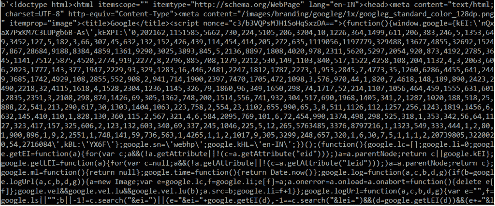
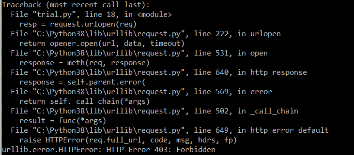

# Python urllib:完整参考

> 原文：<https://www.askpython.com/python-modules/python-urllib>

大家好，欢迎来到另一篇 Python 3 教程文章。在这篇文章中，我们将讨论 Python urllib 库，它是标准库模块的一部分。

Python urllib 的想法是，它允许你通过简单的编程做互联网允许的各种令人惊奇的事情。

因此，让我们开始吧。

## 导入 Python urllib

你要做的第一件事是你需要导入 URLlib。

现在，如果你来自 python 2.7，你习惯于只导入 urllib，仅此而已。

```py
import urllib

```

而在 Python 3 及更高版本中，您必须从 urllib 导入请求包。

```py
import urllib.request

```

## 使用 Python urllib 模块访问网站

下面是一个访问网站的例子。

### 1.获取访问网站的请求

```py
x = urllib.request.urlopen('https://www.google.com')

```

我们将定义一个变量 x 并调用 urlopen 方法，指定网站的 url。

现在，这将作为 HTTP GET 请求从 URL 获取数据。我们将使用 read()来获取数据。

```py
print(x.read())

```

上面的代码片段返回了 google.com 页面的源代码。它返回页面的所有内容，比如 python 控制台上的 html 标记和样式属性。

但是，作为用户，您可能对获取页面的源代码不感兴趣，而只需要文本数据。



Output Get Request

作为普通用户，你会去`python.org`等网站的搜索栏，指定你要搜索的内容，点击提交按钮。

您会注意到地址栏中的 URL 变为如下所示的 URL。这个 URL 包含一些？和&是查询参数。

```py
https://www.python.org/search/?q=urllib&submit=

```

为了让你进一步了解。和&是您在搜索栏中提供的搜索查询，这些查询会发布到 URL。您可以向该 URL 发出 POST 请求来检索内容。但是如果你必须从 python 发布呢？

### 2.发布访问网站的请求

除了请求模块，我们还将导入解析模块，因为这将帮助我们解析请求的值。

```py
import urllib.request as rq
import urllib.parse as ps

```

为了更好地理解 post 请求，我们将使用 python.org 网站。我们将定义一个字典，其中的关键字是“搜索参数”，值是关键字。

```py
url='https://www.python.org/search/'
dictionary = { 'q': 'urllib' }

data = ps.urlencode(dictionary)
data = data.encode('utf-8')

req = rq.Request(url,data)
res = rq.urlopen(req)

print(res.read())

```

在指定了 url 参数之后，理解使用 utf-8 标准编码的万维网是很重要的。因此，我们将把我们的 url 转换成编码内容。

然后，我们将把我们的 URL 和编码的数据传递到 req 对象中，并向该对象发出 urlopen 请求。urlopen 的响应存储在 res 对象中。



Output POST

这是因为我们在这里发布的网站不允许我们在不使用 API 的情况下访问他们的内容。我们可以使用 RESTFUL APIs 或某些其他头文件来检索数据。我们不会在本文中讨论这个问题。

我们仍然可以将包含所有 HTML 标签的整个网页放入 python 控制台。

## 结论

希望你已经理解了如何使用 python 向浏览器和站点发出 HTTP GET 和 HTTP POST 请求。请在评论区告诉我们您的反馈，并提及您希望阅读的任何其他主题。