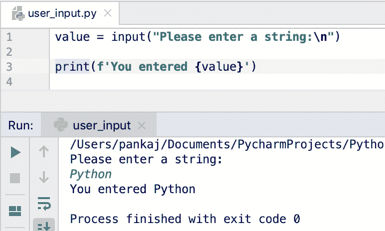
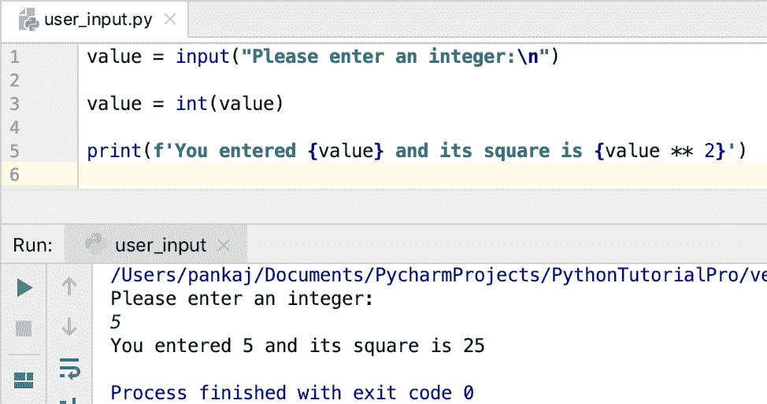
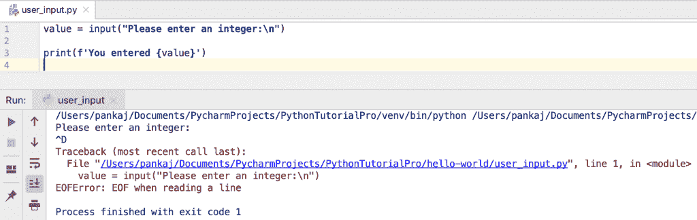
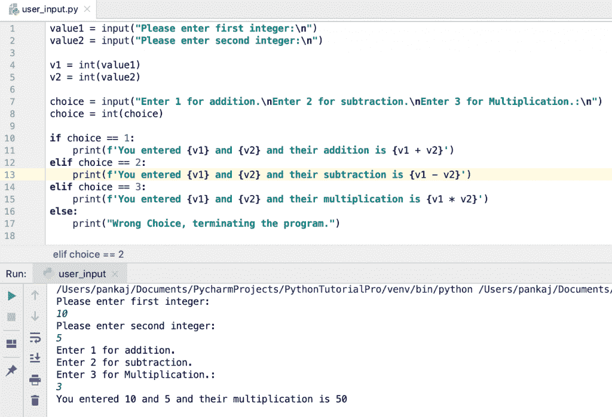

# Python 用户从键盘输入–Input()函数

> 原文：<https://www.askpython.com/python/examples/python-user-input>

*   Python 用户从键盘输入的内容可以使用 input()内置函数读取。
*   用户的输入被读取为一个字符串，并可以赋给一个变量。
*   从键盘输入数值后，我们必须按“输入”按钮。然后，input()函数读取用户输入的值。
*   程序无限期地暂停，等待用户输入。没有提供超时值的选项。
*   如果我们输入 EOF ***(*nix: Ctrl-D，Windows: Ctrl-Z+Return)*** ，EOFError 被引发，程序终止。

* * *

## 输入()函数的语法

input()函数的语法是:

```py
input(prompt)

```

提示字符串打印在控制台上，用户可以控制输入值。您应该打印一些有用的信息来指导用户输入期望值。

* * *

## 在 Python 中获取用户输入

下面是一个简单的例子，它获取用户输入并将其打印在控制台上。

```py
value = input("Please enter a string:\n")

print(f'You entered {value}')

```

**输出:**



Python User Input

* * *

## 用户输入值的类型是什么？

用户输入的值总是被转换成字符串，然后赋给变量。让我们通过使用 type() [函数](https://www.askpython.com/python/python-functions)得到输入[变量](https://www.askpython.com/python/python-variables)的类型来确认这一点。

```py
value = input("Please enter a string:\n")

print(f'You entered {value} and its type is {type(value)}')

value = input("Please enter an integer:\n")

print(f'You entered {value} and its type is {type(value)}')

```

**输出:**

```py
Please enter a string:
Python
You entered Python and its type is <class 'str'>
Please enter an integer:
123
You entered 123 and its type is <class 'str'>

```

* * *

## 如何获取一个整数作为用户输入？

没有办法将整数或任何其他类型作为用户输入。但是，我们可以使用内置函数将输入的字符串转换为整数。

```py
value = input("Please enter an integer:\n")

value = int(value)

print(f'You entered {value} and its square is {value ** 2}')

```

**输出:**



Python User Input Integer

* * *

## Python 用户输入和 EOFError 示例

当我们进入 EOF 时，input()引发 EOFError 并终止程序。让我们看一个使用 PyCharm IDE 的简单例子。

```py
value = input("Please enter an integer:\n")

print(f'You entered {value}')

```

**输出**:

```py
Please enter an integer:
^D
Traceback (most recent call last):
  File "/Users/pankaj/Documents/PycharmProjects/PythonTutorialPro/hello-world/user_input.py", line 1, in <module>
    value = input("Please enter an integer:\n")
EOFError: EOF when reading a line

```



Python User Input raises EOFError

* * *

## Python 用户输入选择示例

我们可以通过给用户选择并接受用户的输入来进行选择，从而构建一个智能系统。

```py
value1 = input("Please enter first integer:\n")
value2 = input("Please enter second integer:\n")

v1 = int(value1)
v2 = int(value2)

choice = input("Enter 1 for addition.\nEnter 2 for subtraction.\nEnter 3 for Multiplication.:\n")
choice = int(choice)

if choice == 1:
    print(f'You entered {v1} and {v2} and their addition is {v1 + v2}')
elif choice == 2:
    print(f'You entered {v1} and {v2} and their subtraction is {v1 - v2}')
elif choice == 3:
    print(f'You entered {v1} and {v2} and their multiplication is {v1 * v2}')
else:
    print("Wrong Choice, terminating the program.")

```

下面是执行上述程序的输出示例。



Python User Input Choice

* * *

## Python raw_input()函数简介

在 Python 2.x 版本中，raw_input()函数用于获取用户输入。下面是 Python 2.7 命令行解释器的一个简单示例，展示了 raw_input()函数的用法。

```py
~ python2.7
Python 2.7.10 (default, Feb 22 2019, 21:55:15) 
[GCC 4.2.1 Compatible Apple LLVM 10.0.1 (clang-1001.0.37.14)] on darwin
Type "help", "copyright", "credits" or "license" for more information.
>>> value = raw_input("Please enter a string\n")
Please enter a string
Hello
>>> print value
Hello

```

该函数已被弃用，并从 Python 3 中移除。如果你还在 Python 2.x 版本，建议升级到 Python 3.x 版本。

* * *

## 结论

在 Python 中，从 input()函数中获取用户输入非常容易。它主要用于为用户提供操作选择，然后相应地改变程序的流程。

但是，程序会无限期地等待用户输入。如果能有一些超时和默认值就好了，以防用户没有及时输入值。

## 参考资料:

*   [Python.org 输入()文档](https://docs.python.org/3.8/library/functions.html#input)