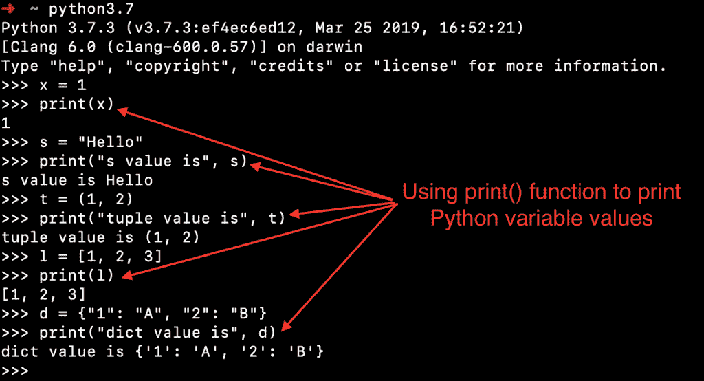
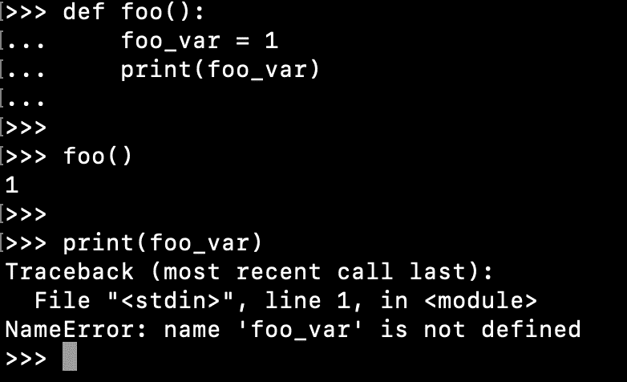
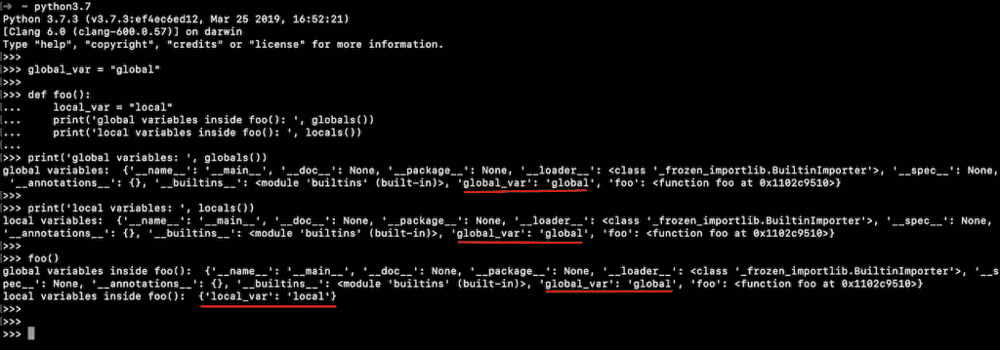

# Python 变量

> 原文：<https://www.askpython.com/python/python-variables>

Python 中的变量是一个 [**标识符**](https://www.askpython.com/python/python-identifiers-rules-best-practices) 来引用程序中的一个值。变量包含对象的内存位置。它们允许 python 程序访问其他对象，并调用它们的函数或执行其他操作。

* * *

## 在 Python 中定义变量的规则

定义 python 变量有一些规则。

1.  Python 变量名可以包含小写字母(a-z)、大写字母(A-Z)、数字(0-9)和下划线(_)。
2.  变量名不能以数字开头。
3.  我们不能使用保留的 [**关键字**](https://www.askpython.com/python/python-keywords) 作为变量名。
4.  Python 变量不能只包含数字。
5.  python 变量名可以以下划线或字母开头。
6.  变量名区分大小写。
7.  变量名的长度没有限制。

* * *

## 有效的 Python 变量示例

*   **abc**
*   **_** :是的，我们可以创建一个下划线的变量名。
*   **__** :是的，多个下划线也是一个有效的变量名。
*   **x_yAB**
*   **_abc**

* * *

## 无效的 Python 变量示例

*   **9abc** :变量名不能以数字开头。
*   **123** :变量名不能只包含数字。
*   **x-y** :变量名中唯一允许的特殊字符是下划线。
*   **def** :变量名无效，因为它是保留关键字。

* * *

## 如何在 Python 中声明变量？

Python 是一种动态类型语言。在声明变量时，我们不需要指定变量的类型。变量用等号定义。左边部分包含变量名，右边部分包含变量值。

让我们看一些用 Python 声明变量的例子。

```py
x = 1  # number
s = "Hello"  # string
t = (1, 2)  # tuple
l = [1, 2, 3]  # list
d = {"1": "A", "2": "B"}  # dictionary

```

## 变量的多重赋值

Python 也支持多重赋值。我们可以使用多重赋值一次定义多个变量。

```py
a = b = c = 100
print(a, b, c)  # 100 100 100

```

我们也可以将一个序列赋给一个变量列表。在这种情况下，序列中元素的数量必须等于变量的数量。

```py
a, b, c = 1, 2, "Hello"
print(a, b, c)  # 1 2 Hello

a, b, c = (1, 2, 3)
print(a, b, c)  # 1 2 3

a, b, c = [1, 2, 3]
print(a, b, c)  # 1 2 3

a, b, c = "098"
print(a, b, c)  # 0 9 8

```

让我们看看当变量的数量和序列中元素的数量不相等时会发生什么。

```py
>>> a,b = (1,2,3)
Traceback (most recent call last):
  File "<stdin>", line 1, in <module>
ValueError: too many values to unpack (expected 2)
>>> 
>>> a,b,c,d = (1,2,3)
Traceback (most recent call last):
  File "<stdin>", line 1, in <module>
ValueError: not enough values to unpack (expected 4, got 3)
>>> 

```

* * *

## 如何在 Python 中打印一个变量值？

我们可以使用 [python print()函数](https://www.askpython.com/python/built-in-methods/python-print-function)来打印变量值。让我们看一些用 Python 打印变量值的例子。

```py
x = 1  # number
print(x)
s = "Hello"  # string
print("s value is", s)
t = (1, 2)  # tuple
print("tuple value is", t)
l = [1, 2, 3]  # list
print(l)
d = {"1": "A", "2": "B"}  # dictionary
print("dict value is", d)

```



How to Print Python Variable Value

Python 程序是顺序执行的。所以如果你试图在变量定义之前访问它，你会得到`NameError`。

```py
print(count)  # NameError: name 'count' is not defined

count = 100

print(count)  # 100

```

* * *

## Python 变量命名约定的最佳实践

如果你看看上面的代码片段，变量名是随机的。它们没有传达变量的含义。在 Python 中命名变量时，有一些最佳实践可以遵循。

1.  变量名只能使用小写字母、数字和下划线。
2.  如果变量名有多个单词，可以用下划线将它们分开。
3.  如果变量作用域是私有的，那么你可以用下划线开始它的名字。
4.  您应该避免变量名以下划线开头和结尾。它们通常由 Python 内置程序使用。
5.  始终为变量使用有意义的名称。它应该传达数据的类型和变量的预期用途。
6.  变量名长度没有限制。但是，有一个小而有意义的名字是好的。

基于上面的最佳实践，我们可以更改上面的代码片段，使其具有正确的变量名。

```py
count = 1
str_message = "Hello"
tuple_ints = (1, 2)
list_of_numbers = [1, 2, 3]
numbers_letters_dict = {"1": "A", "2": "B"}

```

* * *

## 如何打印变量的类型？

我们不指定 Python 程序中变量的类型。我们可以用 [`type()`函数](https://www.askpython.com/python/built-in-methods/python-type-function)来确定变量的类型。让我们看一些打印变量类型的例子。

```py
count = 1  # number
print(type(count))
str_message = "Hello"  # string
print("str_message type is", type(str_message))
tuple_ints = (1, 2)  # tuple
print("tuple_ints type is", type(tuple_ints))
list_of_numbers = [1, 2, 3]  # list
print(type(list_of_numbers))
numbers_letters_dict = {"1": "A", "2": "B"}  # dictionary
print("numbers_letters_dict type is", type(numbers_letters_dict))

```

**输出:**

```py
<class 'int'>
str_message type is <class 'str'>
tuple_ints type is <class 'tuple'>
<class 'list'>
numbers_letters_dict type is <class 'dict'>

```

* * *

## Python 中有哪些不同类型的变量

变量的类型是其值的数据类型。Python 是一种面向对象的编程语言。Python 中的一切都是对象。因此，python 变量总是一个类的实例。

*   **x = 1** :这里变量‘x’的类型是‘int’。它引用了 int 类的一个实例。
*   **message = "Hello"** :消息变量的类型为' str '。

* * *

## Python 中的变量范围

变量作用域定义了程序中变量的可访问区域。Python 变量有两个范围。

1.  局部范围
2.  全球范围

* * *

### Python 中的局部变量

当一个变量被定义在一个函数或类中时，它只能在函数或类中被访问。它们被称为局部变量，它们的作用域仅限于函数或类的边界。

如果我们试图访问一个超出其作用域的局部变量，我们会得到`NameError`这个变量没有被定义。

让我们用一些例子来理解 python 的局部变量的思想。

```py
def foo():
    foo_var = 1
    print(foo_var)

foo()
print(foo_var)

```



Python Local Variable Scope

*   `foo()`函数内的`print()`能够访问`foo_var`,因为它在它的作用域内。
*   `foo()`函数外的`print()`不能访问`foo_var`，因为它超出了变量的范围。

让我们看另一个在类内部定义局部变量的例子。变量 scope 是这个场景的类。

```py
class Foo:
    class_foo_var = 1

print(class_foo_var)

```

**输出** : `NameError: name 'class_foo_var' is not defined`

* * *

### Python 全局变量

当变量不在函数或类中时，可以从程序的任何地方访问它。这些变量被称为全局变量。让我们看看 Python 全局变量的例子。

```py
global_msg = "Hello"

def foo():
    print(global_msg)  # global variables are accessible inside a function

class Foo:
    print(global_msg)  # global variables are accessible inside a class

if 5 < 10:
    print(global_msg)  # global variables are accessible inside a code block

```

代码块中定义的变量，如 if-else、for 循环、while 循环、try-except 等。被添加到全局范围，前提是声明该变量的代码已经执行。我们用一个简单的例子来理解这一点。

```py
>>> if True:
...     var_if = "if"
... else:
...     var_else = "else"
... 
>>> 
>>> print(var_if)
if
>>> print(var_else)
Traceback (most recent call last):
  File "<stdin>", line 1, in <module>
NameError: name 'var_else' is not defined
>>> 

```

未定义 var_else，因为 else 块中的代码未执行。

让我们来看看另一个带有 [try-except 块](https://www.askpython.com/python/python-exception-handling)的例子。

```py
>>> try:
...     var_try = "try"
...     raise TypeError('explicitly throwing')
... except:
...     var_except = "except"
... 
>>> print(var_try)
try
>>> print(var_except)
except
>>> 

```

我们能够访问 try-except 块中定义的变量，因为它们都被执行了。

* * *

## 在 Python 中删除变量

我们可以使用`del`语句删除一个变量。让我们看一个删除 python 变量的简单例子。

```py
>>> count = 100
>>> print(count)
100
>>> del count
>>> 
>>> print(count)
Traceback (most recent call last):
  File "<stdin>", line 1, in <module>
NameError: name 'count' is not defined
>>> 

```

* * *

## Python 静态变量

类中定义的变量可以用类名来访问。它们也被称为静态变量，因为它们属于类。

```py
class Data:
    id = 0

print(Data.id)  # static access

```

这些变量也可以从类对象中访问。但是，建议使用类静态访问。

```py
d1 = Data()

print(d1.id)  # class variable accessed from object

```

## Python 私有变量

Python 编程中没有私有变量的概念。所以，如果你希望一个变量被视为私有的，有一个惯例是以下划线开始名字。这向其他开发人员暗示，这个变量不应该被使用，它可以在将来的任何时候改变它的行为。

* * *

## 快速了解全局()和局部()函数

*   函数的作用是:返回当前作用域全局变量的字典。
*   Python locals()函数返回当前作用域局部变量的字典。

我们可以在任何代码位置使用这些函数来检查一个变量在那个位置是否可访问。它们是 Python 中的内置函数。

让我们看看这些函数的一些快速示例。

```py
global_var = "global"

def foo():
    local_var = "local"
    print('global variables inside foo(): ', globals())
    print('local variables inside foo(): ', locals())

print('global variables: ', globals())
print('local variables: ', locals())
foo()

```

**输出:**

```py
global variables:  {'__name__': '__main__', '__doc__': None, '__package__': None, '__loader__': <_frozen_importlib_external.SourceFileLoader object at 0x1006305f8>, '__spec__': None, '__annotations__': {}, '__builtins__': <module 'builtins' (built-in)>, '__file__': '/Users/pankaj/Documents/PycharmProjects/PythonTutorialPro/hello-world/hello_world.py', '__cached__': None, 'global_var': 'global', 'foo': <function foo at 0x1006817b8>}
local variables:  {'__name__': '__main__', '__doc__': None, '__package__': None, '__loader__': <_frozen_importlib_external.SourceFileLoader object at 0x1006305f8>, '__spec__': None, '__annotations__': {}, '__builtins__': <module 'builtins' (built-in)>, '__file__': '/Users/pankaj/Documents/PycharmProjects/PythonTutorialPro/hello-world/hello_world.py', '__cached__': None, 'global_var': 'global', 'foo': <function foo at 0x1006817b8>}
global variables inside foo():  {'__name__': '__main__', '__doc__': None, '__package__': None, '__loader__': <_frozen_importlib_external.SourceFileLoader object at 0x1006305f8>, '__spec__': None, '__annotations__': {}, '__builtins__': <module 'builtins' (built-in)>, '__file__': '/Users/pankaj/Documents/PycharmProjects/PythonTutorialPro/hello-world/hello_world.py', '__cached__': None, 'global_var': 'global', 'foo': <function foo at 0x1006817b8>}
local variables inside foo():  {'local_var': 'local'}

```



Python Global and Local Variables

* * *

## Python 全局关键字

我们可以在函数内部访问一个全局变量。但是我们不能修改它。我们必须使用`global`关键字来改变函数内部的全局变量值。让我们用一个简单的例子来理解这种行为。

```py
name = "Python"

def foo():
    print(name)

foo()
print(name)

# Output
# Python
# Python

```

让我们看看当我们试图修改函数内部的全局变量值时会发生什么。

```py
>>> name = "Python"
>>> def foo():
...     print(name)
...     name = "Java"
... 
>>> 
>>> foo()
Traceback (most recent call last):
  File "<stdin>", line 1, in <module>
  File "<stdin>", line 2, in foo
UnboundLocalError: local variable 'name' referenced before assignment
>>> 
>>> print(name)
Python
>>> 

```

原因很简单。当我们使用赋值操作符来改变“name”的值时，它开始被当作一个局部变量。所以在 print()函数中访问它会抛出一个错误，因为它当时没有被定义。

让我们使用 global 关键字来修改全局变量值。

```py
>>> name = "Python"
>>> 
>>> def foo():
...     global name
...     print(name)
...     name = "Java"
... 
>>> print(name)
Python
>>> foo()
Python
>>> print(name)
Java
>>> 

```

* * *

## Python 非本地关键字

nonlocal 关键字用于访问在块范围之外定义的变量。这在嵌套函数中总是用来访问外部定义的变量。变量总是在最近的封闭范围内搜索，不包括全局变量。

```py
def outer_function():
    scope = "local"

    def inner_function():
        nonlocal scope
        scope = "nonlocal"
        print(scope)

    inner_function()
    print(scope)

```

* * *

## 摘要

每个程序中都要用到变量。它们是一种标识符。我们学习了如何定义一个变量，与它相关的规则，以及如何访问和删除它们。我们还学习了变量作用域——全局和局部。

## 下一步是什么？

*   [Python 函数](https://www.askpython.com/python/python-functions)
*   [Python 中的数据类型](https://www.askpython.com/python/python-data-types)
*   [Python 列表](https://www.askpython.com/python/list/python-list)
*   [Python 中的环境变量](https://www.askpython.com/python/environment-variables-in-python)
*   [Python 中的 OOPS](https://www.askpython.com/python/oops/object-oriented-programming-python)

## 资源

*   [Python 类实例变量](https://docs.python.org/3/tutorial/classes.html#class-and-instance-variables)
*   [Python 私有变量](https://docs.python.org/3/tutorial/classes.html#private-variables)