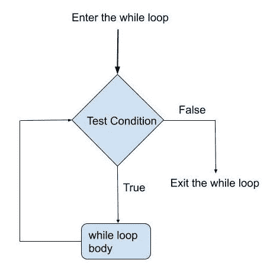
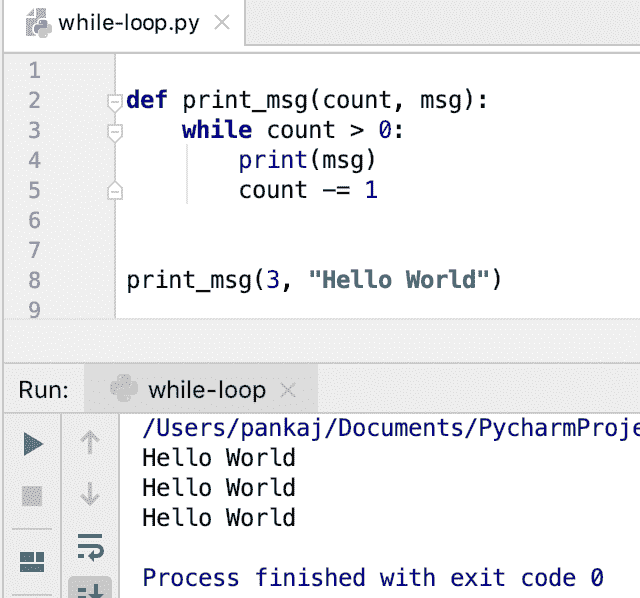
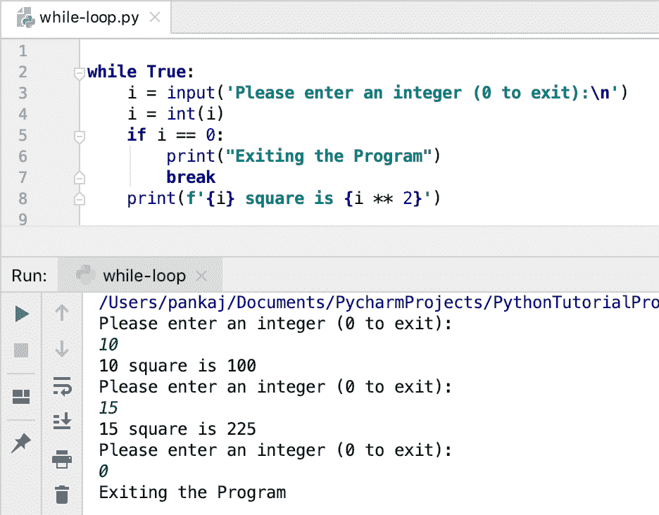
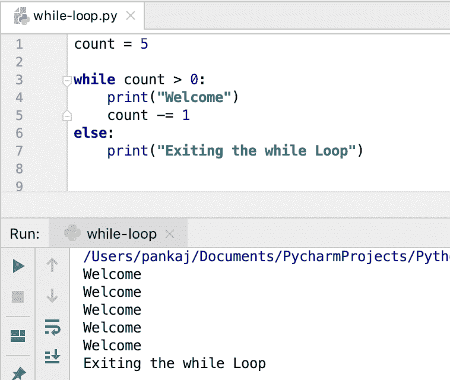
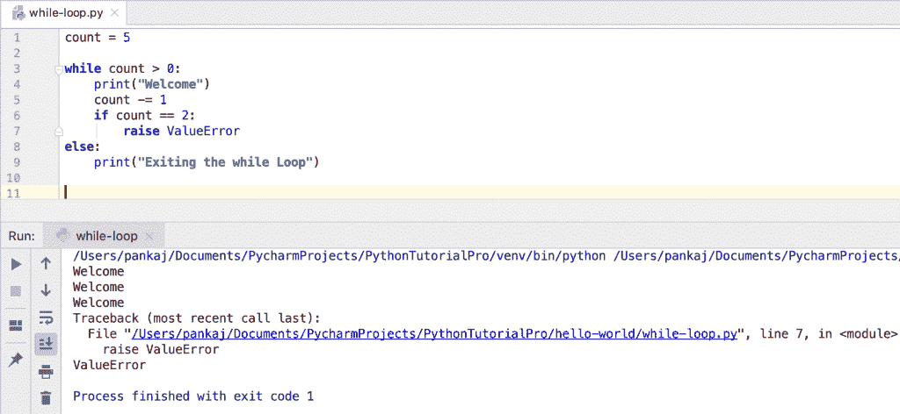

# Python while 循环

> 原文：<https://www.askpython.com/python/python-while-loop>

*   Python while 循环用于重复一段代码，直到指定的条件为**假**。
*   当我们不知道代码块必须执行的次数时，就使用 while 循环。
*   我们应该在编写 while 循环条件时小心谨慎。如果条件从不返回 False，while 循环将进入无限循环。
*   **Python 中的每个对象都有一个布尔值**。如果值为 0 或无，则布尔值为假。否则，布尔值为真。
*   我们可以通过实现`__bool__()`函数来定义一个对象布尔值。
*   我们使用[保留关键字](https://www.askpython.com/python/python-keywords)–**while**–来实现 Python 中的 while 循环。
*   我们可以使用 **break 语句**终止 while 循环。
*   我们可以在 while 循环中使用 continue 语句来跳过代码块的执行。
*   Python 支持嵌套的 while 循环。

* * *

## Python while 循环语法

```py
while condition:
    # while block code

```

* * *

## while 循环的流程图



while Loop Flow Diagram

* * *

## Python while 循环示例

假设我们必须打印给定次数的消息。我们可以使用 while 循环来编写这个实用程序 [**函数**](https://www.askpython.com/python/python-functions) 。

```py
def print_msg(count, msg):
    while count > 0:
        print(msg)
        count -= 1

print_msg(3, "Hello World")

```

**输出:**



Python while Loop Example

* * *

## 带有 break 语句的 while 循环

有时我们明确地想要无限期地执行一个代码块，直到收到退出信号。我们可以使用“while True”block 和 break 语句来实现这个特性。

下面是一个实用程序脚本的例子，它接受用户输入(整数)并打印其平方值。当用户输入 0 时，程序终止。

```py
while True:
    i = input('Please enter an integer (0 to exit):\n')
    i = int(i)
    if i == 0:
        print("Exiting the Program")
        break
    print(f'{i} square is {i ** 2}')

```

下面是这个程序的示例运行的输出。



Python while Loop with break Statement

* * *

## 使用 continue 语句的 Python while 循环

假设我们希望上面的脚本只处理正数。在这种情况下，当用户输入负数时，我们可以使用 continue 语句跳过执行。

```py
while True:
    i = input('Please enter an integer (0 to exit):\n')
    i = int(i)
    if i < 0:
        print("The program works with Positive Integers only.")
        continue
    if i == 0:
        print("Exiting the Program")
        break
    print(f'{i} square is {i ** 2}')

```

输出:

```py
Please enter an integer (0 to exit):
5
5 square is 25
Please enter an integer (0 to exit):
-10
The program works with Positive Integers only.
Please enter an integer (0 to exit):
0
Exiting the Program

```

* * *

## 使用 else 语句的 Python while 循环

我们可以在 while 循环中使用 else 块。当 while 循环正常终止，即条件变为 False 时，else 块代码将被执行。

如果 while 循环由于 Error 或 break 语句而终止，则不会执行 else 块代码。

```py
count = 5

while count > 0:
    print("Welcome")
    count -= 1
else:
    print("Exiting the while Loop")

```

**输出:**



Python While Loop With Else Block

让我们看看当 while 循环由于错误而终止时会发生什么。

```py
count = 5

while count > 0:
    print("Welcome")
    count -= 1
    if count == 2:
        raise ValueError
else:
    print("Exiting the while Loop")

```

**输出:**

```py
Welcome
Welcome
Welcome
Traceback (most recent call last):
  File "/Users/pankaj/Documents/PycharmProjects/PythonTutorialPro/hello-world/while-loop.py", line 7, in <module>
    raise ValueError
ValueError

```



While Loop Else with Error

让我们更改程序以跳出 while 循环。

```py
count = 5

while count > 0:
    print("Welcome")
    count -= 1
    if count == 2:
        break
else:
    print("Exiting the while Loop")

```

输出:

```py
Welcome
Welcome
Welcome

```

* * *

## 嵌套 while 循环示例

我们也可以嵌套 while 循环。下面是一个使用嵌套 while 循环生成元组列表的示例。

```py
i = 3
j = 3

list_tuples = []
while i > 0:
    while j > 0:
        t = (i, j)
        list_tuples.append(t)
        j -= 1
    j = 3
    i -= 1

print(list_tuples)

```

**输出** : `[(3, 3), (3, 2), (3, 1), (2, 3), (2, 2), (2, 1), (1, 3), (1, 2), (1, 1)]`

* * *

## 结论

Python while 循环用于运行特定次数的代码块。我们可以在 while 循环中使用 break 和 continue 语句。当 while 循环正常终止时，将执行带有 while 循环的 else 块。while 循环在无限循环中无限期运行脚本时也很有用。