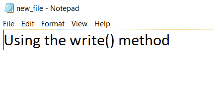

# Python 写文件

> 原文：<https://www.askpython.com/python/built-in-methods/python-write-file>

我们之前已经看到如何用 Python 从文件中读取 [**。类似的**写文件**也可以在 **Python** 编程中实现。但是，在我们开始写入文件之前，我们必须确保打开文件的**模式**允许这样做。让我们来看看使用哪些模式我们可以实际写入一个文件。**](https://www.askpython.com/python/built-in-methods/python-read-file)

*   `w`–打开文件进行写入，如果文件不存在，则创建一个文件。
*   `w+`–打开文件进行读写，
*   `a`–打开文件进行追加。数据被附加到文件的末尾，
*   `x`–以写入和读取模式创建新文件，
*   `r+`–打开文件进行读写。

现在，让我们看看如何使用不同的方法在 Python 中写入文件。

## 1.Python 使用 Write()函数写文件

使用`write()`函数，我们实际上可以直接将一个**字符串**(作为参数传递)写到一个文件中。

```py
file = open("new_file.txt", "w+")
file.write('Using the write() method')
file.seek(0)
print(file.read())

```

**输出:**

```py
Using the write() method

```



Output: new_file.txt is created

## 2.在 Python 中使用 writelines()

`writelines()`是 Python 中另一个**预定义的**方法，用于将**多行**写入一个特定的文件，并以一个字符串元素的**列表作为参数传递。**

**list1=['字符串 1 '，'字符串 2 '，……，'字符串 n ']**

**file _ open _ object . writelines(list 1)**

```py
list1=['Python\n','C\n','C++\n','Java']
file=open("new_file.txt", "w+")
file.writelines(list1)
file.seek(0)
print(file.read())

```

**输出:**

```py
Python
C
C++
Java

```

## **参考文献:**

*   [Python–打印到文件](https://www.askpython.com/python/built-in-methods/python-print-to-file)
*   [https://stack overflow . com/questions/40474139/python-write-text-to-file-by-line](https://stackoverflow.com/questions/40474139/write-text-to-file-line-by-line)