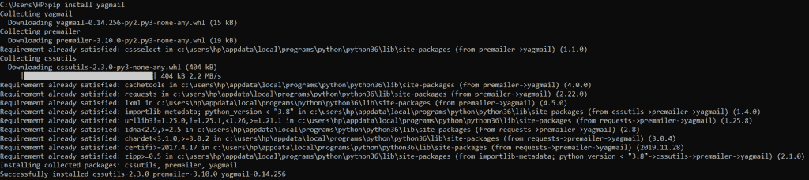

# Python Yagmail 模块——发送电子邮件的简单方法！

> 原文：<https://www.askpython.com/python/examples/python-yagmail-module>

读者朋友们，你们好！本文主要关注 Python Yagmail 的**实现，以便从我们的应用程序发送电子邮件。**

所以，让我们开始吧！！🙂

* * *

## Python Yagmail 模块是什么？

在目前的情况下，几乎每个企业都有一个在线设置。也就是说，他们有一个更好的销售和市场接触的在线存在。

网站收集的常见数据参数之一是客户的电子邮件地址。我们经常被要求使用我们的电子邮件地址注册网站/门户。

我们的电子邮箱里会收到广告，甚至是促销信息。他们不需要手动输入并向所有客户发送电子邮件。这意味着，以某种自动化的方式，通过门户/应用程序发送电子邮件的过程发生了。

这就是 Python Yagmail 模块出现的原因。使用 Python Yagmail 模块，我们可以通过集成了电子邮件模块的应用程序向客户发送电子邮件。

它利用简单的 Gmail，即 SMTP 客户端，以自动化和用户友好的方式发送电子邮件。我们只需要提供更少的细节，如电子邮件地址、邮件正文等。

该模块可以集成为任何零售或在线应用程序/门户的一部分，这可能是该模块的最佳使用案例。🙂

现在让我们来关注一下实现 Yagmail 模块的步骤！

* * *

## 使用 Python Yagmail 模块发送电子邮件的步骤

首先，我们需要在我们的工作站上安装 Python Yagmail 模块。

使用 [pip 命令](https://www.askpython.com/python-modules/python-pip)安装 Yagmail 模块:

```py
pip install yagmail

```



**Python Yagmail module – Installation**

安装后，我们必须将模块安装到我们当前的 python 环境中。

```py
import yagmail

```

一旦导入，我们需要向 Yagmail 模块提供一个帐户，用于验证和发送电子邮件给接收者。也就是说，我们向模块注册了一个用户。通过注册一个电子邮件地址，它使得该模块可以很容易地访问 SMTP 服务器来发送电子邮件。

**语法:**

```py
yagmail.register('username', 'password')

```

*   如果我们不希望将密码等敏感数据作为参数，我们也可以创建一个. yagmail 文件，将您的敏感数据放入该文件，而不是直接将其作为参数公开。

既然我们已经注册了用户，现在是时候与 SMTP 客户机建立安全连接了。

我们可以使用下面的自定义命令-

```py
yagmail.SMTP('username', receiver1, receiver2, subject, body)

```

*   用户名:发件人的电子邮件地址
*   receiver:这包含了接收者的电子邮件地址。我们可以在这里添加多个收件人电子邮件地址。
*   主题:电子邮件的简洁标题
*   正文:电子邮件的内容

如果我们没有指定收件人的电子邮件地址，它会将电子邮件发送到发件人的地址。

一旦内容准备好了，我们就继续将内容发送到收件人的电子邮件地址。

为此，Yagmail 为我们提供了 send()函数。在这里，我们将所有内容、收件人的详细信息以及主题和正文打包在一起。

```py
yagmail.send(to = [receiver1, receiver2, etc], subject=subject, contents=body)

```

贴出这个，我们只需要看着代码为你工作！！

## 通过 Python Yagmail 发送电子邮件

下面是 Python yagmail 模块的完整实现。您可以复制粘贴以下代码，在您的系统上尝试一下。确保您为计划使用的任何电子邮件地址启用了 SMTP 访问。大多数电子邮件提供商默认情况下会阻止 SMTP 访问，以防止未经授权的应用程序滥用。

```py
import yagmail

yag_mail = yagmail.SMTP(user='[email protected]', password='password', host='smtp.gmail.com')

to= "[email protected]"
subject = "Welcome to Journaldev!!"
body = ["World of infinite knowledge"]

yag_mail.send(to=to, subject=subject, contents=body)
print("Email has been sent successfully to the receiver's address.")

```

* * *

## 结论

到此为止，我们已经结束了这个话题。如果你遇到任何问题，欢迎在下面评论。

更多与 Python 编程相关的帖子，请继续关注我们。

在那之前，学习愉快！！🙂