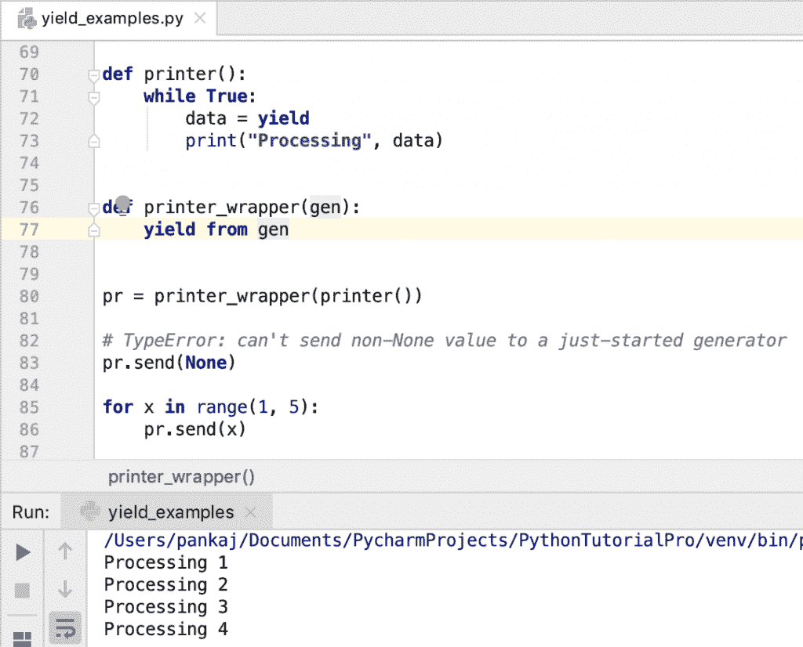

# python yield–生成器函数真实例子

> 原文：<https://www.askpython.com/python/python-yield-examples>

*   Python yield 关键字用于创建一个生成器[函数](https://www.askpython.com/python/python-functions)。
*   yield [关键字](https://www.askpython.com/python/python-keywords)只能在函数体内使用。
*   当函数包含 yield 表达式时，它会自动成为生成器函数。
*   生成器函数返回一个称为生成器的迭代器。
*   生成器控制生成器功能的执行。
*   当第一次调用 generator next()时，生成器函数开始执行。
*   当为生成器调用 next()方法时，它执行生成器函数来获取下一个值。该函数从它停止的地方执行，并且不执行完整的函数代码。
*   生成器在内部维护函数及其变量的当前状态，以便正确检索下一个值。
*   一般我们用 [for-loop](https://www.askpython.com/python/python-for-loop) 从生成器函数中提取所有的值，然后逐个处理。
*   当函数返回大量数据时，生成器函数非常有用。我们可以用 yield 表达式只得到有限的一组数据，然后进行处理，再得到下一组数据。

* * *

## Python 收益与回报

*   [返回语句](https://www.askpython.com/python/python-return-statement)返回函数的值，然后函数终止。yield 表达式将函数转换成一个生成器，以逐个返回值。
*   当我们必须返回大量数据时，Python return 语句并不合适。在这种情况下，yield 表达式对于仅返回部分数据和节省内存非常有用。

* * *

## Python yield 示例

假设我们有一个返回随机数列表的函数。

```py
from random import randint

def get_random_ints(count, begin, end):
    print("get_random_ints start")
    list_numbers = []
    for x in range(0, count):
        list_numbers.append(randint(begin, end))
    print("get_random_ints end")
    return list_numbers

print(type(get_random_ints))
nums = get_random_ints(10, 0, 100)
print(nums)

```

**输出:**

```py
<class 'function'>
get_random_ints start
get_random_ints end
[4, 84, 27, 95, 76, 82, 73, 97, 19, 90]

```

当“计数”值不太大时，它工作得很好。如果我们指定 count 为 100000，那么我们的函数将使用大量内存来存储列表中的那么多值。

在这种情况下，使用 yield 关键字创建一个生成器函数是有益的。让我们将函数转换为生成器函数，并使用生成器迭代器逐个检索值。

```py
def get_random_ints(count, begin, end):
    print("get_random_ints start")
    for x in range(0, count):
        yield randint(begin, end)
    print("get_random_ints end")

nums_generator = get_random_ints(10, 0, 100)
print(type(nums_generator))
for i in nums_generator:
    print(i)

```

**输出:**

```py
<class 'generator'>
get_random_ints start
70
15
86
8
79
36
37
79
40
78
get_random_ints end

```

*   请注意，nums_generator 的类型是 generator。
*   当从生成器中检索第一个元素时，第一个 print 语句只执行一次。
*   一旦生成器函数生成了所有的项，就执行生成器函数中剩余的代码。这就是为什么第二个 print 语句只打印一次，而且是在 for 循环的末尾。

* * *

## Python 生成器函数真实世界示例

使用生成器功能的一个最流行的例子是读取一个大的文本文件。对于这个例子，我创建了两个 python 脚本。

1.  第一个脚本将所有文件行读入一个列表，然后返回它。然后，我们将所有行打印到控制台。
2.  第二个脚本使用 yield 关键字一次读取一行，并将其返回给调用者。然后打印到控制台上。

我使用 Python 资源模块来打印两个脚本的内存和时间使用情况。

**read_file.py**

```py
import resource
import sys

def read_file(file_name):
    text_file = open(file_name, 'r')
    line_list = text_file.readlines()
    text_file.close()
    return line_list

file_lines = read_file(sys.argv[1])

print(type(file_lines))

print(len(file_lines))

for line in file_lines:
    print(line)

print('Peak Memory Usage =', resource.getrusage(resource.RUSAGE_SELF).ru_maxrss)
print('User Mode Time =', resource.getrusage(resource.RUSAGE_SELF).ru_utime)
print('System Mode Time =', resource.getrusage(resource.RUSAGE_SELF).ru_stime)

```

**读取文件产量. py**

```py
import resource
import sys

def read_file_yield(file_name):
    text_file = open(file_name, 'r')
    while True:
        line_data = text_file.readline()
        if not line_data:
            text_file.close()
            break
        yield line_data

file_data = read_file_yield(sys.argv[1])
print(type(file_data))

for l in file_data:
    print(l)

print('Peak Memory Usage =', resource.getrusage(resource.RUSAGE_SELF).ru_maxrss)
print('User Mode Time =', resource.getrusage(resource.RUSAGE_SELF).ru_utime)
print('System Mode Time =', resource.getrusage(resource.RUSAGE_SELF).ru_stime)

```

我有四个不同大小的文本文件。

```py
~ du -sh abc.txt abcd.txt abcde.txt abcdef.txt 
4.0K	abc.txt
324K	abcd.txt
 26M	abcde.txt
263M	abcdef.txt
~

```

以下是我为不同文件运行这两个脚本时的统计数据。

```py
~ python3.7 read_file.py abc.txt
Peak Memory Usage = 5558272
User Mode Time = 0.014006
System Mode Time = 0.008631999999999999

~ python3.7 read_file.py abcd.txt
Peak Memory Usage = 10469376
User Mode Time = 0.202557
System Mode Time = 0.076196

~ python3.7 read_file.py abcde.txt
Peak Memory Usage = 411889664
User Mode Time = 19.722828
System Mode Time = 7.307018

~ python3.7 read_file.py abcdef.txt
Peak Memory Usage = 3917922304
User Mode Time = 200.776204
System Mode Time = 72.781552

~ python3.7 read_file_yield.py abc.txt 
Peak Memory Usage = 5689344
User Mode Time = 0.01639
System Mode Time = 0.010232999999999999

~ python3.7 read_file_yield.py abcd.txt
Peak Memory Usage = 5648384
User Mode Time = 0.233267
System Mode Time = 0.082106

~ python3.7 read_file_yield.py abcde.txt
Peak Memory Usage = 5783552
User Mode Time = 22.149525
System Mode Time = 7.461281

~ python3.7 read_file_yield.py abcdef.txt
Peak Memory Usage = 5816320
User Mode Time = 218.961491
System Mode Time = 74.030242

```

下面是表格形式的数据，以便更好地理解。

| 文件大小 | 返回语句 | 发电机功能 |
| 4 KB | 内存:5.3 兆，时间:0.023 秒 | 内存:5.42 兆，时间:0.027 秒 |
| 324 KB | 内存:9.98 兆，时间:0.028 秒 | 内存:5.37 MB，时间:0.32 秒 |
| 26 兆字节 | 内存:392.8 兆，时间:27.03 秒 | 内存:5.52 兆，时间:29.61 秒 |
| 263 兆字节 | 内存:3.65 GB，时间:273.56 秒 | 内存:5.55 兆，时间:292.99 秒 |

所以生成器函数比 return 语句花费的时间稍微多一点。这很明显，因为它必须跟踪每次迭代器 next()调用中的函数状态。

但是，使用 yield 关键字对内存的好处是巨大的。使用 return 语句时，内存使用量与文件大小成正比。对于发生器函数，它几乎是常数。

**注**:这里的例子是为了说明当函数产生大量数据时使用 yield 关键字的好处。Python 文件已经有了一个内置的函数 readline()，用于逐行读取文件数据，这个函数内存效率高，速度快，使用简单。

* * *

## Python yield 发送示例

在前面的例子中，生成器函数向调用者发送值。我们还可以使用 send()函数向生成器函数发送值。

当调用 send()函数来启动生成器时，必须使用 None 作为参数来调用它，因为没有 yield 表达式可以接收该值。否则，我们将得到 ***类型错误:不能发送非 None 值到一个刚刚启动的生成器*** 。

```py
def processor():
    while True:
        value = yield
        print(f'Processing {value}')

data_processor = processor()

print(type(data_processor))

data_processor.send(None)

for x in range(1, 5):
    data_processor.send(x)

```

输出:

```py
<class 'generator'>
Processing 1
Processing 2
Processing 3
Processing 4

```

* * *

## Python 从示例中产生

“从表达式产生”用于从给定的表达式创建子迭代器。子迭代器产生的所有值都直接传递给调用程序。假设我们想为 get_random_ints()函数创建一个包装器。

```py
def get_random_ints(count, begin, end):
    print("get_random_ints start")
    for x in range(0, count):
        yield randint(begin, end)
    print("get_random_ints end")

def generate_ints(gen):
    for x in gen:
        yield x

```

我们可以在 generate_ints()函数中使用“yield from”来创建调用程序和子迭代器之间的双向连接。

```py
def generate_ints(gen):
    yield from gen

```

当我们必须向生成器函数发送数据时,“yield from”的实际好处是显而易见的。让我们看一个例子，在这个例子中，生成器函数从调用者那里接收数据，并将其发送给子迭代器进行处理。

```py
def printer():
    while True:
        data = yield
        print("Processing", data)

def printer_wrapper(gen):
    # Below code to avoid TypeError: can't send non-None value to a just-started generator
    gen.send(None)
    while True:
        x = yield
        gen.send(x)

pr = printer_wrapper(printer())

# Below code to avoid TypeError: can't send non-None value to a just-started generator
pr.send(None)

for x in range(1, 5):
    pr.send(x)

```

**输出:**

```py
Processing 1
Processing 2
Processing 3
Processing 4

```

创建包装函数需要很多代码。我们可以在这里简单地使用“yield from”来创建包装函数，结果将保持不变。

```py
def printer_wrapper(gen):
    yield from gen

```



* * *

## 结论

Python yield 关键字创建一个生成器函数。当函数通过将数据分成多个块来返回大量数据时，这很有用。我们还可以使用 send()函数向生成器发送值。“yield from”语句用于从生成器函数创建子迭代器。

## 参考资料:

*   [Python.org 屈服表情](https://docs.python.org/3/reference/expressions.html#yieldexpr)
*   [StackOverflow 来自问题](https://stackoverflow.com/questions/9708902/in-practice-what-are-the-main-uses-for-the-yield-from-syntax-in-python-3-3)的产量