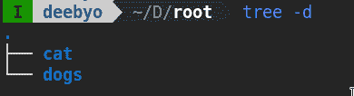

# 在 PyTorch 中创建自定义数据集

> 原文：<https://www.askpython.com/python-modules/pytorch-custom-datasets>

在本文中，我们将学习为 PyTorch 创建自定义数据集。

> 在机器学习中，模型和训练它的数据一样好。

有许多预先构建的标准数据集，如 [MNIST](https://www.askpython.com/python/examples/load-and-plot-mnist-dataset-in-python) 、CIFAR 和 ImageNet，用于初学者教学或基准测试。但是这些预定义的数据集并不多，如果你正在处理一个相对较新的问题，你可能没有预定义的数据集，你需要使用自己的数据集进行训练。

在本教程中，我们将了解一些使用 PyTorch 从自定义数据中提取的初级数据集。

## 了解 PyTorch 数据集和数据加载器类

用于处理数据样本的代码可能会变得混乱，难以维护；理想情况下，我们希望数据集代码与模型训练代码分离，以获得更好的可读性和模块化。

PyTorch 提供了两个数据原语:`torch.utils.data.DataLoader` 和`torch.utils.data.Dataset`，它们允许您使用预加载的数据集以及您自己的数据。`Dataset`存储样品及其相应的标签，`DataLoader`在`Dataset`周围包裹一个可重复标签，以便于获取样品。

因此，Dataset 是负责将数据从磁盘加载到计算机可读形式的类。它使用一种懒惰的方式来加载内存-它只在数据加载器或用户需要将数据从磁盘加载到内存时才加载内存。这是存储器有效的，因为所有的图像不是一次存储在存储器中，而是根据需要读取。

torch 数据集类是表示数据集的抽象类。为了创建自定义数据集，我们可以从这个抽象类继承。但是一定要定义两个非常重要的功能:

*   `__len__`以便`len(dataset)`返回数据集的大小。
*   `__getitem__`支持索引，以便`dataset[i]`可用于获取第 i *i* 个样本。

数据加载器只是调用这些方法来加载内存。在本文中，我们将只关注自定义数据集的创建。数据加载器也可以进行很大程度的扩展，但这超出了本文的范围。

既然我们已经学习了`DataLoader`和`Dataset`的基本功能，我们将看看现实生活中的一些例子。

## 从未标记的图像加载自定义数据集

这是一个相对简单的例子，将一个文件夹中的所有图像加载到一个数据集中，用于 [GAN 训练](https://www.askpython.com/python-modules/training-gan-in-pytorch)。所有的数据都来自同一个类，所以你现在不需要关心标签。

### 1.初始化自定义数据集类

```py
# Imports
import os
from PIL import Image
from torch.utils.data import Dataset
from natsort import natsorted
from torchvision import datasets, transforms

# Define your own class LoadFromFolder
class LoadFromFolder(Dataset):
    def __init__(self, main_dir, transform):

        # Set the loading directory
        self.main_dir = main_dir
        self.transform = transform

        # List all images in folder and count them
        all_imgs = os.listdir(main_dir)
        self.total_imgs = natsorted(all_imgs)

```

现在我们需要为自定义数据集定义两个专门的函数。

### 2.定义 __len__ 函数

该函数将允许我们识别已经从我们的定制数据集中成功加载的项目的数量。

```py
    def __len__(self):
        # Return the previously computed number of images
        return len(self.total_imgs)

```

### 3.定义 __getitem__ 函数

```py
    def __getitem__(self, idx):
        img_loc = os.path.join(self.main_dir, self.total_imgs[idx])

        # Use PIL for image loading
        image = Image.open(img_loc).convert("RGB")
        # Apply the transformations
        tensor_image = self.transform(image)
        return tensor_image

```

定义数据集后，您可以使用，

```py
dataset = LoadFromFolder(main_dir="./data", transform=transform)
dataloader = DataLoader(dataset)
print(next(iter(dataloader)).shape)  # prints shape of image with single batch

```

## 从带标签的图像加载自定义数据集

假设我们有一个更复杂的问题，比如猫狗分类器。我们现在必须标记数据集的图像。为此，我们有一个非常特殊的 PyTorch 数据集类 ImageFolder

假设我们有以下目录结构:



所有猫的图片都在猫文件夹里，所有狗的图片都在狗文件夹里。如果您碰巧有以下目录结构，您可以使用

```py
from torchvision.datasets import ImageFolder
dataset = ImageFolder(root="./root", transform=transform)
dataloader = DataLoader(dataset)
print(next(iter(dataloader)).shape)  # prints shape of image with single batch

```

你可以通过继承 ImageFolder 类来改变图片的标签和加载方式。

## 载入自定音频数据集

如果您正在处理音频，同样的技术也适用于音频。唯一改变的是数据集长度的测量方式和文件在内存中的加载方式。

```py
from torch.utils.data import Dataset

class SpectrogramDataset(Dataset):

    def __init__(self,file_label_ds,  transform, audio_path=""):
        self.ds= file_label_ds
        self.transform = transform
        self.audio_path=audio_path

    # The length of the dataset
    def __len__(self):
        return len(self.ds)

    # Load of item in folder
    def __getitem__(self, index):
        file,label=self.ds[index]
        x=self.transform(self.audio_path+file)
        return x, file, label

```

```py
# file_label_ds is a dataset that gives you the file name and label.
dataset = SpectrogramDataset(file_label_ds, transform)

```

## 结论

这就把我们带到了文章的结尾。敬请关注更多关于深度学习和 PyTorch 的文章。