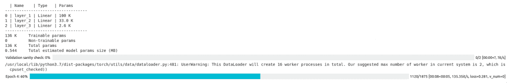

# PyTorch Lightning:如何训练你的第一个模型？

> 原文：<https://www.askpython.com/python/pytorch-lightning>

在本文中，我们将使用 PyTorch Lightning 训练我们的第一个模型。自 2016 年成立以来，PyTorch 一直是许多研究人员的首选。它变得流行是因为它更 pythonic 化的方法和对 CUDA 非常强的支持。然而，它有一些样板代码的基本问题。一些功能，如使用多个 GPU 的分布式培训，是为高级用户准备的。

PyTorch lightning 是 PyTorch 的一个包装器，旨在给 PyTorch 一个类似 Keras 的界面，而不牺牲任何灵活性。如果你已经使用 PyTorch 作为你的日常驱动，PyTorch-lightning 可以成为你的工具集的一个很好的补充。

## PyTorch Lightning 入门

我们将在这里以一种简单易懂的方式回顾创建我们的第一个模型的步骤。因此，没有任何进一步的麻烦，让我们马上开始吧！

### 1.安装 PyTorch 闪电

要安装 PyTorch-lightning，您可以运行简单的 [pip 命令](https://www.askpython.com/python-modules/python-pip)。如果你想从一些预定义的数据集开始，闪电模块也会派上用场。

```py
pip install pytorch-lightning lightning-bolts

```

### 2.导入模块

首先，我们导入 pytorch 和 pytorch-lightning 模块。

```py
import torch
from torch.nn import functional as F
from torch import nn
import pytorch_lightning as pl

```

可能会有一个常见的问题:“当我们已经在使用闪电时，为什么我们还需要火炬？”

嗯，闪电让 torch 的编码速度更快。lightning 建立在 torch 之上，可轻松扩展 torch 模块，允许用户在必要时进行关键的特定应用程序更改。

### 3.设置 MNIST 数据集

与 base PyTorch 不同，lightning 使数据库代码更易于用户访问和组织。

> 数据模块只是 train_dataloader、val_dataloader、test_dataloader 以及所需的匹配转换和数据处理/下载步骤的集合。
> 
> [https://pytorch-lightning.readthedocs.io/en/stable/extensions/datamodules.html#what-is-a-datamodule](https://pytorch-lightning.readthedocs.io/en/stable/extensions/datamodules.html#what-is-a-datamodule)

在 PyTorch 中， [MNIST 数据模块](https://www.askpython.com/python/examples/load-and-plot-mnist-dataset-in-python)通常定义如下:

```py
from torchvision import datasets, transforms

# transforms
# prepare transforms standard to MNIST
transform=transforms.Compose([transforms.ToTensor(),
                              transforms.Normalize((0.1307,), (0.3081,))])

mnist_train = MNIST(os.getcwd(), train=True, download=True, transform=transform)
mnist_train = DataLoader(mnist_train, batch_size=64)

```

正如您所看到的，数据模块并没有真正构造成一个块。如果您希望添加更多功能，如数据准备步骤或验证数据加载器，代码会变得更加混乱。Lightning 将代码组织成一个`LightningDataModule`类。

## 在 PyTorch-Lightning 中定义数据模块

### 1.设置数据集

让我们首先使用`LightningDataModule`加载并设置数据集。

```py
from torchvision.datasets import MNIST
from torchvision import transforms

class MNISTDataModule(pl.LightningDataModule):

    def __init__(self, data_dir: str = './'):
        super().__init__()
        self.data_dir = data_dir
        self.transform = transforms.Compose([
            transforms.ToTensor(),
            transforms.Normalize((0.1307,), (0.3081,))
        ])

        # self.dims is returned when you call dm.size()
        # Setting default dims here because we know them.
        # Could optionally be assigned dynamically in dm.setup()
        self.dims = (1, 28, 28)

    def prepare_data(self):
        # download
        MNIST(self.data_dir, train=True, download=True)
        MNIST(self.data_dir, train=False, download=True)

    def setup(self, stage = None):

        # Assign train/val datasets for use in dataloaders
        if stage == 'fit' or stage is None:
            mnist_full = MNIST(self.data_dir, train=True, transform=self.transform)
            self.mnist_train, self.mnist_val = random_split(mnist_full, [55000, 5000])

        # Assign test dataset for use in dataloader(s)
        if stage == 'test' or stage is None:
            self.mnist_test = MNIST(self.data_dir, train=False, transform=self.transform)

```

`preapre_data`函数下载数据并以 torch 可读的形式保存。`setup`函数将数据集分为训练、测试和验证。这些函数可以任意复杂，这取决于数据需要多少预处理。

### 2.定义数据加载器

现在我们有了设置，我们可以添加数据加载器函数。

```py
    def train_dataloader(self):
        return DataLoader(self.mnist_train, batch_size=32)

    def val_dataloader(self):
        return DataLoader(self.mnist_val, batch_size=32)

    def test_dataloader(self):
        return DataLoader(self.mnist_test, batch_size=32)

```

### 3.最后看一下 MNIST 数据模块

最后的`LightningDataModule`是这样的:

```py
class MNISTDataModule(pl.LightningDataModule):

    def __init__(self, data_dir: str = './'):
        super().__init__()
        self.data_dir = data_dir
        self.transform = transforms.Compose([
            transforms.ToTensor(),
            transforms.Normalize((0.1307,), (0.3081,))
        ])

        # self.dims is returned when you call dm.size()
        # Setting default dims here because we know them.
        # Could optionally be assigned dynamically in dm.setup()
        self.dims = (1, 28, 28)

    def prepare_data(self):
        # download
        MNIST(self.data_dir, train=True, download=True)
        MNIST(self.data_dir, train=False, download=True)

    def setup(self, stage = None):

        # Assign train/val datasets for use in dataloaders
        if stage == 'fit' or stage is None:
            mnist_full = MNIST(self.data_dir, train=True, transform=self.transform)
            self.mnist_train, self.mnist_val = random_split(mnist_full, [55000, 5000])

        # Assign test dataset for use in dataloader(s)
        if stage == 'test' or stage is None:
            self.mnist_test = MNIST(self.data_dir, train=False, transform=self.transform)

    def train_dataloader(self):
        return DataLoader(self.mnist_train, batch_size=32)

    def val_dataloader(self):
        return DataLoader(self.mnist_val, batch_size=32)

    def test_dataloader(self):
        return DataLoader(self.mnist_test, batch_size=32)

```

MNIST 数据模块在 PyTorch-bolts 数据模块中预定义。如果您不想为自己编写整个代码而烦恼，您可以只导入数据模块并开始使用它。

```py
from pl_bolts.datamodules import MNISTDataModule

# Create MNIST DataModule instance
data_module = MNISTDataModule()

```

现在我们已经有了现成的数据，我们需要模型来进行训练。

## 创建多感知器模型

照明模型非常类似于 PyTorch 模型的基础类，除了它有一些特殊的类函数来简化训练。`__init__`和`forward`方法与 PyTorch 完全相似。我们正在创建一个 3 层感知，每层感知的数量为(128，256，10)。还有一个大小为 28 * 28 (784)的输入图层，它采用展平的 28×28 MNIST 图像。

### 1.基本 PyTorch 型模型

```py
class MyMNISTModel(nn.Module):

    def __init__(self):
        super().__init__()

        # mnist images are (1, 28, 28) (channels, width, height)
        self.layer_1 = nn.Linear(28 * 28, 128)
        # The hidden layer of size 256
        self.layer_2 = nn.Linear(128, 256)
        # 3rd hidden layer of size 10.
        # This the prediction layer
        self.layer_3 = nn.Linear(256, 10)

    def forward(self, x):
        batch_size, channels, width, height = x.size()

        # Flatten the image into a linear tensor
        # (b, 1, 28, 28) -> (b, 1*28*28)
        x = x.view(batch_size, -1)

        # Pass the tensor through the layers
        x = self.layer_1(x)
        x = F.relu(x)
        x = self.layer_2(x)
        x = F.relu(x)
        x = self.layer_3(x)

        # Softmax the values to get a probability
        x = F.log_softmax(x, dim=1)
        return x

```

让我们使用一个随机的(28，28)值来检查这个模型是否有效。

```py
net = MyMNISTModel()

x = torch.randn(1, 1, 28, 28)
print(net(x).shape)

```

**输出:**

```py
torch.Size([1, 10])

```

1 表示批次，10 表示输出类的数量。所以我们的模型运行良好。

### 2.定义初始化和转发功能

PyTorch 数据模块看起来完全相似，除了它将从`*pl*.*LightningModule*`派生它的属性。闪电网络将会是这样的:

```py
class MyMNISTModel(pl.LightningModule):

    def __init__(self):
        super().__init__()
        ...
     def forward(self, x):
       ....

```

除了这些基本的 torch 功能，lighting 还提供了一些功能，允许我们定义在培训、测试和验证循环中发生了什么。

### 2.定义培训和验证循环

为模型的训练和验证步骤定义训练循环。

```py
    def training_step(self, batch, batch_idx):
        x, y = batch

        # Pass through the forward function of the network
        logits = self(x)
        loss = F.nll_loss(logits, y)
        return loss

    def validation_step(self, batch, batch_idx):
        x, y = batch
        logits = self(x)
        loss = F.nll_loss(logits, y)
        return loss

    def test_step(self, batch, batch_idx):
        x, y = batch
        logits = self(x)
        loss = F.nll_loss(logits, y)
        y_hat = torch.argmax(logits, dim=1)
        accuracy = torch.sum(y == y_hat).item() / (len(y) * 1.0)
        output = dict({
            'test_loss': loss,
            'test_acc': torch.tensor(accuracy),
        })
        return output

```

### 3.优化者

lightning 模型允许我们在模型定义中为特定的模型定义优化器。

```py
    # We are using the ADAM optimizer for this tutorial
    def configure_optimizers(self):
        return torch.optim.Adam(self.parameters(), lr=1e-3)

```

### 4.最后看一下我们的模型

最终的闪电模型应该是这样的:

```py
class MyMNISTModel(pl.LightningModule):

    def __init__(self):
        super().__init__()

        # mnist images are (1, 28, 28) (channels, width, height)
        self.layer_1 = nn.Linear(28 * 28, 128)
        # The hidden layer of size 256
        self.layer_2 = nn.Linear(128, 256)
        # 3rd hidden layer of size 10.
        # This the prediction layer
        self.layer_3 = nn.Linear(256, 10)

    def forward(self, x):
        batch_size, channels, width, height = x.size()

        # Flatten the image into a linear tensor
        # (b, 1, 28, 28) -> (b, 1*28*28)
        x = x.view(batch_size, -1)

        # Pass the tensor through the layers
        x = self.layer_1(x)
        x = F.relu(x)
        x = self.layer_2(x)
        x = F.relu(x)
        x = self.layer_3(x)

        # Softmax the values to get a probability
        x = F.log_softmax(x, dim=1)
        return x

    def training_step(self, batch, batch_idx):
        x, y = batch

        # Pass through the forward function of the network
        logits = self(x)
        loss = F.nll_loss(logits, y)
        return loss

    def validation_step(self, batch, batch_idx):
        x, y = batch
        logits = self(x)
        loss = F.nll_loss(logits, y)
        return loss

    def test_step(self, batch, batch_idx):
        x, y = batch
        logits = self(x)
        loss = F.nll_loss(logits, y)
        y_hat = torch.argmax(logits, dim=1)
        accuracy = torch.sum(y == y_hat).item() / (len(y) * 1.0)
        output = dict({
            'test_loss': loss,
            'test_acc': torch.tensor(accuracy),
        })
        return output

    def configure_optimizers(self):
        return torch.optim.Adam(self.parameters(), lr=1e-3)

```

我们现在已经有了数据和模型。让我们继续用数据训练模型。

### 5.训练模型

与传统的样板循环[寻找损失](https://www.askpython.com/python/examples/loss-functions)并进行反向传递不同，pytorch-lighting 模块中的培训师无需太多代码就能为我们完成这项工作。

首先，我们在 lightning 中用特定的参数初始化一个训练器。

```py
from pytorch_lightning import Trainer

# Set gpus = 0 for training on cpu
# Set the max_epochs for maximum number of epochs you want
trainer = Trainer(gpus=1, max_epochs=20)

```

用 MNISTDataModule 拟合数据集

```py
trainer.fit(net, data_module)

```



### 6.结果

让我们检查一下训练数据集的最终准确性，

```py
trainer.test(test_dataloaders=data_module.train_dataloader())

```

**输出:**

```py
--------------------------------------------------------------------------------
DATALOADER:0 TEST RESULTS
{'test_acc': tensor(.98), 'test_loss': tensor(0.0017, device='cuda:0')}
--------------------------------------------------------------------------------

```

在训练数据集中获得高精度可能表明过度拟合。因此，我们还需要在我们之前分离的测试数据集上测试我们的模型。让我们在验证数据集上检查模型的最终准确性。

```py
trainer.test(test_dataloaders=data_module.test_dataloader())

```

**输出:**

```py
--------------------------------------------------------------------------------
DATALOADER:0 TEST RESULTS
{'test_acc': tensor(.96), 'test_loss': tensor(0.0021, device='cuda:0')}
--------------------------------------------------------------------------------

```

因此，有了这些结果，我们就可以确认模型在数据上训练得很好。

## 结论

就这样，我们结束了关于 PyTorch-lightning 的教程。PyTorch-lightning 相对较新，发展很快，所以我们可以期待在不久的将来会有更多的功能。所以敬请关注更多关于机器学习和深度学习的此类文章。