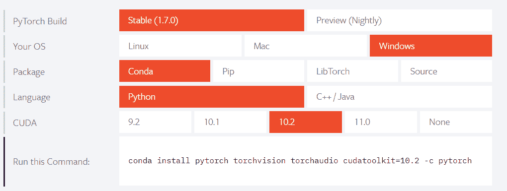

# py torch——简单的初学者参考

> 原文：<https://www.askpython.com/python-modules/pytorch>

PyTorch 在短短四年前首次亮相，是风靡数据科学行业的模块之一。

它为用户提供了文档完整的代码、教程和示例，帮助他们开始使用 PyTorch，在数据科学家和研究人员看来，这是一个巨大的成功。

PyTorch 的创造者也是致力于 TorchVision 和 TorchText 的人，这两个模块被认为在计算机视觉和自然语言处理领域非常有用。

PyTorch 是一个主要基于使用 Python 中的张量和动态神经网络的模块，但是也可以扩展到使用不同的领域。

如果您想与 PyTorch 合作，我们可以帮助您从这里开始！

还建议使用 Anaconda 进行数据科学和机器学习，所以，你可能也想了解一下。

## 安装 PyTorch

PyTorch 官方网站为我们提供了一个简单的界面，我们可以根据您的发行版和操作系统来使用和检索所需的安装命令。

如果您希望将正常环境与数据科学环境分开，您应该考虑创建虚拟环境。



Pick your flavor of PyTorch

稍微摆弄一下，为您的本地 PyTorch 库选择一个合适的版本，然后我们就可以进去使用 PyTorch 了。

## 从 PyTorch 开始

如果你已经安装了 PyTorch，太好了！我们现在都准备好开始工作了。

### 1.0 张量？

如果你曾经在 Python 中处理过大型矩阵，你可能会使用 [NumPy](https://www.askpython.com/python-modules/numpy/python-numpy-module) 。这是因为 NumPy 在处理多维数组时提供了强大的支持，允许在 n 维数组上处理各种不同的操作。

PyTorch 用张量技术给这个领域带来了竞争。

张量在某种意义上是多维数组，很像 NumPy 所提供的。然而，不同之处在于，在与 GPU 一起工作时，张量得到了很好的支持。

谷歌的 Tensorflow 也在张量上运行，以处理和处理数据。

**那么，我们如何开始使用张量和 PyTorch 呢？让我们找出答案。**

### 1.1.进口火炬

我们已经知道，使用任何模块都首先需要一个 *[导入](https://www.askpython.com/python/python-import-statement)* 来将它包含在脚本中。因此，我们就这么做吧，

```py
# Importing torch to use in the script.
import torch

```

### 1.2.创建张量

使用`torch`模块创建张量(本质上是矩阵)非常简单。这里有一些初始化/创建张量对象的方法。

```py
# Creating tensors with strict numbers
ten1 = torch.tensor(5)
ten2 = torch.tensor(8)
print(ten1, ten2)
# Output : tensor(5) tensor(8)

# Creating a matrix of zeros using the zeros function
ten3 = torch.zeros((3, 3))
print(ten3)
# tensor([[0., 0., 0.],
          [0., 0., 0.],
          [0., 0., 0.]])

# Creating a matrix of random numbers
ten4 = torch.randn(3, 3)
print(ten4)
# tensor([[-0.9685, 0.7256, 0.7601],
          [-0.8853, 0.4048, -1.0896],
          [0.6743, 1.5665, 0.2906]])

```

### 1.3.基本张量运算

张量在很多方面都可以使用，就像 NumPy 模块创建的矩阵一样。

我们可以进行基本的数字运算，

```py
firstten = torch.tensor(3)
secondten = torch.tensor(6)

# Addition of tensors
print(firstten + secondten)
# Output : tensor(9)

# Subtraction of tensors
print(firstten - secondten)
# Output : tensor(-3)

# Multiplication of tensors
print(firstten * secondten)
# Output : tensor(18)

# Division of tensors
print(firstten / secondten)
# Output : tensor(0.5000)

```

### 1.4.与张量一起前进

张量不仅仅可以用于简单的运算，在 Python 中，简单的运算通常可以用变量来完成。

它们支持对它们执行多种操作，通常在 PyTorch 脚本的许多操作中用作变量。

用类似[矩阵乘法](https://www.askpython.com/python/python-matrix-tutorial) `torch.mm`的函数，创建等间距张量`torch.linspace`，用类似`torch.sin(x)`的[数学函数](https://www.askpython.com/python-modules/python-math-module)处理数学函数。

毫不奇怪，所提供的功能允许嵌入数学方法的深度计算。

如果你希望通过例子来研究张量的工作，你可能希望看这里的。

## 下一步是什么？

除了使用通常的张量和默认提供的函数之外，研究 PyTorch 提供的另一个模块可能会有所帮助。

张量本身终究只是一个基础。真正的力量在于模块提供的使用这种媒介进行计算的应用程序用法。

PyTorch 为我们提供了为与神经网络一起工作而设计的模块，称为`torch.nn`。

`torch.nn`模块包含各种各样的功能来帮助它执行基于神经网络的操作，

*   [集装箱](https://pytorch.org/docs/stable/nn.html#containers)
*   [卷积层](https://pytorch.org/docs/stable/nn.html#convolution-layers)
*   [汇集层](https://pytorch.org/docs/stable/nn.html#pooling-layers)
*   [填充层](https://pytorch.org/docs/stable/nn.html#padding-layers)
*   [非线性激活(加权和，非线性)](https://pytorch.org/docs/stable/nn.html#non-linear-activations-weighted-sum-nonlinearity)
*   [非线性激活(其他)](https://pytorch.org/docs/stable/nn.html#non-linear-activations-other)
*   [归一化图层](https://pytorch.org/docs/stable/nn.html#normalization-layers)
*   [轮回层](https://pytorch.org/docs/stable/nn.html#recurrent-layers)
*   [变压器层数](https://pytorch.org/docs/stable/nn.html#transformer-layers)
*   [线性图层](https://pytorch.org/docs/stable/nn.html#linear-layers)
*   [脱落层](https://pytorch.org/docs/stable/nn.html#dropout-layers)
*   [稀疏层](https://pytorch.org/docs/stable/nn.html#sparse-layers)
*   [距离函数](https://pytorch.org/docs/stable/nn.html#distance-functions)
*   [损失函数](https://pytorch.org/docs/stable/nn.html#loss-functions)
*   [视觉层](https://pytorch.org/docs/stable/nn.html#vision-layers)
*   [数据并行层(多 GPU，分布式)](https://pytorch.org/docs/stable/nn.html#dataparallel-layers-multi-gpu-distributed)
*   [实用程序](https://pytorch.org/docs/stable/nn.html#utilities)
*   [量化函数](https://pytorch.org/docs/stable/nn.html#quantized-functions)

使用 PyTorch 作为数据科学模块的下一步就是处理这些问题。

## 结论

PyTorch 仍在开发中，但它提供的功能被广泛认为优于许多数据科学模块。

有大量的模块被创建来与 PyTorch 兼容，也有大量的资源帮助使用它们。

PyTorch 是一个开源项目，这意味着您可以参与该项目并为其未来版本做出贡献。

这里是 [GitHub 链接](https://github.com/pytorch/pytorch)，这里是为了开源！干杯！

查看我们的其他文章，这些文章将对您的数据科学项目有所帮助——[Pandas](https://www.askpython.com/python-modules/pandas/python-pandas-module-tutorial)和[使用 sklearn](https://www.askpython.com/python/examples/split-data-training-and-testing-set) 进行培训和测试。

## 参考

*   【PyTorch 官方文档
*   【PyTorch 入门教程
*   [使用 PyTorch 的资源](https://pytorch.org/resources/)