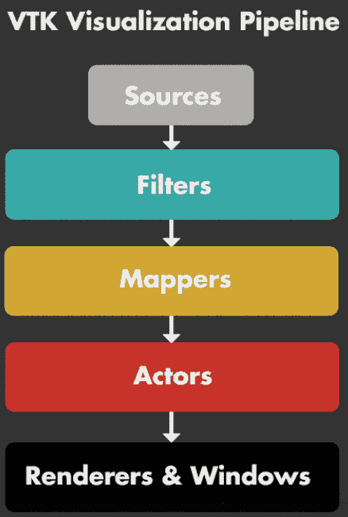
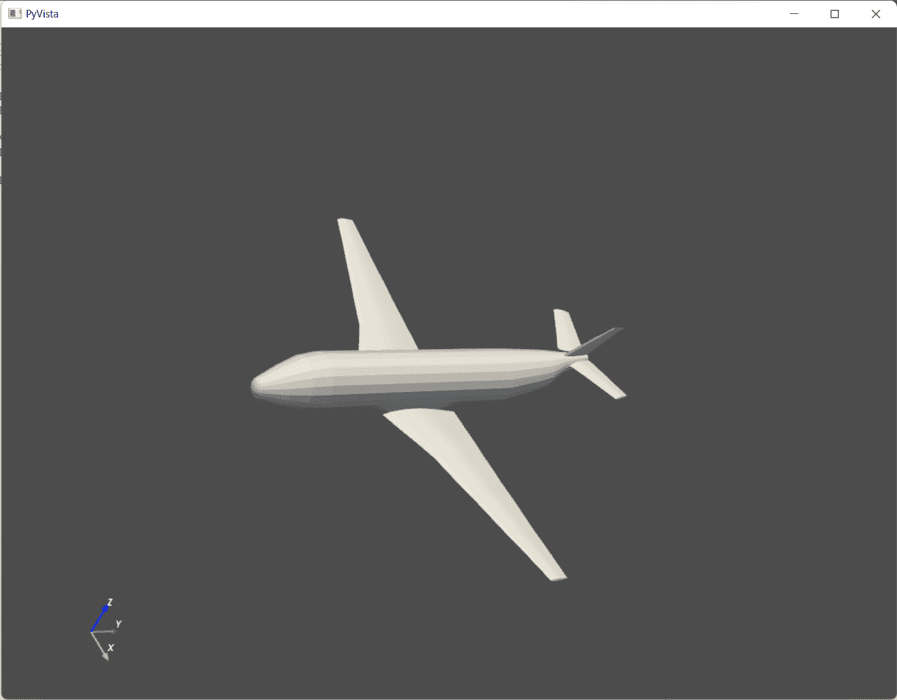
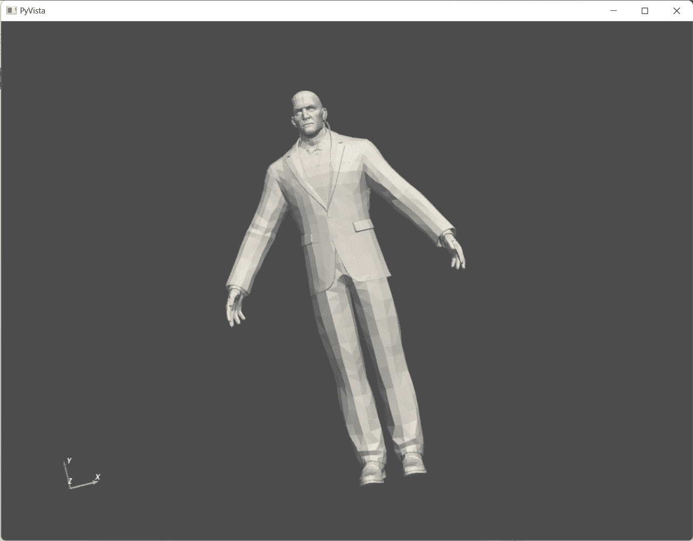
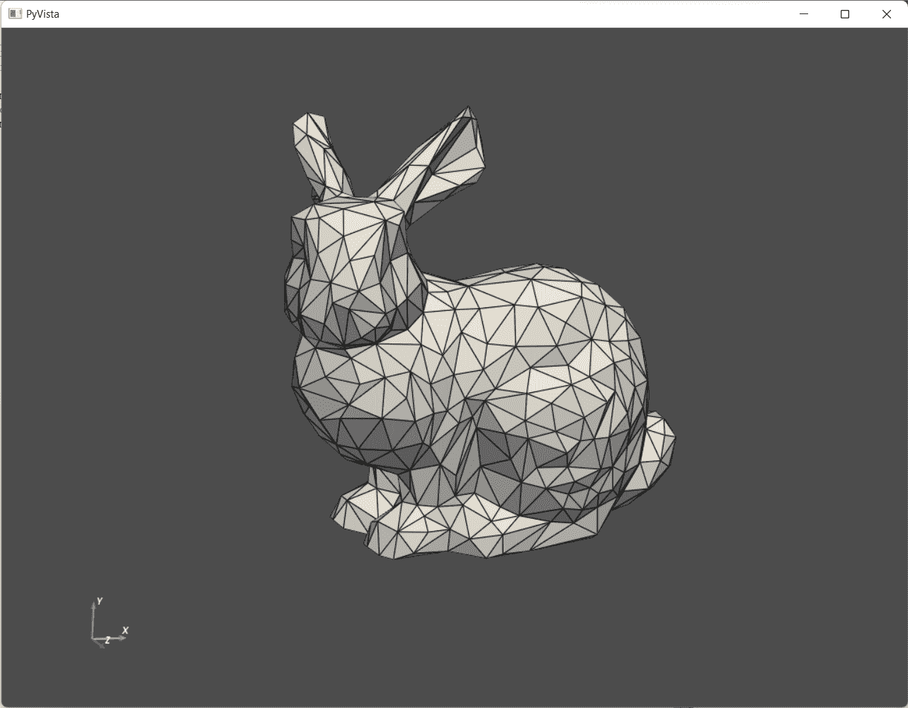

# Python 中 PyVista 的介绍

> 原文：<https://www.askpython.com/python-modules/pyvista-in-python>

PyVista(以前的“vtki ”)是一个适应性强的辅助模块和可视化工具包(VTK)的高级 API。它是 VTK 的简化界面，支持基于 Python 的网格分析和 3D 图形绘制。2019 年 5 月由 C. Bane Sullivan 和 Alexander A. Kaszynski(研究论文)提出。在深入研究 PyVista 的细节之前，让我们先快速了解一下 VTK。

* * *

## VTK 介绍(可视化工具包)

**VTK** 是一个前沿的工具包，由 C++类库和解释接口层组成，如 Java、Python 和 Tcl/Tk。它融合了 C++的执行速度和 Python 的快速原型制作能力。

开源包 VTK 包括一个强大的处理和渲染管道，以及许多先进的可视化方法。VTK 的设计基于强大的管道概念。以下是这一概念的基本组成部分的总结:



VTK Pipeline

然而，当使用 VTK 时，简单的应用程序(如构建网格对象)需要很长的代码，但是 PyVista 只需几行 Pythonic 和简单的代码就可以完成相同的操作。

PyVista 通过 NumPy 库封装了 VTK，各种类和方法允许直接访问数组。它允许空间数据、快速原型和网格分析的可视化集成。

* * *

## PyVista 的 Python 实现

本节将介绍 PyVista 实现，并显示各种 3D 形状和对象。我们将从使用下面的代码片段导入 PyVista 模块以及该模块下的示例开始。

```py
import pyvista as pv
from pyvista import examples

```

我们将利用一个内置的示例文件，以网格的形式显示飞机。请看下面的代码片段。我们还将在下面的代码片段中读取平面文件的网格数据。

```py
plane_file = examples.planefile
plane_mesh = pv.read(plane_file)

```

下一步是使用下面的代码在 3D 图上绘制平面及其网格。第三行代码将网格和平面结合在一起。

```py
cpos = plane_mesh.plot()
plane_plotter = pv.Plotter()
plane_plotter.add_mesh(plane_mesh)

```

输出如下所示。



PyVista Plane Output

看起来很棒，对吧？让我们尝试一些其他形状和物体，看看惊人的结果。下面的代码片段将帮助我们得到一个门卫作为输出。

```py
mesh = examples.download_doorman()
mesh.plot(cpos="xy")

```



PyVista Doorman Output

哇哦。多详细的模型啊？我相信你也对结果感到惊讶。我们再来看看最后一个对象！下面的代码片段将会产生一些令人惊奇的东西。只要试一试，你就会惊叹不已。

```py
mesh = examples.download_bunny_coarse()
cpos = [(0.2, 0.3, 0.9), (0, 0, 0), (0, 1, 0)]
mesh.plot(cpos=cpos, show_edges=True, color=True)

```



PyVista Bunny Output

屏幕上的小兔子真可爱，对吧？

* * *

## 结论

我希望你喜欢 PyVista 上的教程，并在这个教程中学到一些新东西。如果你喜欢这个教程，我建议你也看看下面的教程:

1.  [Python 编程语言中的 ASCII 艺术](https://www.askpython.com/python-modules/ascii-art)
2.  [使用 Matplotlib 的 Python 三维绘图](https://www.askpython.com/python-modules/matplotlib/3-dimensional-plots-in-python)
3.  [plottly 等高线图–完整指南](https://www.askpython.com/python-modules/plotly-contour-plot)

感谢您的阅读！

* * *