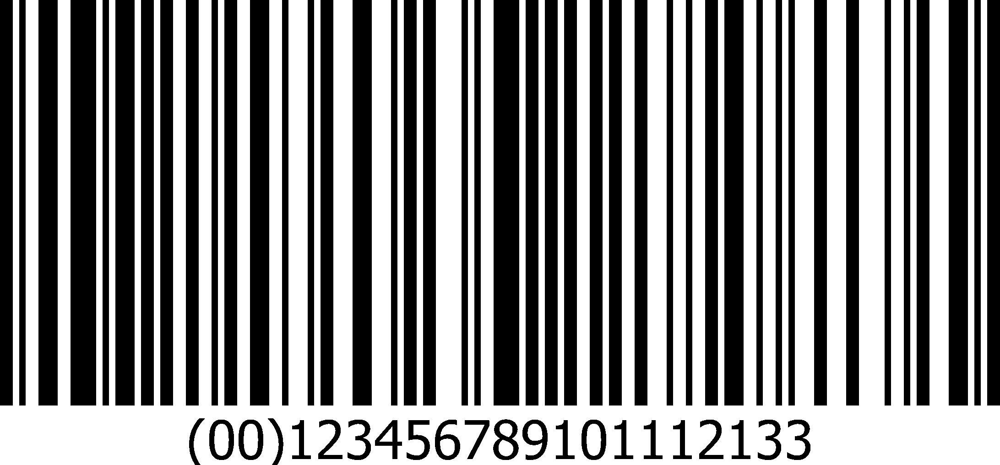

# pyzbar 模块:用 Python 解码条形码

> 原文：<https://www.askpython.com/python-modules/pyzbar-module>

你好，程序员朋友！在本教程中，我们将学习如何使用 Python 解码图像中的条形码。我们将同样使用`pyzbar`模块，并将其与[枕形模块](https://www.askpython.com/python-modules/pillow-module)配对。

## 使用 pyzbar 模块从图像中解码条形码

`pyzbar`模块是一个负责轻松读取和解码一维条形码或 QR 码的模块，它需要`PIL`模块才能正常工作。在实现模块之前，我们首先需要导入这两个模块。

### 1.导入所需的模块

为了准确地操作函数，我们首先需要在代码中导入 pyzbar 模块和 PIL。使用下面的代码块导入解码条形码所需的模块和功能。

```py
from pyzbar.pyzbar import decode
from PIL import Image

```

### 2.导入条形码图像

下一步是借助 PIL 模块图像子模块的打开功能，从我们的系统导入条形码图像。同样如下图所示。

```py
img = Image.open("bar1.jpg")

```

对于本教程，我们已经采取了一个随机的条形码在网上找到。如果您想定制条形码/QR 码，您可以查看关于[创建定制条形码/QR 码](https://www.askpython.com/python-modules/qrcode-module)的教程。

我们选择的条形码如下所示。我们的目标是提取条形码下的信息。



Bar1

### 3.从条形码获取信息

为了从图像中提取信息，借助将图像对象作为参数的`decode`函数获得条形码。相同的代码如下所示。

```py
all_info = decode(img)

```

但是存储在`all_info`变量中的信息显示在下面的块中。你可以看到获得的信息非常杂乱，从这些信息中无法解码出任何东西。

```py
[Decoded(data=b'00123456789101112133', type='CODE128', rect=Rect(left=28, top=0, width=2114, height=885), polygon=[Point(x=28, y=1), Point(x=28, y=885), Point(x=2142, y=884), Point(x=2142, y=0)])]

```

### 4.显示条形码信息

为了只显示条形码图像中的数据，而忽略变量中其余不必要的信息，我们将使用下面的代码块。

```py
for i in all_info:
    print(i.data.decode("utf-8"))

```

*该代码块将在屏幕上显示与条形码图像下的值相匹配的值 **00123456789101112133** 。您可以在其他条形码图像甚至 QR 码图像上测试相同的代码。*

## 结论

所以，我希望你知道如何用 Python 编程语言解码条形码。感谢您阅读教程！

继续多看！快乐学习！