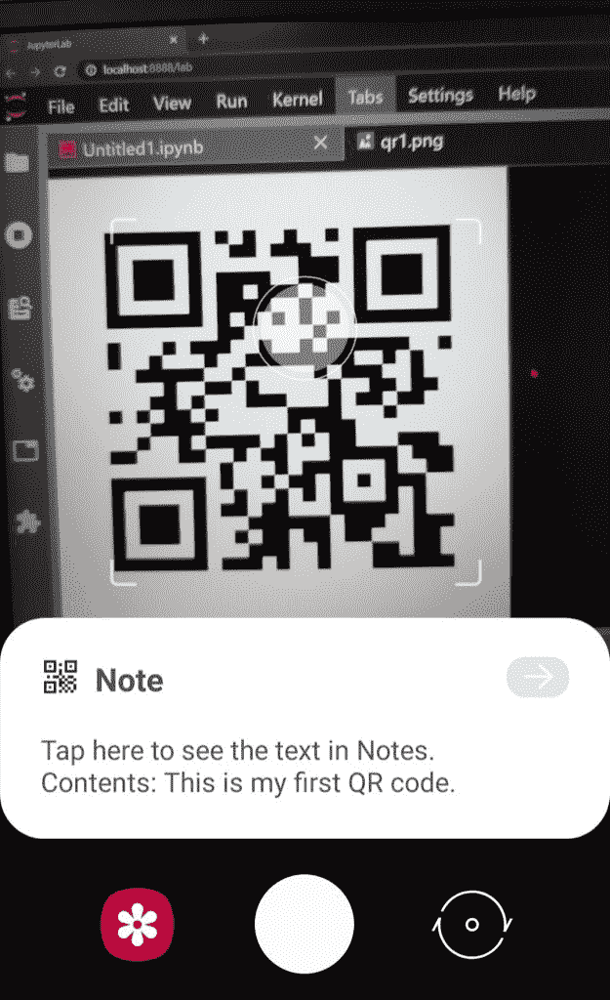
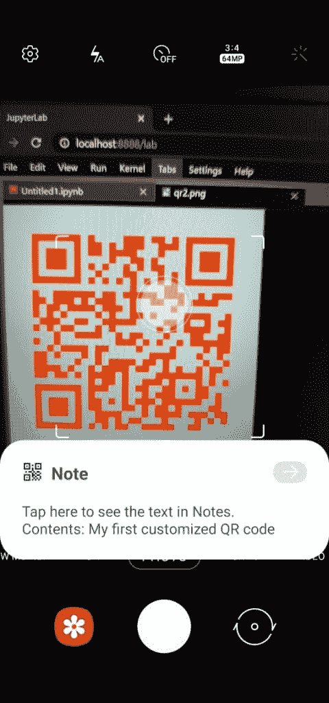

# 二维码模块:使用 Python 生成您自己的二维码！

> 原文：<https://www.askpython.com/python-modules/qrcode-module>

你好。今天，我们将学习如何使用 Python 中的 qrcode 模块获得自己的 QR code。

似乎很有趣，对吗？我们开始吧！

## QR(快速响应)码简介

二维码能够存储大量数据，当扫描时，用户可以立即获取信息。

它将所有数据存储为方形网格中的一系列像素。一般来说，我们将 QR 码用于以下目的:

1.  链接应用程序下载链接
2.  帐户登录详细信息
3.  付款

标准 QR 码的主要组成部分是 QR 码外面的三个大方块。一旦 QR 阅读器识别出它们，它就知道方块中包含的全部信息。

***推荐阅读:[如何使用 faker 模块创建假人物细节？](https://www.askpython.com/python-modules/faker-module)***

## 使用二维码模块从头开始创建或代码

我们做的第一件事是导入`qrcode`模块，然后使用`ORCode`函数创建一个`qr`对象。

我们要编码的下一步是使用`add_data`函数将数据添加到 QR 码中。我们以字符串的形式传递我们想要的数据。

接下来，我们使用`make`函数来构建二维码。下一步是获取我们构建的二维码的图像。

为了以图像的形式创建和保存 QR 码，我们将分别使用`make_image`和`save`函数。

在同一个函数中，我们添加了图像的路径/名称。相同的代码如下所示。

```py
import qrcode
qr = qrcode.QRCode()
qr.add_data('This is my first QR code.')
qr.make()
img = qr.make_image()
img.save('qr1.png')

```

生成的二维码显示如下。


First Qr Code Generated Python

下图显示了通过我的设备扫描保存的二维码的结果。



First Qr Python Phone Output 1

## 定制二维码

我们还可以通过在前面使用`QRCode`函数创建的 qr 对象中添加一些属性来定制 QR 码的设计和结构。

**我们将要添加到对象中的一些属性如下:**

1.  `version`:决定了二维码的大小，取值范围从 1 到 40 ( 1 显然是最小的)
2.  `box_size`:这决定了 QR 框中需要有多少像素

我们还在`make_image`函数中添加了一些属性，分别使用`back_color`和`fill_color`属性来改变背景和 QR 码的颜色。

生成此类 QR 码的代码如下所示:

```py
qr1 = qrcode.QRCode(version=1,box_size=10)
qr1.add_data('My first customized QR code')
qr1.make()
img1 = qr1.make_image(fill_color="red", back_color="lightblue")
img1.save('qr2.png')

```

输出的自定义二维码如下图所示:


Second Qr Code Generated Python

从我自己的设备上扫描时，结果是准确的，如下所示:



Customized Qr Python

## 结论

恭喜你！现在你可以自己为任何你想要的东西建立二维码。扫描二维码时，您还可以为二维码添加链接，而不是简单的文本，以访问某个网站。

希望你学到了一些东西！编码快乐！