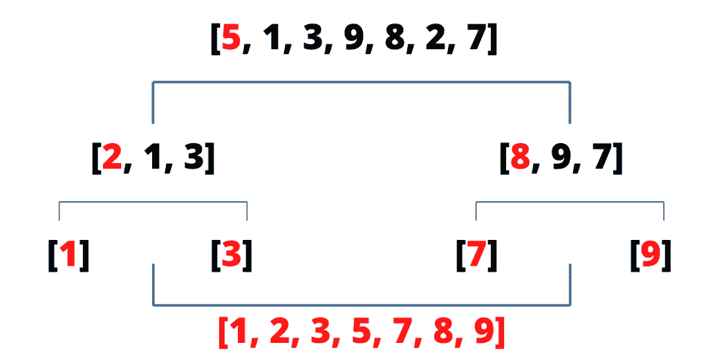

# 如何用 Python 实现快速排序？

> 原文：<https://www.askpython.com/python/examples/quicksort-algorithm>

快速排序是一种[排序算法](https://www.askpython.com/python/array/sort-array-python)，遵循**分而治之的策略。**它的工作原理是选择一个轴心元素，然后通过执行交换来围绕轴心排列元素。它递归地重复这个过程，直到数组被排序。

在本教程中，我们将学习快速排序是如何工作的，以及如何为其实现编写 python 代码。

## 了解快速排序算法

对数组执行快速排序的第一步是选择透视元素。有多种选择枢纽元素的方式。

你可以选择一个**随机元素**或者你可以选择数组的**中值。**为了简单起见，我们将选择[数组](https://www.askpython.com/python/array/python-array-declaration)的**第一个元素作为我们的枢纽**元素。

### 1.选择透视元素

如上所述，第一个元素被挑选为枢纽元素。

```py
pivot = array[start]

```

选择一个枢纽元素后，我们需要重新排列它周围的元素。我们以这样的方式重新排列元素，所有小于枢轴的元素在左边，所有大于枢轴的元素在右边。

我们如何做到这一点？

让我们接下来讨论那个。

### 2.围绕轴心重新排列元素

为了围绕轴心重新排列元素，我们初始化两个变量。

让我们称这些变量为**低和高。**

我们用数组的第二个元素初始化低电平(旋转后一个)，用最后一个元素初始化高电平。

```py
 low = start + 1
 high = end

```

为了重新排列元素，我们将低的向右移动，高的向左移动。在这样做的时候，我们的目的是确保所有大于中枢的值应该向右移动，而所有小于中枢的值应该向左移动。

当我们以这种方式排列值时，我们可以找到 pivot 元素在排序数组中的最终位置，因为所有比 pivot 小的元素都在它的左边，而所有在右边的元素都更大。

枢轴右侧和左侧的元素可能以排序方式排列，也可能不以排序方式排列。

### 3.如何移低移高？

我们向左移动 high，直到 high 指向小于 pivot 的值，或者直到 high 小于 low。

```py
while low <= high and array[high] >= pivot:
     high = high - 1

```

类似地，我们向右移动低位，直到它指向一个高于中枢的值，或者直到高位小于低位。

```py
while low <= high and array[low] <= pivot:
     low = low + 1

```

从循环中出来后，我们检查 low 是否小于或等于 high。如果是这种情况，那么我们需要交换高低值。

```py
 if low <= high:
     array[low], array[high] = array[high], array[low]

```

如果 low 大于 high，我们将跳出循环，返回 high 作为 pivot 元素的位置。这意味着我们已经成功地围绕轴心排列了值。

### 4.到目前为止实现的代码

下面给出了负责选择 pivot 元素并重新排列元素的函数的完整代码:

```py
def pivot(array, start, end):

#initializing 
    pivot = array[start]
    low = start + 1
    high = end

    while True:

#moving high towards left
        while low <= high and array[high] >= pivot:
            high = high - 1

#moving low towards right 
        while low <= high and array[low] <= pivot:
            low = low + 1

#checking if low and high have crossed
        if low <= high:

#swapping values to rearrange
            array[low], array[high] = array[high], array[low]

        else:
#breaking out of the loop if low > high
            break

#swapping pivot with high so that pivot is at its right # #position 
    array[start], array[high] = array[high], array[start]

#returning pivot position
    return high

```

### 5.对数组的两半进行递归调用

在围绕轴心重新排列元素之后，我们需要对数组的两半进行递归调用。

这些调用会不断重复，直到数组的大小为 1。进行递归调用的函数代码如下所示:

```py
def quick_sort(array, start, end):
    if start >= end:
        return

#call pivot 
    p = pivot(array, start, end)
#recursive call on left half
    quick_sort(array, start, p-1)
#recursive call on right half
    quick_sort(array, p+1, end)

```

最后两条语句分别在左半部分和右半部分进行递归调用。

对于左半部分和右半部分，重复相同的选择枢轴并重新排列其周围元素的过程。

当我们重复这样做时，我们确保每个元素都被放置在正确的位置。

在这里，“正确的位置”意味着所有较小的元素在左边，所有较大的元素在右边。当所有的元素都放在正确的位置时，我们得到一个排序后的数组。

## 快速排序数组的示例

让我们举一个测试代码的例子。

```py
[5,1,3,9,8,2,7]

```

让我们添加一些代码，为每个递归调用打印 pivot 元素、数组的左半部分和右半部分。

```py
def quick_sort(array, start, end):
    if start >= end:
        return

    p = pivot(array, start, end)
    print("Pivot",array[p])
    print("left :", array[start:p])
    print("right :",array[p+1:end+1])
    print("\n")
    quick_sort(array, start, p-1)
    quick_sort(array, p+1, end)

```

让我们用上面的示例数组运行代码。

```py
array = [5,1,3,9,8,2,7]

quick_sort(array, 0, len(array) - 1)
print(array)

```

输出结果如下:

```py
Pivot 5
left : [2, 1, 3]
right : [8, 9, 7]

Pivot 2
left : [1]
right : [3]

Pivot 8
left : [7]
right : [9]

[1, 2, 3, 5, 7, 8, 9]

```

我们可以看到，对于每个 pivot 元素，左边的数组包含小于 pivot 的元素，右边的数组包含大于 pivot 的元素。

我们可以直观地将递归调用表示如下:



## 完全实现

快速排序的完整实现如下所示:

```py
def pivot(array, start, end):

#initializing 
    pivot = array[start]
    low = start + 1
    high = end

    while True:

#moving high towards left
        while low <= high and array[high] >= pivot:
            high = high - 1

#moving low towards right 
        while low <= high and array[low] <= pivot:
            low = low + 1

#checking if low and high have crossed
        if low <= high:

#swapping values to rearrange
            array[low], array[high] = array[high], array[low]

        else:
#breaking out of the loop if low > high
            break

#swapping pivot with high so that pivot is at its right # #position 
    array[start], array[high] = array[high], array[start]

#returning pivot position
    return high

def quick_sort(array, start, end):
    if start >= end:
        return

#call pivot 
    p = pivot(array, start, end)
#recursive call on left half
    quick_sort(array, start, p-1)
#recursive call on right half
    quick_sort(array, p+1, end)

array = [5,1,3,9,8,2,7]

quick_sort(array, 0, len(array) - 1)
print(array)

```

## 结论

本教程是关于在 Python 中实现快速排序的。快速排序的**最坏情况时间复杂度为 O(n² )** ，**平均情况时间复杂度为 O(n logn)。**