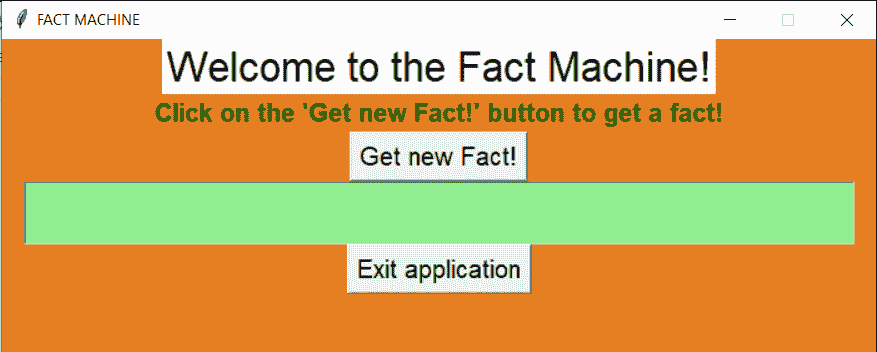

# Python Tkinter 示例:随机事实机器

> 原文：<https://www.askpython.com/python-modules/tkinter/random-facts-machine>

你好，初学者！今天我们将使用 Python Tkinter 构建一个 GUI 应用程序，随机事实机器。让我们开始吧！

## 我们指的是什么样的事实？

世界各地的随机事件。可以是字面上的任何东西，只要该陈述是真实的，并且基于实际发生的事件。

**事实**回答“在哪里”、“何时”、“为什么”和“如何”的问题。事实总是有证据支持的，这就是为什么事实总是真实的。

阅读事实显然也有助于增加一个人的词汇量、阅读能力和知识。它还可以帮助释放一个人的压力和焦虑。

***推荐阅读:[如何用 Tkinter 搭建摄氏到华氏转换器？](https://www.askpython.com/python-modules/tkinter/celsius-to-fahrenheit-converter)***

## 构建随机事实机器

让我们进入使用 Python 中的 [Tkinter 模块构建随机事实机器的步骤。](https://www.askpython.com/python-modules/tkinter/tkinter-buttons)

### 1.设计界面

应用程序的设计包括以下步骤:

1.  **创建窗口**
    *   正在导入 Tkinter 模块
    *   创建自定义的空白窗口
    *   将 resizable 属性设置为 False 以保持尺寸不变
2.  **添加基本元素**
    *   [标签](https://www.askpython.com/python-modules/tkinter/tkinter-frame-and-label)
    *   *获取事实*按钮
    *   用于显示事实的文本框
    *   按钮退出应用程序

相同的代码如下所示。您可以根据自己的喜好自定义窗口。

```py
import tkinter as tk
window = tk.Tk()
window.geometry("700x250")
window.config(bg="#E67E22")
window.resizable(width=False,height=False)
window.title('FACT MACHINE')

l1 = tk.Label(window,text="Welcome to the Fact Machine!",font=("Arial", 25),fg="Black",bg="White")
l2= tk.Label(window,text="Click on the 'Get new Fact!' button to get a fact!",font=("Arial", 15,"bold"),fg="darkgreen",bg="#E67E22")
btn1 = tk.Button(window,text="Get new Fact!",font=("Arial", 15))
btn2 = tk.Button(window,text="Exit application",font=("Arial", 15))
t1 = tk.Text(window,width=60,height=2,font=("Arial",15),state='disabled',bg="lightgreen")

l1.pack()
l2.pack()
btn1.pack()
t1.pack()
btn2.pack()

```

创建的最终设计如下所示。



Initial Screen Fact Machine

### 向按钮添加功能

#### 按钮 1:退出按钮

要添加退出按钮功能，我们需要做的就是创建一个破坏窗口的`exit`函数。然后给按钮添加`command`属性，设置为退出功能。

相同的代码如下所示:

```py
def exit():
    window.destroy()

```

#### 按钮 2:获取事实按钮

现在，为了获得每次点击的随机事实，我们使用 Python 中的 **randfacts 模块**。如果该模块不存在，那么在系统的命令提示符下运行 **pip install randfacts** 。

为了获得新的事实，我们使用了`getFact`函数，并为随机有趣的事实添加了参数 **False** ！获得事实后，我们清除文本框，并将事实添加到文本框中。

在声明函数之后，`command`属性被添加到 get fact 按钮，并被设置为 get_fact 函数。相同的代码如下所示:

```py
import randfacts
def get_fact():
    t1.config(state='normal')
    t1.delete('1.0', tk.END)
    f = randfacts.getFact(False)
    t1.insert(tk.END,f)
    t1.config(state='disabled')

```

## Tkinter 中随机事实机的完整代码

整个应用程序的最终代码如下所示:

```py
import randfacts
def get_fact():
    t1.config(state='normal')
    t1.delete('1.0', tk.END)
    f = randfacts.getFact(False)
    t1.insert(tk.END,f)
    t1.config(state='disabled')

def exit():
    window.destroy()

import tkinter as tk
window = tk.Tk()
window.geometry("700x250")
window.config(bg="#E67E22")
window.resizable(width=False,height=False)
window.title('FACT MACHINE')

l1 = tk.Label(window,text="Welcome to the Fact Machine!",font=("Arial", 25),fg="Black",bg="White")
l2= tk.Label(window,text="Click on the 'Get new Fact!' button to get a fact!",font=("Arial", 15,"bold"),fg="darkgreen",bg="#E67E22")
btn1 = tk.Button(window,text="Get new Fact!",font=("Arial", 15),command=get_fact)
btn2 = tk.Button(window,text="Exit application",font=("Arial", 15),command=exit)
t1 = tk.Text(window,width=60,height=2,font=("Arial",15),state='disabled',bg="lightgreen")

l1.pack()
l2.pack()
btn1.pack()
t1.pack()
btn2.pack()

window.mainloop()

```

## 输出

正如您在下图中看到的那样，该应用程序运行良好:


Output1 Fact Machine


Output2 Fact Machine

## 结论

恭喜你！您已经成功地构建了自己事实机器。希望你喜欢它！快乐学习！

感谢您的阅读！