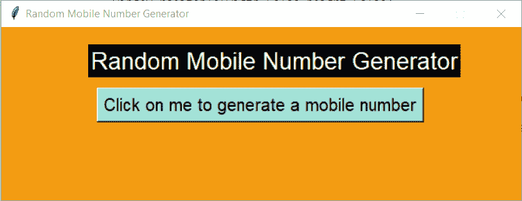
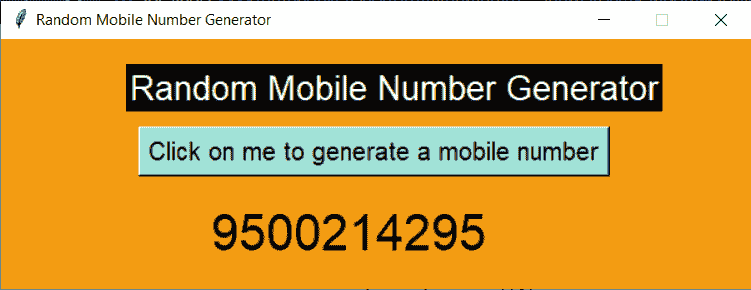
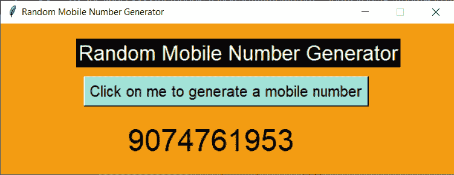

# Python Tkinter 项目:随机移动号码生成器

> 原文：<https://www.askpython.com/python-modules/tkinter/random-mobile-number-generator>

你好 Tkinter coders！今天我们将学习构建我们自己的随机手机号码生成器。该应用程序对于需要一些假数据的开发人员来说非常有用。

## 用 Python 创建随机移动号码生成器

让我们进入使用 Tkinter 创建随机数生成器的步骤。这是一个有趣的小应用程序，你会喜欢使用它，你也可以在你的初学者作品集里炫耀一下！

### 步骤 1:导入模块并创建 Tkinter 窗口

任何 Tkinter 项目的第一步都是导入`tkinter`和`random`模块，然后创建一个空白窗口。我们可以根据自己的喜好配置窗口。

我们将提供一个标题和背景颜色的窗口。与此同时，我们将窗口的 resize 属性设置为`false`。

```py
import tkinter as tk
window = tk.Tk()
window.geometry("600x200")
window.config(bg="#F39C12")
window.resizable(width=False,height=False)
window.title('Random Mobile Number Generator')

window.mainloop()

```


Initial Black Screen Tkinter

### 步骤 2:在创建的窗口上添加小部件

这一步包括在我们刚刚创建的窗口上添加各种小部件，包括标签和按钮。我们还将创建一个空白标签，该标签将被设置为后面部分中生成的手机号码。

对于每个小部件，我们将创建小部件变量，然后在 place 函数的帮助下将它们放在屏幕上，place 函数需要小部件的 x 和 y 坐标。

```py
import tkinter as tk
window = tk.Tk()
window.geometry("600x200")
window.config(bg="#F39C12")
window.resizable(width=False,height=False)
window.title('Random Mobile Number Generator')

l1 = tk.Label(text="Random Mobile Number Generator",font=("Arial",20),bg="Black",fg="White")

b1 = tk.Button(text="Click on me to generate a mobile number",font=("Arial",15),bg="#A3E4D7")

l2 = tk.Label(bg="#F39C12",font=("Arial",30),text="")

l1.place(x=100,y=20)
b1.place(x=110,y=70)
l2.place(x=165,y=130)

window.mainloop()

```



Design Screen Tkinter

## 步骤 3:创建一个函数来生成一个随机数

现在来创建一个函数来生成随机数，我们将利用 [`random`模块](https://www.askpython.com/python-modules/python-random-module-generate-random-numbers-sequences)，然后创建一个列表，其中包含以字符串形式存储在一起的 0-9 的所有数字。

我们将一个数字变量初始化为一个空字符串，从列表中选择 10 个随机数字，并不断地将它们追加到数字变量中。最后，我们将空字符串的文本设置为生成的数字。

之后，不要忘记在按钮声明中添加函数名作为`command`属性。你已经准备好了！

```py
import random
def generate_number():
    list = ["0","1","2","3","4","5","6","7","8","9"]
    number = ""
    for i in range(10):
        number = number + random.choice(list)
    l2.config(text = number)

```

## 最终代码

```py
import random
def generate_number():
    list = ["0","1","2","3","4","5","6","7","8","9"]
    number = ""
    for i in range(10):
        number = number + random.choice(list)
    l2.config(text = number)

import tkinter as tk
window = tk.Tk()
window.geometry("600x200")
window.config(bg="#F39C12")
window.resizable(width=False,height=False)
window.title('Random Mobile Number Generator')

l1 = tk.Label(text="Random Mobile Number Generator",font=("Arial",20),bg="Black",fg="White")

b1 = tk.Button(text="Click on me to generate a mobile number",font=("Arial",15),bg="#A3E4D7",command=generate_number)

l2 = tk.Label(bg="#F39C12",font=("Arial",30),text="")

l1.place(x=100,y=20)
b1.place(x=110,y=70)
l2.place(x=165,y=130)

window.mainloop()

```

## 一些示例输出



Random Number Output 1



Random Number Output 2

## 结论

恭喜你！今天我们学习了如何使用 python tkinter 技术生成手机号码！自己试试吧！

感谢您的阅读！敬请关注，了解更多信息！