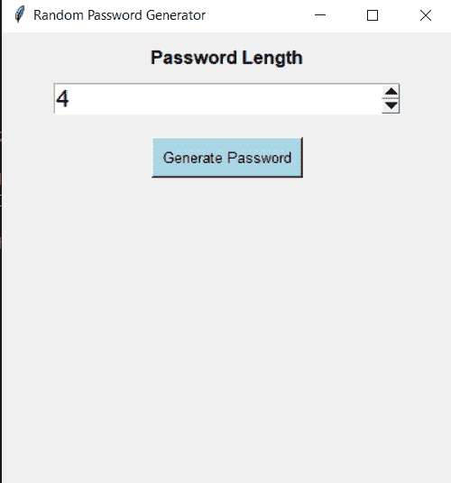
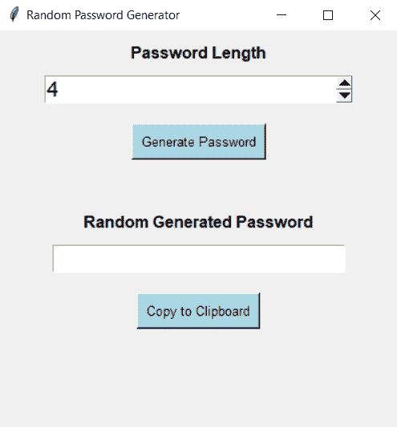

# Python 中的随机密码生成器| GUI Tkinter

> 原文：<https://www.askpython.com/python/examples/random-password-generator>

在本文中，我们将学习如何用 Python 创建一个随机密码生成器。使用强密码是必要的，也是值得推荐的。根据网络安全专家的说法，密码必须是字母、数字和符号的组合，还要确保该组合不是一个可以使用社会工程方法轻易猜到的合理单词或组合。

另一方面，长度至少为 8 个字符的随机密码即使在应用了高级安全破坏方法(如暴力攻击)之后，也很难被破坏或破解，或者可能需要很长时间来破坏它。

## 随机密码生成器代码–GUI

生成建议长度的强随机密码是一项困难的任务，显然不会比记住它更困难。但是在这里，我们将编写一个 python 脚本来生成一个随机密码。

### 1.安装并导入所需的模块

我们从使用 pip 包管理器安装所需的库开始。在命令行或终端中输入以下命令来安装模块。

我们需要安装 Tkinter，使我们的密码生成器 GUI(图形用户界面)基于 pyperclip 库注入复制到剪贴板功能。

```py
pip install tkinter
pip install pyperclip
pip install random

```

在从终端安装了所需的库之后，我们现在转移到 Python 文件来编码。我们首先将库导入为:

其中 random 用于从给定列表中[生成**随机**字符](https://www.askpython.com/python/examples/generate-random-strings-in-python)，而**字符串**用于获取字符/文本。

```py
import random, string
from tkinter import *
import pyperclip

```

### 2.初始化 Tkinter 窗口

下一步，我们使用 [Tkinter](https://www.askpython.com/python-modules/tkinter/tkinter-font-class) 模块初始化我们的 GUI 窗口。

```py
#Initialize Window

root =Tk()
root.geometry("400x400") #size of the window by default

#title of our window
root.title("Random Password Generator")

```

### 3.给元素编码

我们现在开始按照 GUI 对元素进行编码，包括标题、文本、标签、按钮等。

为了选择密码的**长度，**

*   我们使用 **Label** 方法来生成一个文本标签，以定义我们想要的密码长度的输入字段的用途。
*   **spinbox** 方法用于根据值选择器获取输入，范围从 4 到 32，您可以根据需要更改，这定义了密码的最小和最大长度。

```py
#get length of password

pass_head = Label(root, text = 'Password Length', font = 'arial 12 bold').pack(pady=10) #to generate label heading

pass_len = IntVar() #integer variable to store the input of length of the password wanted
length = Spinbox(root, from_ = 4, to_ = 32 , textvariable = pass_len , width = 24, font='arial 16').pack()

```

我们编写了一个**生成密码按钮**，点击它可以生成一个随机密码:

*   我们给我们的按钮一些样式，以及名称-生成密码。我们使用命令，它显示了单击(按键)按钮时将运行哪个函数(这里是 randPassGen 函数)。

```py
Button(root, text = "Generate Password" , command = randPassGen, font="Arial 10", bg='lightblue', fg='black', activebackground="teal", padx=5, pady=5 ).pack(pady= 20)

```

在这一步，我们的窗口显示以下输出:



Password Length

添加 so 之后，我们现在在代码中添加输出元素。

*   我们再次添加了一个标签来显示正在显示的内容，我们添加了一个带有某种样式的“随机生成的密码”的标签。
*   同样，我们添加了一个**条目**小部件来创建一个输入字段，这是为了显示我们随机生成的密码
*   **textvariable** 小部件用于显示 output_pass 变量的值，该变量保存随机生成的密码。

```py
pass_label = Label(root, text = 'Random Generated Password', font = 'arial 12 bold').pack(pady="30 10")
Entry(root , textvariable = output_pass, width = 24, font='arial 16').pack()

```

*   我们现在在代码中添加 **Add to Clipboard 按钮**来显示，它的命令小部件显示 copyPass 函数将在单击该按钮时运行。

```py
Button(root, text = 'Copy to Clipboard', command = copyPass, font="Arial 10", bg='lightblue', fg='black', activebackground="teal", padx=5, pady=5 ).pack(pady= 20)

```

在执行时，我们的 Tkinter 输出窗口如下所示:



Copy To Clipboard

### 4.随机密码功能

完成了前端(GUI)部分后，我们现在转到代码的后端，在这里我们向按钮添加功能

*   我们编写了这段代码中最重要的函数，用于随机生成密码，我们在代码中这样做:

```py
#Random Password generator

output_pass = StringVar()

all_combi = [string.punctuation, string.ascii_uppercase, string.digits, string.ascii_lowercase]  #list of all possible characters

def randPassGen():
    password = "" # to store password
    for y in range(pass_len.get()):
        char_type = random.choice(all_combi)   #to randomize the occurance of alphabet, digit or symbol
        password = password + random.choice(char_type) #to generate random characters as per the input length from the occurance list

    output_pass.set(password)

```

### 5.复制密码功能

最后一步，我们在代码中添加复制密码函数，如下所示:

*   我们使用 **pyperclip** 库的 copy 方法来保存复制到我们系统中的密码。我们使用 output_pass 变量的 get 方法获取密码。

```py
#Copy to clipboard function

def copyPass():
    pyperclip.copy(output_pass.get())

```

尽管在本教程的后面讨论过，随机密码生成器和复制到剪贴板功能并没有包含在代码的末尾，因为在这种情况下，如果没有找到，程序将抛出一个错误。

我们在窗口初始化之后(在步骤 2 的代码之后)声明我们的函数。如下面的最终代码所示:

## GUI 随机密码生成器的完整 Python 代码

```py
import random, string
from tkinter import *
import pyperclip

#Initialize Window

root =Tk()
root.geometry("400x400") #size of the window by default

#title of our window
root.title("Random Password Generator")

# -------------------  Random Password generator function

output_pass = StringVar()

all_combi = [string.punctuation, string.ascii_uppercase, string.digits, string.ascii_lowercase]  #list of all possible characters

def randPassGen():
    password = "" # to store password
    for y in range(pass_len.get()):
        char_type = random.choice(all_combi)   #to randomize the occurance of alphabet, digit or symbol
        password = password + random.choice(char_type)

    output_pass.set(password)

# ----------- Copy to clipboard function

def copyPass():
    pyperclip.copy(output_pass.get())

#-----------------------Front-end Designing (GUI)

pass_head = Label(root, text = 'Password Length', font = 'arial 12 bold').pack(pady=10) #to generate label heading

pass_len = IntVar() #integer variable to store the input of length of the password wanted
length = Spinbox(root, from_ = 4, to_ = 32 , textvariable = pass_len , width = 24, font='arial 16').pack()

#Generate password button

Button(root, command = randPassGen, text = "Generate Password", font="Arial 10", bg='lightblue', fg='black', activebackground="teal", padx=5, pady=5 ).pack(pady= 20)

pass_label = Label(root, text = 'Random Generated Password', font = 'arial 12 bold').pack(pady="30 10")
Entry(root , textvariable = output_pass, width = 24, font='arial 16').pack()

#Copy to clipboard button

Button(root, text = 'Copy to Clipboard', command = copyPass, font="Arial 10", bg='lightblue', fg='black', activebackground="teal", padx=5, pady=5 ).pack(pady= 20)

root.mainloop()  #to bundle pack the code for tkinter

```

基于 GUI 的随机密码生成器的输出如下:

<https://www.askpython.com/wp-content/uploads/2022/01/Ourput-to-random-password-generator.mp4>

## 结论

教程到此为止。希望你已经很好地学习了如何用 Python 制作一个随机密码生成器，并且通过编写一个基于接口的脚本也有所提高。