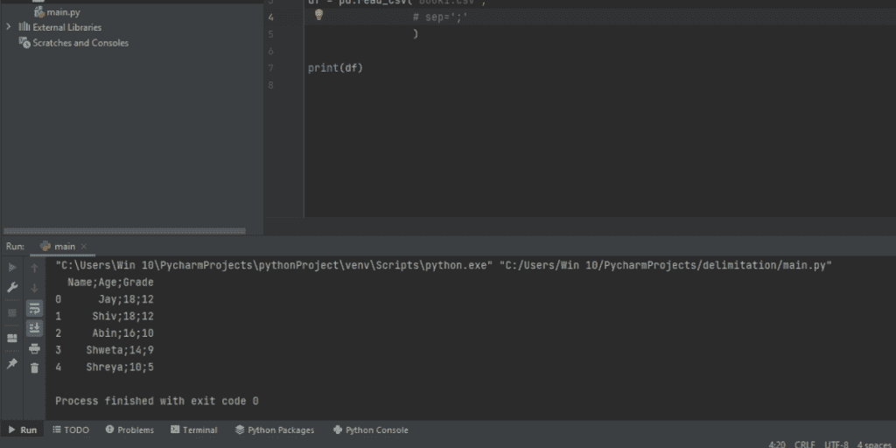
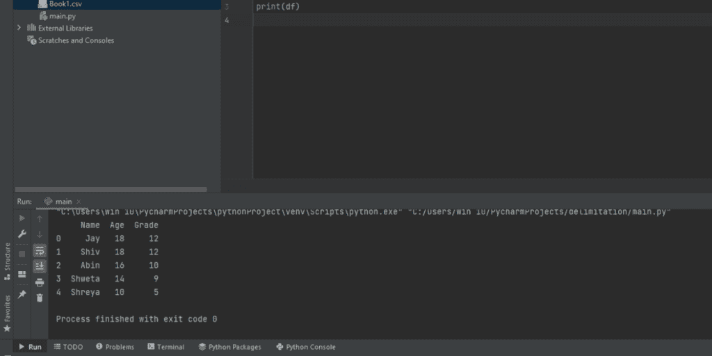

# 熊猫 read_csv()带有自定义分隔符

> 原文：<https://www.askpython.com/python-modules/pandas/read-csv-with-delimiters>

在本文中，我们将了解如何使用带有自定义分隔符的 read_csv()函数。首先，让我们先了解一下基础知识。

**如果你已经知道了基本知识，请[跳到使用自定义分隔符与熊猫 read_csv()](#using-custom-delimiters-with-read-csv)**

## 熊猫是什么？

今天有许多类型的数据结构在使用，有些我们可能知道，有些可能不知道。Pandas 是一个非常流行的 Python 库，它主要允许我们创建两种类型的数据结构:

*   数据帧
*   系列

**数据帧**是行和列的矩阵，以类似表格的格式存储数据。数据帧中的项目数量需要相等地量化，即每一列必须具有相同数量的项目。

**Series** 是一维的数据结构，而且就像一个数组，可以存储不同数据类型的项目。它主要由构造者熊猫创造。

### 什么是 CSV 文件？

CSV 代表逗号分隔值。

例如，假设一个文件存在，其中填充了多个随机值，但当一起查看时，它没有任何意义。但是如果我们用逗号分隔所有的值，那么它就变成了一个学校记录，其中充满了学生的数据库，包括他们的姓名、编号、地址等等。

### 什么是分隔符？

分隔符是一种特殊字符或标点符号，用于分隔或显示两个单词或数字之间的差异。大多数情况下，逗号用作分隔符，但也可以使用其他字符。

正如我们在上面的例子中所观察到的，一旦使用逗号将一组没有特定含义的数据分隔开，这些数据就开始变得有意义，同样，在. csv 文本文件中，当逗号填充在数据之间时，它采用具有行和列的表格的形式。

所以，把一个有随机值的文件变成一个有意义的表的过程叫做定界。

定界通常由逗号完成，但在某些情况下，也可以用运算符、标点符号以及特殊字符来完成。

现在我们来了解一下什么是 read_csv()函数，它是如何工作的。

## 使用 Pandas read_csv()方法

这个熊猫函数用于读取(。csv)文件。但是您也可以识别逗号以外的分隔符。这个特性使得 read_csv 成为一个非常方便的工具，因为有了它，reading。带有任何分隔符的 csv 文件可以变得非常容易。

让我们看一个工作代码来理解如何调用 read_csv 函数来读取. csv 文件。我们已经准备好了。包含许多汽车公司的汽车数据的 csv 文件，命名为“Car_sales.csv”。

**示例代码**

```py
import pandas as pd

CarData = pd.read_csv('Car_sales.csv')

```

在上面的代码中，我们初始化了一个名为“CarData”的变量，然后用它来存储“Car_sales.csv”中的所有值。中的值。csv 文件是逗号分隔的，所以我们不需要在编译器的 read_csv 参数中指定更多的迭代。

read_csv 函数允许从一个很大的参数列表中进行选择，然后在任何需要的时候或者临时使用它。只有一个参数是必须使用的，那就是指定文件名或文件路径。(注意:在重新创建上述代码时，需要提到文件路径，因为文件名只有在 Python。txt 文件和。csv 文件存在于同一目录中)。

## 对 read_csv()使用自定义分隔符

现在让我们学习如何在 read_csv()函数中使用自定义分隔符。我们将向您展示如何使用不同的常用分隔符来读取 CSV 文件。您可以根据所使用的文件类型，用任何自定义分隔符替换这些分隔符。

### 1.分号分隔符

正如我们所知，有许多特殊字符可以用作分隔符，read_csv 提供了一个参数' sep ',它指示编译器将逗号以外的字符作为分隔符。让我们了解如何使用它。

假设我们有一个包含内容的数据库，文件名为“Book1.csv”:

```py
Name;Age;Grade
Jay;18;12
Shiv;18;12
Abin;16;10
Shweta;14;9
Shreya;10;5

```

现在，如果我们按照常规标准，那么使用:

```py
import pandas as pd
df = pd.read_csv('Book1.csv')
print(df)

```

将产生一个输出:



但是，如果我们将' sep '添加到 read_csv 语法中，最终结果会发生变化:

**代码:**

```py
import pandas as pd
df = pd.read_csv('Book1.csv', sep=';')
print(df)

```

**输出:**



### 2.竖线分隔符

如果文件用竖线而不是分号或逗号分隔，则可以使用以下语法读取该文件:

```py
import pandas as pd
df = pd.read_csv('Book1.csv', sep='|')
print(df)

```

### 3.冒号分隔符

同样，如果文件是用冒号分隔的，那么我们将使用以下语法:

```py
import pandas as pd
df = pd.read_csv('Book1.csv', sep=':')
print(df)

```

## 结论

定界是一个非常重要的功能。csv 文件，还有很多。csv 文件需要定界。本文解释了所有可能的定界方法，以使你掌握这些概念。

我们触及了最基本的内容，从解释熊猫和 CSV 开始，然后我们继续讨论划界以及如何划界。我们还学习了不同种类的分隔符，如分号、逗号、竖线和冒号。

我希望这篇文章能帮助你轻松地学习这些概念。