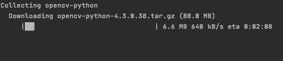
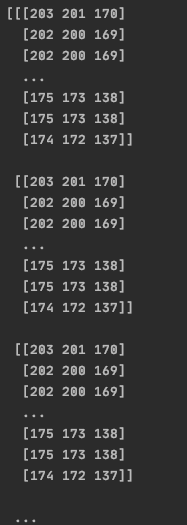
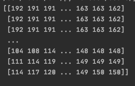
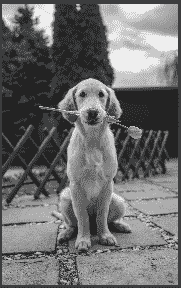

# 使用 OpenCV 读取 Python 中的图像

> 原文：<https://www.askpython.com/python-modules/read-images-in-python-opencv>

Python 使得导入图像和摆弄图像变得很容易。了解如何在 Python 中读取图像将使您能够进行图像处理，并在图像数据上训练机器学习模型。

## 什么是图像处理？

**图像处理**涉及对图像执行一些操作，以获得增强的图像或从中提取一些有用的信息。

图像处理领域即将到来并迅速发展。它支持图像中的对象检测，其应用范围从自动驾驶汽车到医学领域的肿瘤检测。

## 什么是图像？

这是一个荒谬的问题。当然，你知道图像是什么。更好的问题应该是“**什么是机器的图像”。**

你看到的图像实际上是计算机的 2D 矩阵。

数字图像存储为像素的组合。每个像素还包含不同数量的通道。如果是灰度图像，它只有一个像素，而彩色图像包含三个通道:**红色、**绿色和**蓝色。**

每个像素的每个通道都有一个在 **0 到 255** 之间的值。通过不同比例的红、绿、蓝组合，我们可以创造出任何颜色。

## 用 OpenCV 读取 Python 中的图像

在本教程中，我们将学习如何使用 OpenCV 库读取 Python 中的图像。

OpenCV 是一个开源的计算机视觉和机器学习软件库，其编程功能主要针对实时计算机视觉。

### 1.安装 OpenCV 库

您可以使用 [pip 命令](https://www.askpython.com/python-modules/python-pip)安装软件包，如下所示:

```py
pip install opencv-python

```



Install OpenCV

要在 Python 项目中使用 OpenCV，您需要导入它。要导入它，请使用下面一行:

```py
import cv2

```

### 2.编程读取图像

要使用 OpenCV 读取图像，请使用下面的代码行。

```py
img = cv2.imread('image_path')

```

现在变量 **img** 将是像素值的[矩阵](https://www.askpython.com/python/python-matrix-tutorial)。我们可以打印出来，看看 RGB 值。

我们在此示例中使用的图像是:


Sample Image

要打印矩阵，请使用:

```py
print(img)

```

### 3.使用 OpenCV 在 Python 中读取图像的完整实现

完整的代码如下:

```py
import cv2

#read
img = cv2.imread('sample_image.jpg')

#show
print(img)

```

**输出**



## 使用 Python OpenCV 显示图像

要使用 OpenCV 显示图像，请使用以下代码行:

```py
ccv2.imshow('image',img)
cv2.waitKey(0)
cv2.destroyAllWindows()

```

**cv2.waitKey()** 是一个键盘绑定函数。它的参数是以毫秒为单位的时间。

该函数为任何键盘事件等待指定的毫秒数。如果您在这段时间内按下任何键，程序将继续运行。如果传递 0，它将无限期等待击键。

### Python 实现

显示图像的完整代码是:

```py
import cv2
#read
img = cv2.imread('sample_image.jpg')
#show
cv2.imshow('image',img)
cv2.waitKey(0)
cv2.destroyAllWindows()

```

## 使用 Python OpenCV 处理图像

OpenCV 中有很多允许你操作图像的功能。我们将看看如何把图像变成灰度。

灰度图像意味着每个像素只有一个通道，其值在 0 到 255 之间。

做到这一点的代码是:

```py
gray_image = cv2.cvtColor(img, cv2.COLOR_BGR2GRAY)

```

### 实现 Python 代码

将图像转换为灰度的完整代码是:

```py
#read
img = cv2.imread('sample_image.jpg')
#to grayscale
gray_image = cv2.cvtColor(img, cv2.COLOR_BGR2GRAY)
#show
print(gray_image)
cv2.imshow('image',gray_image)
cv2.waitKey(0)
cv2.destroyAllWindows()

```



你可以看到这个矩阵的维数与彩色图像的维数不同。

### 保存处理过的图像文件

要在操作后保存图像，请使用以下代码行:

```py
cv2.imwrite('sample_grayscale.jpg',gray_image)

```

这里，第一个参数是您要给文件起的名字，第二个参数是包含您要保存的图像的变量。我们正在保存上面创建的灰度图像。

### 完整的 Python 代码，用于转换彩色图像灰度

保存图像的完整代码是:

```py
import cv2

#read
img = cv2.imread('sample_image.jpg')
#to grayscale
gray_image = cv2.cvtColor(img, cv2.COLOR_BGR2GRAY)
#show
print(gray_image)
#save
cv2.imwrite('sample_grayscale.jpg',gray_image)

```



This is what the saved image looks like

## 结论

在本教程中，我们介绍了如何使用 OpenCV 在 Python 中读取和操作图像。要进一步了解 OpenCV，请阅读它的[文档。](https://docs.opencv.org/)