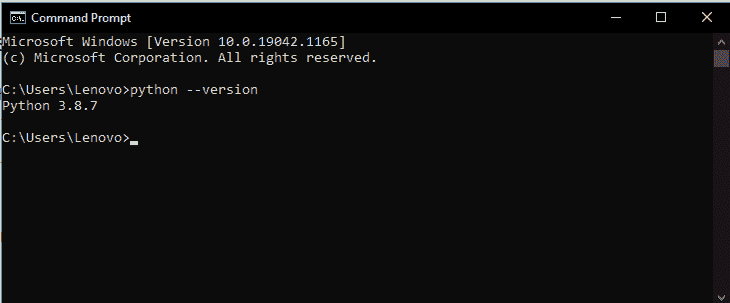
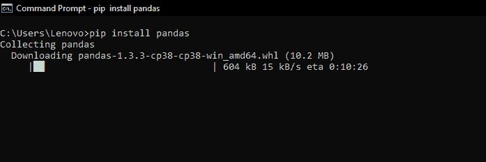
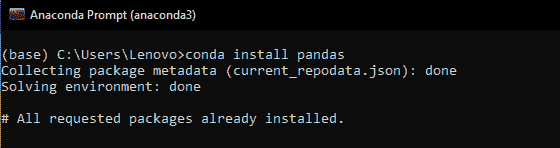
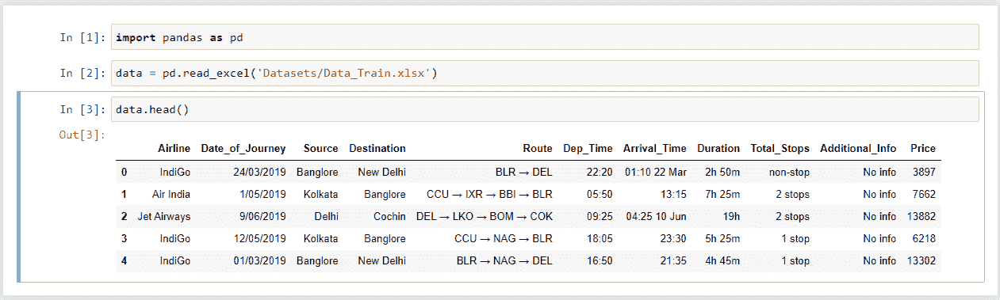
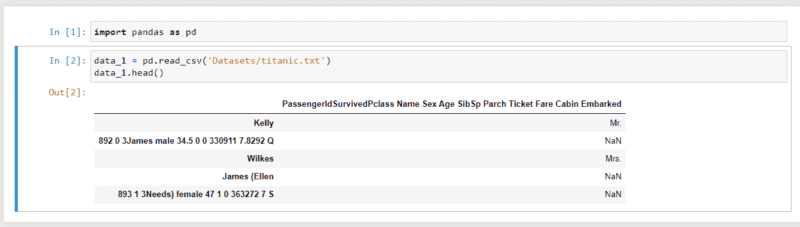

# 使用熊猫阅读文本文件——简要参考

> 原文：<https://www.askpython.com/python-modules/pandas/read-text-file-pandas>

这篇文章是一个简单的教程，关于我们如何使用 Python 中的 [**熊猫**库读取文本文件。如今，文本文件有助于存储大量原始信息。它们是获取特定信息的最简单方式之一。他们可以持有以下物品:](https://www.askpython.com/python-modules/pandas/python-pandas-module-tutorial)

1.  密码
2.  Raw info
3.  链接
4.  信息和更多信息

因此，为了管理它，有一些工具和技术，通过它们我们可以很容易地提取我们需要的东西。其中之一是通过计算机编程。让我们更详细地看看它是如何工作的。

* * *

## 使用 Python Pandas 读取文本文件的步骤

计算机中的文件可以存储各种数量的文件和扩展名。一般来说，文件是用来存储任何信息的。所以，没有具体的定义。但是，它们的扩展说明了很多。每个扩展都定义了存储在其中的不同数据位。

例如，像 python 这样的特定编程语言的文件具有. py 的扩展名。扩展名只是为了表明它是什么类型的文件以及它代表什么数据。

### 在 windows 中创建 sample.txt 文件

在 windows 中创建文本文件的过程非常简单。请遵循以下步骤:

1.  转到 windows 搜索栏，键入**记事本**。点击那个。
2.  它会打开一个空白页。在那里我们可以放入任何我们想要的文本或信息，并随时对其进行修改。
3.  完成工作后，按下 **Ctrl+S** 或转到左上角的**文件**选项，点击**保存**将文件保存到您想要的位置。

### 阅读熊猫的文本文件

Pandas 是 Python 中的一个库，包含了一些必要的数据。主要在**数据科学和机器学习领域使用。**这是一个开源项目，就像 Python 一样，任何人都可以参与开发。

前往此 [**链接**](https://pandas.pydata.org/contribute.html) 了解更多信息。以下是它的用途:

1.  数据分析
2.  数据预处理
3.  数据清理
4.  数据争论
5.  从嵌入外部链接的文件中访问信息
6.  从 JSON、SQL、Excel 文件格式中提取数据。

纯内置的 Python 和其他支持库为管理大量数据提供了最佳工作空间

### Python Pandas 中的文本文件方法

在数据科学中，我们获取的信息量是巨大的，所以它们都包含在一个称为数据集的文件中。这个数据集可能有数千行和数千列，包含各种输入。熊猫为处理我们的数据提供了更多的功能和方法。

1.  **read_excel() :** 读取一个 excel 文件
2.  **read_csv() :** 读取逗号分隔值文件
3.  **info() :** 显示所有列的信息
4.  **isna() :** 检查缺少的值
5.  **sum() :** 各种数据类型的任意列的值的总和
6.  **dropna() :** 删除一列
7.  **head() :** 返回数据集的前 5 行。但是，可以根据我们给大括号里面的数字返回。

这些是主要功能。要提前了解更多关于该库的信息，请访问此链接获取入门指南。

### 安装熊猫

[Python PIP](https://www.askpython.com/python-modules/python-pip) 命令即**‘Python 的包安装器’**使得在任何系统中安装 Pandas 变得容易。但是，这有一些限制。但是首先，在命令提示符下输入

```py
python --version

```

确保您拥有 Python 3.6 或更高版本。



下一个类型 **pip 安装熊猫**如下所示:



pandas installation

### 使用 Anaconda 安装熊猫

注意:为此你需要在你的系统上安装 [Anaconda](https://www.askpython.com/python-modules/python-anaconda-tutorial) 。

Pandas 预装了 Anaconda，但是作为参考，我们应该知道如何通过 conda 提示符添加新的库。

因此，打开 Anaconda 提示符并输入以下命令

```py
conda install pandas

```



因此，我们确认该库已经存在于 conda 环境中。

### 进口熊猫

所以，在安装并获得一些粗略的信息后，是时候更熟悉它了。首先要做的是导入库并检查它是否正确安装。

```py
import pandas

```

如果安装后没有出现错误，那么就可以使用了。

### 在熊猫中读取文件

该教程是非常简单的关于读取一个文件。我们将在此阅读三种类型的文件。

1.  彗形分离值文件
2.  Excel 文件
3.  **文本文件**

读取每个文件都有特殊的函数。如前所述，它有 **read_excel()** 和 **read_csv()** 。环境—**《朱庇特笔记本》**

**用 Python 读取 excel 文件:**

使用的样本文件-**" train . xlsx "**

```py
import pandas as pd                       
data = pd.read_excel('train.xlsx')      
data.head()                                    

```

**输出:**



**读取 Python 中的文本文件:**

使用的样本文件-**" titanic . txt "**

```py
import pandas as pd
data_1 = read_csv('titanic.txt')
data_1.head()

```

**输出:**



## 结论

在这里，我们结束这个话题。所以，通过这种方式，我们可以通过熊猫读取一些文件，让我们的数据科学和机器学习之旅更加顺畅。我认为这是开始使用 pandas 并在系统中配置它的最相关的方式。