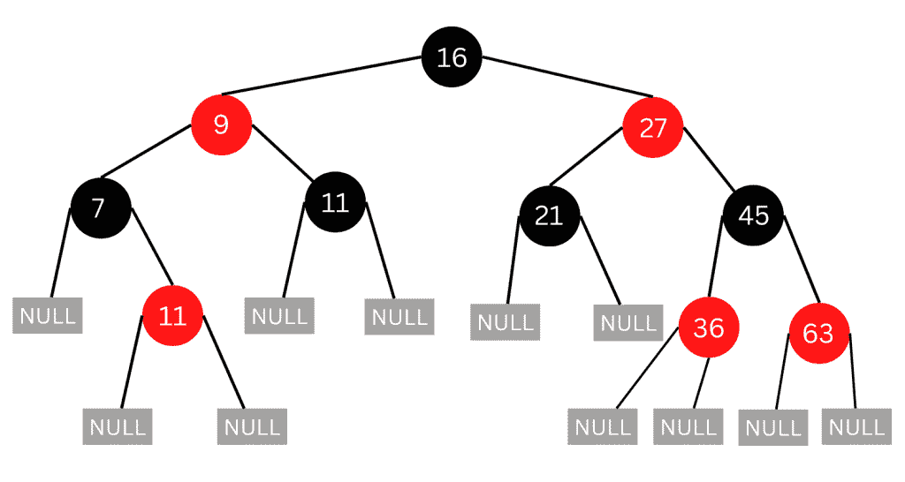
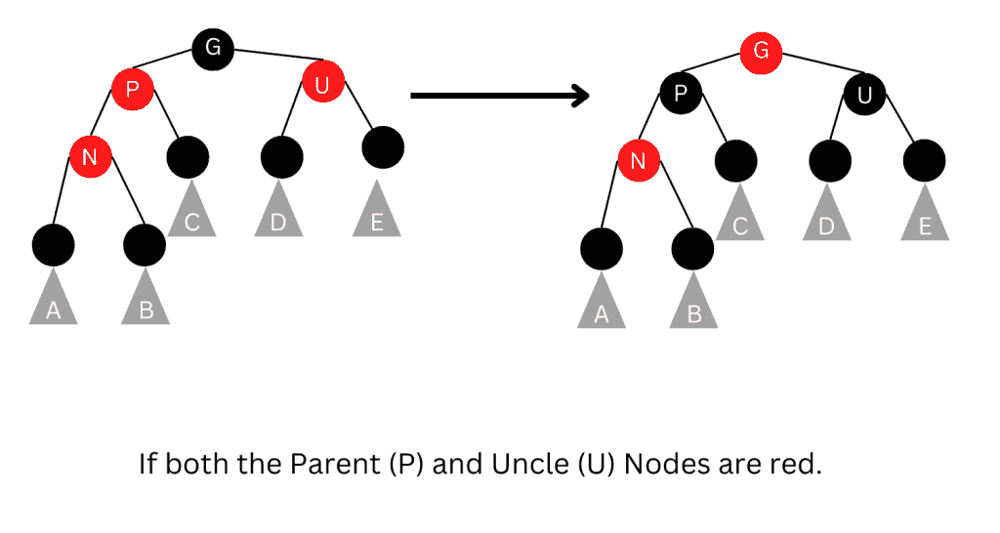
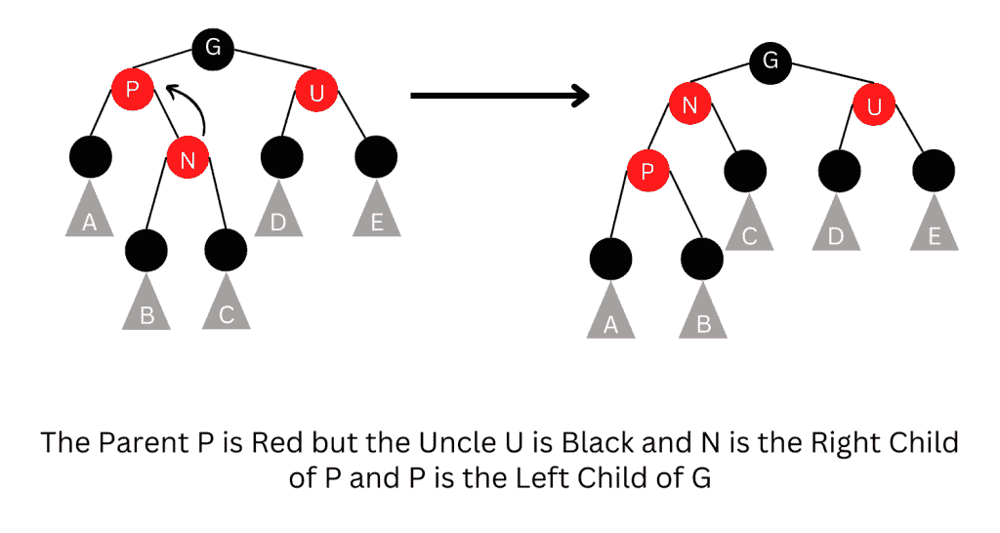
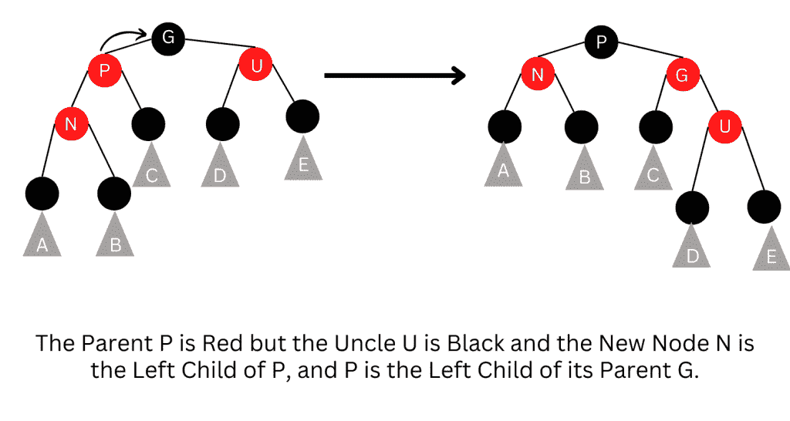
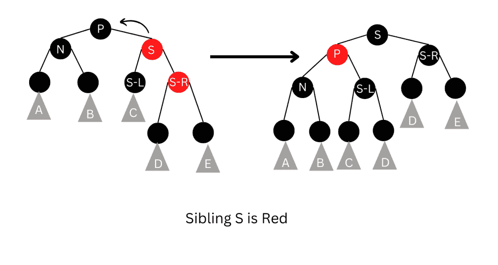
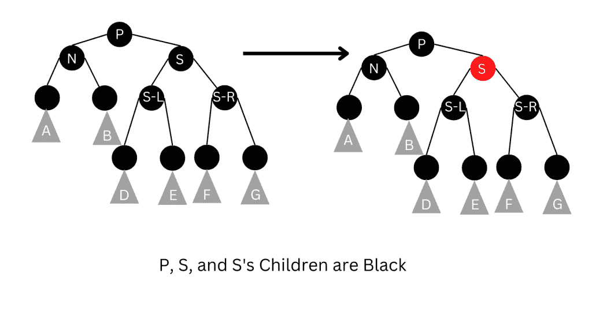
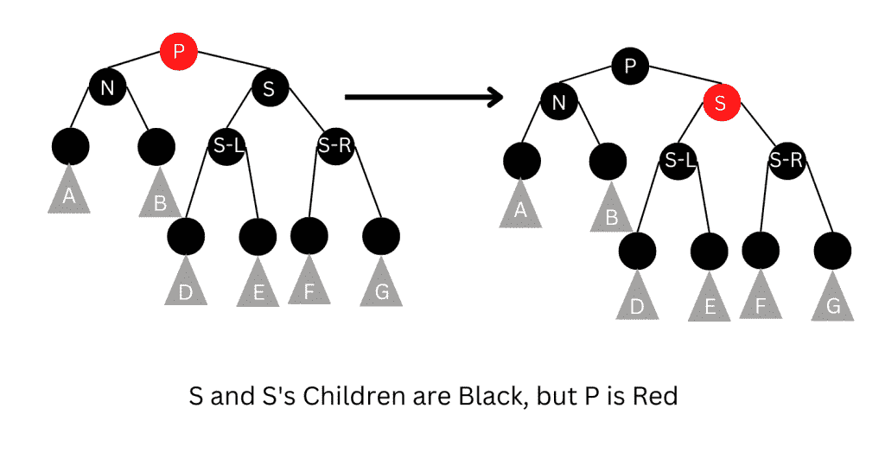
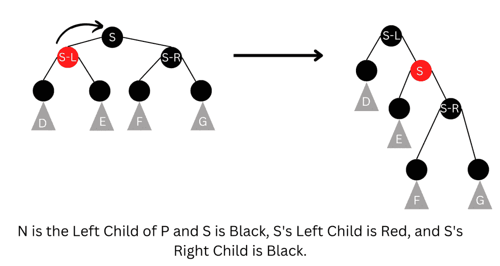
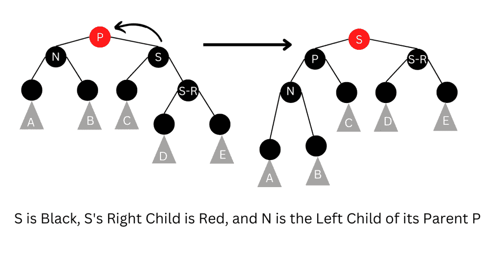
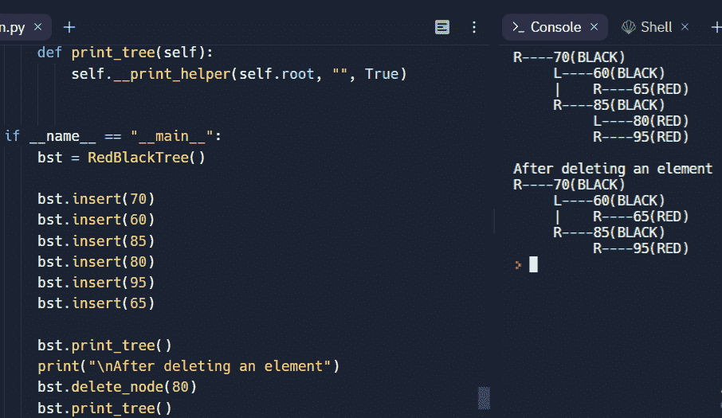

# Python 中的红黑树——示例实现

> 原文：<https://www.askpython.com/python/examples/red-black-tree-in-python>

在这篇文章中，让我们试着去了解红黑树。红黑树是一种自平衡二叉查找树，由鲁道夫·拜尔于 1972 年发明，他称之为“对称二进制 B 树”。

尽管红黑树很复杂，但它的操作在最坏的情况下也有很好的运行时间，可以有效地用于搜索、插入和删除。这些都可以在 O(logN)时间内完成，其中 N 是树中节点的数量。

实际上，红黑树是一个二叉查找树，可以智能地插入和移除，以保持树的合理平衡。关于红黑树需要特别注意的一点是，在这种树中，没有数据存储在叶节点上。

***也读作:[波束搜索算法与逻辑并用 Python 实现](https://www.askpython.com/python/examples/beam-search-algorithm)***

## 红黑树的性质

红黑树是一个二叉查找树，其中每个节点的颜色不是红色就是黑色。除了二叉查找树的其他限制外，红黑树还有以下附加要求:

1.  节点的颜色不是红色就是黑色。
2.  根节点的颜色总是黑色。
3.  所有叶节点都是黑色的。
4.  每个红色节点都有两个黑色的子节点。
5.  从一个给定节点到它的任何一个叶节点的每一条简单路径都有相同数量的黑色

下图是一棵红黑树的例子



EXAMPLE

这些约束强化了红黑树的一个关键属性。

> 从根节点到任何叶节点的最长路径不超过从根到该树中任何其它叶的最短路径的两倍。

这就产生了一个大致 [**平衡的树**](https://www.askpython.com/python/examples/balanced-binary-tree) 。由于诸如插入、删除和搜索之类的操作需要与树的高度成比例的最坏情况时间，这种理论上的高度上限允许红黑树在最坏情况下是有效的，这与普通的二分搜索法树不同。

为了理解这些属性的重要性，注意到根据属性 4，没有路径可以在一行中有两个红色节点就足够了。最短的可能路径将具有所有黑色节点，而最长的可能路径将交替具有红色和黑色节点。因为所有最大路径都有相同数量的黑色节点(属性 5)，所以没有路径比任何其他路径长两倍以上。

## 对红黑树的不同操作

在红黑树上执行只读操作(比如遍历树中的节点)不需要对用于二分搜索法树的操作进行修改。记住每一棵红黑树都是二叉查找树的特例。但是，插入和删除操作可能会违反红黑树的属性。因此，这些操作可能需要恢复红-黑属性，这可能需要少量(O(log N)或摊销 O(1))颜色变化。

### 1.插入节点

插入操作的开始方式与我们在二叉查找树中添加新节点的方式相同。然而，在二叉查找树中，我们总是将新节点作为叶子添加，而在红黑树中，叶子节点不包含数据。因此，我们没有添加新节点作为叶节点，而是添加了一个红色的内部节点，它有两个黑色的叶节点。请注意，新节点的颜色是红色，其叶节点的颜色是黑色。一旦添加了新的节点，可能会违反红黑树的一些属性。因此，为了恢复它们的属性，我们检查某些案例，并根据插入后出现的案例来恢复属性。

当我们在红黑树中插入新节点时，请注意以下几点:

*   所有叶节点总是黑色的。所以属性 3 总是成立。
*   属性 4(每个红色节点的两个子节点都是黑色的)只有通过添加一个红色节点、重画一个黑色节点(红色)或旋转才会受到威胁。
*   属性 5(从任何给定节点到其叶节点的所有路径具有相等数量的黑色节点)仅通过添加黑色节点、将红色节点重绘为黑色或旋转而受到威胁。

#### 案例 1:添加到根树的新节点

在这种情况下，N 被重绘为黑色，因为树根总是黑色的。因为 s 一次向每条路径添加一个黑节点，所以不违反属性 5。

#### 情况 2:新节点的父节点(P)是黑色的

在这种情况下，每个红色节点的两个子节点都是黑色的，因此属性 4 不会失效。财产 5 也没有受到威胁。这是因为新节点 S 有两个黑色叶节点，但是因为是红色的，所以通过它的每个子节点的路径都有相同数量的黑色节点。

*(下面的例子中，假设有一个祖父节点(父节点的父节点)–G，因为它的父节点 P 是红色的，如果是根节点，它就是黑色的。因此，N 也有一个叔叔节点(父节点的兄弟)–U(不管 U 是叶节点还是内部节点)。)*

#### 情况 3:父(P)和叔(U)节点都是红色的。

在这种情况下，违反了属性 5，即从任何给定节点到其叶节点的所有路径都具有相同数量的黑节点。第三种情况下的插入如下所示。

为了恢复属性 5，两个节点(P 和 U)都被重绘为黑色，而祖父 G 被重绘为红色。现在，新的红色节点 N 有一个黑色的父节点。由于通过父节点或叔节点的任何路径都必须通过祖父节点，因此这些路径上的黑色节点的数量没有变化。

然而，祖父 G 现在可能违反了属性 2，即根节点总是黑色的，或者违反了属性 4，即每个红色节点的两个孩子都是黑色的。

当 G 有一个红色的双亲时，性质 4 将被违反。为了解决这个问题，整个过程递归地在案例 1 中的 G 上执行。



INSERTION 3

#### 情况 4:父母 P 是红色的，但是叔叔 U 是黑色的，N 是 P 的右孩子，P 是 G 的左孩子

为了解决这个问题，向左旋转以切换新节点 S 及其父节点的角色。在旋转之后，注意我们已经重新标记了 N 和 P，然后，调用 case 5 来处理新节点的父节点。这样做是因为仍然违反了规定每个红色节点的两个子节点都应该是黑色的属性 4。下图说明了情况 4 的插入。注意，在 N 是 G 的左子，P 是 G 的右子的情况下，我们要进行右旋转。



INSERTION 4

#### 情况 5:父节点 P 是红色的但是叔节点 U 是黑色的并且新节点 N 是 P 的左子节点，P 是其父节点 g 的左子节点。

为了解决这个问题，对 G(N 的祖父母)执行右旋转。经过这次旋转，前父节点 P 现在既是新节点 N 的父节点，也是前祖父节点 G 的父节点，我们知道 G 的颜色是黑色的(因为否则，它的前子节点不可能是红色的)。现在，切换 P 和 G 的颜色，使生成的树满足属性 4，即红色节点的两个子节点都是黑色的。案例 5 的插入如下图所示。



INSERTION 5

### 2.删除节点

我们开始从红黑树中删除一个节点，就像我们在[二叉查找树](https://www.askpython.com/python/examples/binary-search-tree)的情况下所做的一样。在二叉查找树中，当我们删除具有两个非叶子节点的节点时，我们在该节点的左子树中找到最大元素，或者在右子树中找到最小元素，并将其值移动到被删除的节点中。

之后，我们删除从中复制值的节点。请注意，该节点的非叶节点必须少于两个。因此，仅仅复制一个值并不违反任何红黑属性，只是把删除的问题简化为删除一个最多有一个非叶子节点的问题。

在本节中，我们将假设删除一个节点，该节点最多有一个非叶节点，我们称之为其子节点。如果这个节点有两个叶节点，那么让其中一个作为它的子节点。

在删除一个节点时，如果它的颜色是红色，那么我们可以简单地用它的子节点替换它，子节点必须是黑色的。通过已删除节点的所有路径将简单地通过少一个红色节点，并且已删除节点的父节点和子节点都必须是黑色的，因此不会违反任何属性。

另一个简单的例子是当我们删除一个有红色子节点的黑色节点时。在这种情况下，属性 4 和属性 5 可能会被违反，所以要恢复它们，只需用黑色重新绘制被删除节点的子节点。然而，当要删除的节点及其子节点都是黑色时，就会出现复杂的情况。在这种情况下，我们首先用子节点替换要删除的节点。

#### 情况 1: N 是新节点。

在这种情况下，我们已经从每个路径中删除了一个黑色节点，新的根是黑色的，因此没有违反任何属性。

#### 情况 2:兄弟姐妹 S 是红色的

在这种情况下，交换 P 和 S 的颜色，然后在 P 处向左旋转。在结果树中，S 将成为 N 的祖父母。下图说明了情况 2 的删除。



DELETION 2

#### 案例三:P，S，S 的孩子是黑人

在这种情况下，简单地用红色重画 S。在结果树中，所有经过 S 的路径都将少一个黑色节点。因此，所有通过 P 的路径现在都比不通过 P 的路径少一个黑节点，所以仍然违反了性质 5。为了解决这个问题，我们在 P 上执行重新平衡过程，从情况 1 开始。案例 3 如下图所示



DELETION 3

#### 案例 4: S 和 S 的孩子是黑色的，但是 P 是红色的

在这种情况下，我们交换 S 和 p 的颜色。虽然这不会影响经过 S 的路径上的黑色节点的数量，但它会向经过 N 的路径添加一个黑色节点，以弥补这些路径上被删除的黑色节点。下图说明了这种情况。



DELETION 4

#### 案例五:N 是 P 的左子，S 是黑的，S 的左子是红的，S 的右子是黑的

在这种情况下，在 S 处执行右旋转，旋转后，S 的左子成为 S 的父，N 的新兄弟。此外，交换 S 和它的新父对象的颜色。请注意，现在所有路径仍然有相同数量的黑色节点，但是 N 有一个黑色兄弟，它的右子节点是红色的，因此我们陷入了情况 6。请参考下图。



DELETION 5

#### 案例 6: S 是黑色的，S 的右子是红色的，N 是其父 P 的左子

在这种情况下，在 P 处进行一次左旋转，使 S 成为 P 的父，S 的右子。旋转后，P 和 S 的颜色互换，S 的右孩子被涂成黑色。一旦遵循了这些步骤，您将观察到属性 4 和属性 5 仍然有效。下图解释了情况 6



DELETION 6

## 用 Python 实现红绿树算法

```py
import sys

class Node():
    def __init__(self, item):
        self.item = item
        self.parent = None  #parent node
        self.left = None   # left node
        self.right = None  # right node
        self.color = 1     #1=red , 0 = black

class RedBlackTree():
    def __init__(self):
        self.TNULL = Node(0)
        self.TNULL.color = 0
        self.TNULL.left = None
        self.TNULL.right = None
        self.root = self.TNULL

    # Preorder
    def pre_order_helper(self, node):
        if node != TNULL:
            sys.stdout.write(node.item + " ")
            self.pre_order_helper(node.left)
            self.pre_order_helper(node.right)

    # Balancing the tree after deletion
    def delete_fix(self, x):
        while x != self.root and x.color == 0:
            if x == x.parent.left:
                s = x.parent.right
                if s.color == 1:
                    s.color = 0
                    x.parent.color = 1
                    self.left_rotate(x.parent)
                    s = x.parent.right

                if s.left.color == 0 and s.right.color == 0:
                    s.color = 1
                    x = x.parent
                else:
                    if s.right.color == 0:
                        s.left.color = 0
                        s.color = 1
                        self.right_rotate(s)
                        s = x.parent.right

                    s.color = x.parent.color
                    x.parent.color = 0
                    s.right.color = 0
                    self.left_rotate(x.parent)
                    x = self.root
            else:
                s = x.parent.left
                if s.color == 1:
                    s.color = 0
                    x.parent.color = 1
                    self.right_rotate(x.parent)
                    s = x.parent.left

                if s.right.color == 0 and s.right.color == 0:
                    s.color = 1
                    x = x.parent
                else:
                    if s.left.color == 0:
                        s.right.color = 0
                        s.color = 1
                        self.left_rotate(s)
                        s = x.parent.left

                    s.color = x.parent.color
                    x.parent.color = 0
                    s.left.color = 0
                    self.right_rotate(x.parent)
                    x = self.root
        x.color = 0

    def __rb_transplant(self, u, v):
        if u.parent == None:
            self.root = v
        elif u == u.parent.left:
            u.parent.left = v
        else:
            u.parent.right = v
        v.parent = u.parent

    # Node deletion
    def delete_node_helper(self, node, key):
        z = self.TNULL
        while node != self.TNULL:
            if node.item == key:
                z = node

            if node.item <= key:
                node = node.right
            else:
                node = node.left

        if z == self.TNULL:
            print("Cannot find key in the tree")
            return

        y = z
        y_original_color = y.color
        if z.left == self.TNULL:
            x = z.right
            self.__rb_transplant(z, z.right)
        elif (z.right == self.TNULL):
            x = z.left
            self.__rb_transplant(z, z.left)
        else:
            y = self.minimum(z.right)
            y_original_color = y.color
            x = y.right
            if y.parent == z:
                x.parent = y
            else:
                self.__rb_transplant(y, y.right)
                y.right = z.right
                y.right.parent = y

            self.__rb_transplant(z, y)
            y.left = z.left
            y.left.parent = y
            y.color = z.color
        if y_original_color == 0:
            self.delete_fix(x)

    # Balance the tree after insertion
    def fix_insert(self, k):
        while k.parent.color == 1:
            if k.parent == k.parent.parent.right:
                u = k.parent.parent.left
                if u.color == 1:
                    u.color = 0
                    k.parent.color = 0
                    k.parent.parent.color = 1
                    k = k.parent.parent
                else:
                    if k == k.parent.left:
                        k = k.parent
                        self.right_rotate(k)
                    k.parent.color = 0
                    k.parent.parent.color = 1
                    self.left_rotate(k.parent.parent)
            else:
                u = k.parent.parent.right

                if u.color == 1:
                    u.color = 0
                    k.parent.color = 0
                    k.parent.parent.color = 1
                    k = k.parent.parent
                else:
                    if k == k.parent.right:
                        k = k.parent
                        self.left_rotate(k)
                    k.parent.color = 0
                    k.parent.parent.color = 1
                    self.right_rotate(k.parent.parent)
            if k == self.root:
                break
        self.root.color = 0

    # Print
    def __print_helper(self, node, indent, last):
        if node != self.TNULL:
            sys.stdout.write(indent)
            if last:
                sys.stdout.write("R----")
                indent += "     "
            else:
                sys.stdout.write("L----")
                indent += "|    "

            s_color = "RED" if node.color == 1 else "BLACK"
            print(str(node.item) + "(" + s_color + ")")
            self.__print_helper(node.left, indent, False)
            self.__print_helper(node.right, indent, True)

    def preorder(self):
        self.pre_order_helper(self.root)

    def minimum(self, node):
        while node.left != self.TNULL:
            node = node.left
        return node

    def maximum(self, node):
        while node.right != self.TNULL:
            node = node.right
        return node

    def successor(self, x):
        if x.right != self.TNULL:
            return self.minimum(x.right)

        y = x.parent
        while y != self.TNULL and x == y.right:
            x = y
            y = y.parent
        return y

    def predecessor(self,  x):
        if (x.left != self.TNULL):
            return self.maximum(x.left)

        y = x.parent
        while y != self.TNULL and x == y.left:
            x = y
            y = y.parent

        return y

    def left_rotate(self, x):
        y = x.right
        x.right = y.left
        if y.left != self.TNULL:
            y.left.parent = x

        y.parent = x.parent
        if x.parent == None:
            self.root = y
        elif x == x.parent.left:
            x.parent.left = y
        else:
            x.parent.right = y
        y.left = x
        x.parent = y

    def right_rotate(self, x):
        y = x.left
        x.left = y.right
        if y.right != self.TNULL:
            y.right.parent = x

        y.parent = x.parent
        if x.parent == None:
            self.root = y
        elif x == x.parent.right:
            x.parent.right = y
        else:
            x.parent.left = y
        y.right = x
        x.parent = y

    def insert(self, key):
        node = Node(key)
        node.parent = None
        node.item = key
        node.left = self.TNULL
        node.right = self.TNULL
        node.color = 1

        y = None
        x = self.root

        while x != self.TNULL:
            y = x
            if node.item < x.item:
                x = x.left
            else:
                x = x.right

        node.parent = y
        if y == None:
            self.root = node
        elif node.item < y.item:
            y.left = node
        else:
            y.right = node

        if node.parent == None:
            node.color = 0
            return

        if node.parent.parent == None:
            return

        self.fix_insert(node)

    def get_root(self):
        return self.root

    def delete_node(self, item):
        self.delete_node_helper(self.root, item)

    def print_tree(self):
        self.__print_helper(self.root, "", True)

if __name__ == "__main__":
    bst = RedBlackTree()

    bst.insert(70)
    bst.insert(60)
    bst.insert(85)
    bst.insert(80)
    bst.insert(95)
    bst.insert(65)

    bst.print_tree()
    print("\nAfter deleting an element")
    bst.delete_node(80)
    bst.print_tree()

```

## 输出



Output

## 红黑树的应用

红黑树是高效的二分搜索法树，因为它们为插入、删除和搜索操作提供了最坏情况下的时间保证。

红黑树不仅在诸如实时应用的时间敏感应用中有价值，而且在提供最坏情况保证的其他数据结构中优选用作构建块，AVL 树也支持 O(log n)搜索、插入和删除操作，但是它们比红黑树更加严格地平衡，从而导致较慢的插入和移除，但是更快的数据检索。

## 摘要

在本文中，我们深入研究了红黑树、它在 python 中的实现以及它的应用。最后，我们可以得出结论，红黑树是自平衡二叉查找树，也称为“对称二叉 B 树”。尽管红黑树很复杂，但它的操作有很好的最坏情况运行时间，并且使用起来很有效，因为搜索、插入和删除都可以在 O(log n)时间内完成。