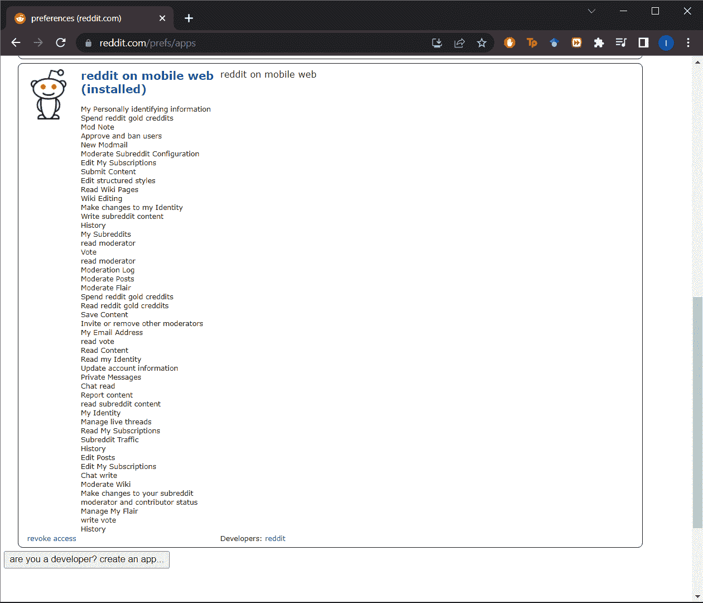
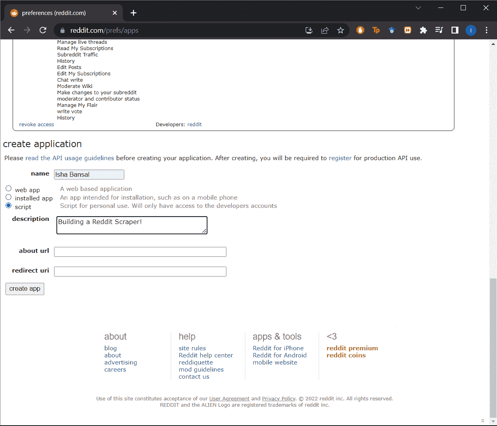
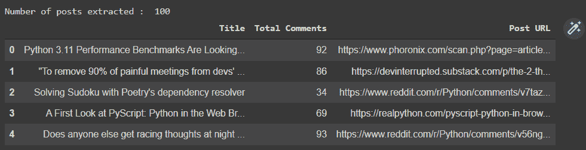
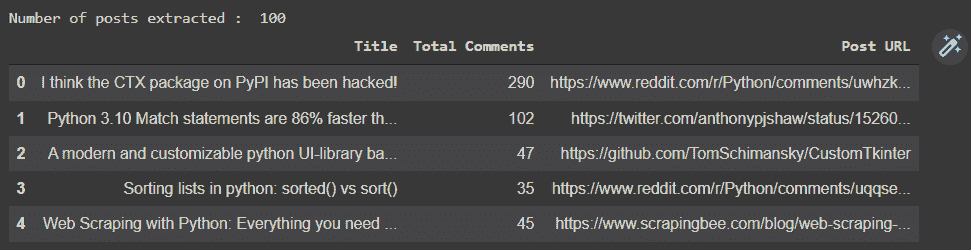
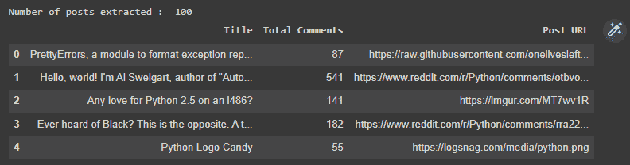
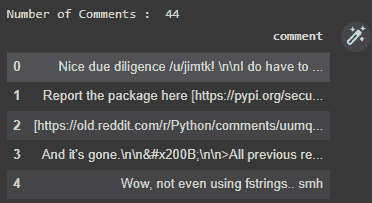

# 用 Python 构建 Reddit Web Scraper

> 原文：<https://www.askpython.com/python/examples/reddit-web-scraper-in-python>

Reddit 是无数社区、无休止的讨论和真正的人类联系的家园。Reddit 有一个针对各种兴趣的社区，包括突发新闻、体育、电视迷理论，以及源源不断的互联网上最可爱的动物。

使用 Python 的 PRAW (Python Reddit API Wrapper)包，本教程将演示如何从 Reddit 抓取数据。PRAW 是 Reddit API 的 Python 包装器，允许你从子编辑中抓取数据，开发机器人，等等。

在本教程结束时，我们将尝试从 subreddit 中收集尽可能多的 Python 相关数据，并了解 reddit 用户对 Python 的真实看法。让我们开始开心吧！

* * *

## 介绍

顾名思义，它是一种从在线页面中“抓取”或提取数据的技术。使用网络浏览器可以在互联网上看到的所有内容，包括本指南，都可以擦除到本地硬盘上。网络抓取有许多应用。数据捕获是任何数据分析的第一阶段。互联网是所有人类历史和知识的巨大宝库，你有能力提取你想要的任何信息，并以你认为合适的方式使用它。

尽管有各种各样的技术可以从 Reddit 上抓取数据，但 PRAW 简化了这个过程。它符合所有 Reddit API 要求，并消除了开发人员代码中对睡眠调用的需求。在安装刮刀之前，必须设置 Reddit 刮刀的认证。下面列出了各个步骤。

* * *

## Reddit 刮刀的认证步骤

使用 PRAW 需要身份验证。为此，我们将采取以下步骤:

1.  跟随此[链接](https://www.reddit.com/prefs/apps)访问 Reddit 开发者账户。
2.  滚动到页面底部，找到“您是开发人员吗？”按钮来开发应用程序。
3.  下一步是构建一个应用程序，填写表单，并开发应用程序。
4.  这将带您到一个页面，其中包含刮刀所需的所有信息。



001 Scraper Step 1

对于重定向 URL，您应该选择 `http://localhost:8080` 。完成后，点击创建应用程序按钮。



001 Scraper Step 2

既然身份验证阶段已经完成，我们将在下一步中继续实现 Reddit scraper。

* * *

## 刮刀的实现

这一部分将解释你必须做的一切，以获得本教程旨在获得的数据。我们首先将所有需要的模块和库导入到程序文件中。在导入 PRAW 库之前，我们必须通过在命令提示符下执行以下行来安装 PRAW:

```py
pip install praw

```

既然 PRAW 已经成功安装，下面的代码片段可以用来导入 PRAW 和其他需要的库。

```py
import praw
import pandas as pd
from praw.models import MoreComments

```

我们刚刚完成的认证程序将立即生效。在利用 PRAW 抓取任何数据之前，我们必须在软件中进行认证。这可以通过创建 Reddit 实例或授权实例来实现。

在本指南中，我们将创建一个授权实例，允许我们对我们的 Reddit 帐户执行任何操作。您只需要向实例提供客户机 id、客户机密码、用户代理、用户名和密码。检查下面的代码片段(填写您的密钥，而不是空白字符串)。

```py
reddit_authorized = praw.Reddit(client_id=" ",
                                client_secret=" ",
                                user_agent=" ",
                                username=" ",
                                password=" ")

```

我们的目标是找到 redditors 在平台上谈论 Python 的内容，但如果你改变主意，想了解其他内容，我们将从用户那里收集关于该主题的信息。请看下面的代码片段。

```py
name_subreddit = input("Enter the name of Sub-reddit : ")

```

使用下面的代码，我们接下来将尝试使用我们之前生成的实例对象来访问 subreddit。此外，我们将提供一些关于 subreddit 的基本信息，以检查我们是否拥有访问权限。

```py
subreddit = reddit_authorized.subreddit(name_subreddit)
print("Display Name:", subreddit.display_name)
print("Title:", subreddit.title)
print("Description:", subreddit.description)

```

我们将尝试在接下来的代码片段中提取每周、每月和每年的热门帖子，以了解该主题的热门帖子是什么。我们将在提取的 post 对象上的 for 循环的帮助下提取帖子的标题、评论数量和帖子的 URL。

为了使分析更容易，我们将把数据转换成数据帧。下面的代码将提取本周关于该主题的热门帖子。

```py
posts = subreddit.top("week")

posts_dict = {"Title": [],
              "Total Comments": [],
              "Post URL": []}

for post in posts:
	posts_dict["Title"].append(post.title)
	posts_dict["Total Comments"].append(post.num_comments)
	posts_dict["Post URL"].append(post.url)

top_posts_week = pd.DataFrame(posts_dict)

print("Number of posts extracted : ",top_posts_week.shape[0])
top_posts_week.head()

```

输出看起来有点像下图，您可以看到我们能够提取 100 个帖子的数据。



002 Top Weekly Posts Reddit

下一个代码片段将获得本月关于该主题的热门帖子。你需要改变的只是`subreddit.top`函数的参数。

```py
posts = subreddit.top("month")

posts_dict = {"Title": [],
              "Total Comments": [],
              "Post URL": []}

for post in posts:
	posts_dict["Title"].append(post.title)
	posts_dict["Total Comments"].append(post.num_comments)
	posts_dict["Post URL"].append(post.url)

top_posts_month = pd.DataFrame(posts_dict)

print("Number of posts extracted : ",top_posts_month.shape[0])
top_posts_month.head()

```

看看通过代码提取的月度热门帖子。



003 Top Monthly Posts Reddit

最后，下面的代码片段将获得该主题的年度热门帖子。同样，您需要更改的只是`subreddit.top`函数的参数。

```py
posts = subreddit.top("year")

posts_dict = {"Title": [],
              "Total Comments": [],
              "Post URL": []}

for post in posts:
	posts_dict["Title"].append(post.title)
	posts_dict["Total Comments"].append(post.num_comments)
	posts_dict["Post URL"].append(post.url)

top_posts_year = pd.DataFrame(posts_dict)

print("Number of posts extracted : ",top_posts_year.shape[0])
top_posts_year.head()

```

看看通过上面的代码提取的年度热门帖子。



004 Top Yearly Posts Reddit

最后，让我们使用下面的代码片段，在帖子 URL 的帮助下，尝试提取帖子的所有评论。这将有助于了解人们对 Python 上的帖子的反应。

我们将从每月发布的最受欢迎的 Python 文章的初始帖子中提取最佳评论。要实现这一点，将需要 praw 模块下的更多注释。

```py
url = top_posts_month['Post URL'][0]
submission = reddit_authorized.submission(url=url)

post_comments = []
for comment in submission.comments:
	if type(comment) == MoreComments:
		continue
	post_comments.append(comment.body)

comments_df = pd.DataFrame(post_comments, columns=['comment'])

print("Number of Comments : ",comments_df.shape[0])
comments_df.head()

```

看看下图中这篇文章的 44 条评论。



005 Comments Reddit Output

* * *

## 结论

Praw 是 Reddit API 的 Python 包装器，允许我们通过简单的 Python 接口使用 Reddit API。该 API 可用于网络抓取、机器人创建和其他目的。本教程讨论了身份验证，从子编辑中检索最受欢迎的每周、每月和每年的帖子，并提取帖子的评论。

我希望你喜欢这篇文章，如果你喜欢，我建议你也看看下面的教程:

1.  [Python Selenium 简介和设置](https://www.askpython.com/python-modules/selenium-introduction-and-setup)
2.  [使用 Selenium 从网页获取数据【完全指南】](https://www.askpython.com/python-modules/fetch-website-data-selenium)
3.  [如何使用 Scrapy 在 Python 中抓取雅虎财经数据](https://www.askpython.com/python/scrape-yahoo-finance-python-scrapy)

* * *