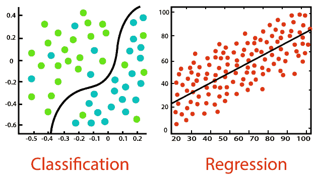

# 机器学习中的回归与分类

> 原文：<https://www.askpython.com/python/regression-vs-classification>

读者朋友们，你们好！在本文中，我们将详细讨论机器学习中的 **[回归](https://www.askpython.com/python/examples/linear-regression-from-scratch) vs [分类](https://www.askpython.com/python/examples/gradient-boosting-model-in-python)。**

所以，让我们开始吧！！🙂

* * *

## 机器学习中的回归与分类——简介

当我们想到数据科学和分析时，机器学习一直在为预测和分析数据建模方面发挥着重要作用。

机器学习为我们提供了各种算法，帮助我们在提供的训练和测试数据集上对数据进行建模。有两种机器学习算法:

1.  **监督机器学习算法:这些算法对带标签的数据进行处理，并从提供给它的历史数据中学习，在其上建立模型，然后该模型可以用于对测试数据的未来预测。**
2.  **[**无监督机器学习算法**](https://www.askpython.com/python/examples/types-of-machine-learning) :这些算法与监督学习算法不同，不从历史数据中学习。相反，他们从实时数据中识别相似的模式/特征，并将它们归为一类。**

**具体谈到监督机器学习算法，它们进一步细分为以下类型的算法:**

1.  ****回归**:这些算法作用于数字数据值。它们对因变量或目标变量是数字数据变量的数据集进行预测。因此，预测的结果也是一个数字/连续数据变量。一些最常用的回归 ML 算法有线性回归、决策树回归器、支持向量回归器等。**
2.  ****分类**:这类算法作用于分类数据值，即拥有分类数据的数据变量。它对恰好有分类因变量/目标变量的数据集进行预测。最常用的分类最大似然算法有朴素贝叶斯、逻辑回归、KNN 等。**

**理解了监督 ML 中的回归和分类之后，现在将在下一节讨论它们之间的主要区别。**

* * *

## **回归任务**

**如上所述，回归算法试图将连续的目标变量映射到数据集中的各种输入变量。它有助于我们预测围绕最佳拟合线的所需计算的连续综合得分/值。**

**当我们运行任何回归算法来评估模型时，拥有解决方案的变量是必不可少的，通过这些变量，我们可以评估连续预测数值的解决方案的可信度。**

****解决方案 01:** 差异**

**通过回归，目标数据变量与独立变量建立了联系。方差使我们能够测试目标数据变量估计的变化，以及来自分区数据集的训练数据变量的任何种类的变化。**

**通常，对于任何训练数据值，模型的理想结果应该给出相同的结果。也就是说，它应该表现出最小的方差分数。因此，对于任何回归模型/算法，我们确保方差分数尽可能低。**

****解决方案 02:** 偏差**

**用简单的语言来说，偏差表示回归算法在没有考虑所有数据的情况下适应和学习不正确数据值的可能性。对于任何具有更好结果的模型，具有低偏差分数是必不可少的。通常，当数据集中的数据有缺失值或异常值时，偏差值较高。**

**最后，当谈到回归算法时，整个场景都围绕着最佳拟合线的概念。是的，回归模型试图拟合预测和实际数据得分之间的直线。**

* * *

## **分类任务**

**如上所述，分类类型算法使我们能够轻松地处理数据值的分类类型。我们从各种类别集合(数据变量)中预测类别标签。**

**关于分类，存在各种类型的分类任务，其中一些在下面提到**

1.  ****二元分类**–在这类场景中，数据集包含的因变量有两个标签。也就是说，分类模型根据两个分类标签进行测试。例如，检查电子邮件是否是垃圾邮件的推荐系统、检查具有特定 ID 的学生是否在场的门户等等。我们可以利用逻辑回归、决策树等来解决二元分类问题。**
2.  ****多类分类**–顾名思义，多类分类算法包含具有两个以上分类标签的数据集作为因变量。与二进制分类不同，这里的标签不是二进制的，而是属于预期的标签范围。例如动物或植物物种识别、基于两个以上属性的人脸分类等。**
3.  ****不平衡分类**–在这种类型的分类中，属于每个类别或类标签的实例数量分布不均。例如，考虑一个医疗诊断数据集，其中包含被诊断患有疟疾的人和未受其影响的人的数据。在这种情况下，考虑 80%以上的训练数据包含表明人们患有疟疾的元素。这种情况或分类问题称为不平衡分类问题。在这里，标签的类型之间存在着不平等的差异。我们可以利用 SMOTE 或随机过采样来解决这类问题。**

* * *

## **区别 1:结果值的行为**

****

**一旦我们完成了预测，对于回归类型的数据，预测结果在本质上是连续的。也就是说，预测的数据值本质上是数值。**

**另一方面，在预测之后，分类算法的结果类型本质上是分类的。它们导致一些组或类别。**

* * *

## **区别 2:模型的评估(误差估计)**

**预测之后，我们有必要应用某些指标来检查模型的准确性。**

**同样，在回归算法中，我们利用 MAPE、R-square 等来度量模型的误差估计。另一方面，对于分类算法，我们主要利用召回率、混淆矩阵、F-1 评分等来评估模型的准确性。**

* * *

## **区别 3:预测方法**

**对于针对历史数据的数据值预测，回归算法利用最佳拟合线来估计和预测数据集的最接近的连续数据值。**

**分类算法使用判定边界来检测由具有相似特征的点的组合形成的聚类的边界。这有助于识别不同类别的输入数据。**

* * *

## **结论**

**到此，我们就结束了这个话题。如果你遇到任何问题，欢迎在下面评论。**

**更多与 Python 编程相关的帖子，请继续关注我们。**

**在那之前，学习愉快！！🙂**