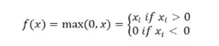

# Python ReLu 函数–您需要知道的一切！

> 原文：<https://www.askpython.com/python/examples/relu-function>

读者朋友们，你们好！在本文中，我们将详细关注 **Python ReLu 函数**。所以，让我们开始吧！！🙂

***也读作:[用 Python 构建神经网络](https://www.askpython.com/python/examples/neural-networks)***

* * *

## ReLu 函数是什么？—简明概述

Python 在临时构建基于卷积图像的学习模型以及机器学习模型方面发挥了重要作用。这些深度学习模型受益匪浅，就像通过 Python 提供的内置模块和功能，构建它们的过程变得很容易。

为了提高深度学习模型的计算效率，Python 为我们引入了 ReLu 函数，也称为修正线性激活函数。

ReLu 函数使我们能够检测和呈现模型结果的状态，并且模型的计算效率也随之提高。

ReLu 激活函数声明，**如果输入为负，返回 0。否则，返回 1** 。



**ReLu function**

了解了 ReLu 函数之后，现在让我们使用 Python 来实现它。

* * *

## Python 中 ReLu 函数的基本实现

首先，我们将创建一个定制的 ReLu 函数，如下所示。

**举例**:

这里，我们创建了一个定制的用户定义函数，它将利用 [max()函数](https://www.askpython.com/python/built-in-methods/python-max-method)，并将传递的元素与 0.0 进行比较，从而得出它是正还是负的结论。

因为 val 是正数，所以它返回 1.0。变量 val1 是一个负数，因此它返回 0.0

```py
def ReLu(val):
    return max(0.0,val)
val = 1.0
print(ReLu(val))
val1 = -1.0
print(ReLu(val1))

```

**输出**:

```py
1.0
0.0

```

* * *

## ReLu 函数的梯度值

在用于挖掘和处理的数据处理中，当我们试图计算 ReLu 函数的导数时，对于小于零的值，即负值，发现梯度为 0。这意味着学习函数的权重和偏差没有相应地更新。这可能会给模型的训练带来问题。

为了克服 ReLu 函数的这个限制，我们将讨论泄漏 ReLu 函数。

* * *

## 泄漏 ReLu 函数

如上所述，为了克服通过 ReLu 函数的负值的梯度问题， [Leaky ReLu](https://www.askpython.com/python-modules/training-gan-in-pytorch) 函数基本上将常数的微小线性分量添加到负输入分数。

```py
f(num)= 0.001num, num<0
    = num,   num>=0

```

如上所述，在我们的例子中，我们将负数乘以常数(0.001)。

现在，当我们查看上述泄漏 ReLu 函数的梯度时，负数的梯度分数现在将显示为非零，这表明学习函数的权重现在被正确更新。

**举例**:

```py
def ReLu(a):
  if a>0 :
    return a
  else :
    return 0.001*a

a = -1.0
print(ReLu(a))  

```

**输出**:

```py
-0.001

```

* * *

## 结论

到此，我们就结束了这个话题。如果你遇到任何问题，欢迎在下面评论。

更多与 Python 编程相关的帖子，请继续关注我们。

在那之前，学习愉快！！🙂