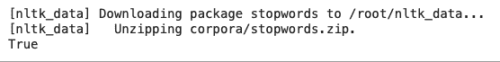

# 如何使用 NLTK 去除 Python 中的停用词？

> 原文：<https://www.askpython.com/python/examples/remove-stop-words-nltk>

在本教程中，我们将学习如何在 Python 中删除一段文本中的停用词。在使用机器学习模型之前，从文本中删除停用词属于数据预处理。

## 什么是停用词？

停用词是自然语言中没有什么意义的词。这些是像' **is '，' the '，' and 之类的词。**

当从文本中提取信息时，这些词并不提供任何有意义的东西。因此，在使用文本训练机器学习模型之前，从文本中删除停用词是一个好的做法。

移除停用字词的另一个优点是，它减少了数据集的大小和训练模型所需的时间。

删除停用词的做法在搜索引擎中也很常见。像谷歌这样的搜索引擎从搜索查询中删除停用词，以获得更快的响应。

在本教程中，我们将使用 **NLTK 模块**来删除停用词。

NLTK 模块是自然语言处理中最受欢迎的模块。

首先，我们将从 NLTK 模块下载带有停用词的语料库。

## 从 NLTK 下载带有停用词的语料库

要下载语料库，请使用:

```py
import nltk
nltk.download('stopwords')

```

输出:



Download

现在我们可以开始使用语料库了。

## 打印语料库中的停用词列表

让我们打印出语料库中的停用词列表。为此，请使用:

```py
from nltk.corpus import stopwords
print(stopwords.words('english'))

```

输出:

```py
['i', 'me', 'my', 'myself', 'we', 'our', 'ours', 'ourselves', 'you', "you're", "you've", "you'll", "you'd", 'your', 'yours', 'yourself', 'yourselves', 'he', 'him', 'his', 'himself', 'she', "she's", 'her', 'hers', 'herself', 'it', "it's", 'its', 'itself', 'they', 'them', 'their', 'theirs', 'themselves', 'what', 'which', 'who', 'whom', 'this', 'that', "that'll", 'these', 'those', 'am', 'is', 'are', 'was', 'were', 'be', 'been', 'being', 'have', 'has', 'had', 'having', 'do', 'does', 'did', 'doing', 'a', 'an', 'the', 'and', 'but', 'if', 'or', 'because', 'as', 'until', 'while', 'of', 'at', 'by', 'for', 'with', 'about', 'against', 'between', 'into', 'through', 'during', 'before', 'after', 'above', 'below', 'to', 'from', 'up', 'down', 'in', 'out', 'on', 'off', 'over', 'under', 'again', 'further', 'then', 'once', 'here', 'there', 'when', 'where', 'why', 'how', 'all', 'any', 'both', 'each', 'few', 'more', 'most', 'other', 'some', 'such', 'no', 'nor', 'not', 'only', 'own', 'same', 'so', 'than', 'too', 'very', 's', 't', 'can', 'will', 'just', 'don', "don't", 'should', "should've", 'now', 'd', 'll', 'm', 'o', 're', 've', 'y', 'ain', 'aren', "aren't", 'couldn', "couldn't", 'didn', "didn't", 'doesn', "doesn't", 'hadn', "hadn't", 'hasn', "hasn't", 'haven', "haven't", 'isn', "isn't", 'ma', 'mightn', "mightn't", 'mustn', "mustn't", 'needn', "needn't", 'shan', "shan't", 'shouldn', "shouldn't", 'wasn', "wasn't", 'weren', "weren't", 'won', "won't", 'wouldn', "wouldn't"]

```

这是英语的停用词列表。也有其他语言可用。

要打印可用语言列表，请使用:

```py
from nltk.corpus import stopwords
print(stopwords.fileids())

```

输出:

```py
['arabic', 'azerbaijani', 'danish', 'dutch', 'english', 'finnish', 'french', 'german', 'greek', 'hungarian', 'indonesian', 'italian', 'kazakh', 'nepali', 'norwegian', 'portuguese', 'romanian', 'russian', 'slovene', 'spanish', 'swedish', 'tajik', 'turkish']

```

这些语言的停用词在 NLTK ' *停用词*语料库中可用。

## 如何在语料库中添加自己的停用词？

要将您自己的停用字词添加到列表中，请使用:

```py
new_stopwords = stopwords.words('english')
new_stopwords.append('SampleWord')

```

现在你可以使用' *new_stopwords* 作为新的语料库。让我们学习如何使用这个语料库从句子中删除停用词。

## 如何删除文本中的停用词？

在这一节中，我们将学习如何从一段文本中删除停用词。在我们继续之前，您应该阅读这篇关于[标记化的教程。](https://www.askpython.com/python-modules/tokenization-in-python-using-nltk)

标记化是将一段文本分解成称为标记的更小单元的过程。这些令牌构成了 NLP 的构造块。

我们将使用标记化将一个句子转换成一个单词列表。然后我们将从那个 [Python 列表](https://www.askpython.com/python/list/python-list)中移除停用词。

```py
nltk.download('punkt')
from nltk.tokenize import word_tokenize
text = "This is a sentence in English that contains the SampleWord"
text_tokens = word_tokenize(text)

remove_sw = [word for word in text_tokens if not word in stopwords.words()]

print(remove_sw)

```

输出:

```py
['This', 'sentence', 'English', 'contains', 'SampleWord']

```

您可以看到输出包含' *SampleWord* '，这是因为我们使用了默认语料库来删除停用词。让我们使用我们创建的语料库。同样，我们将使用[列表理解](https://www.askpython.com/python/list/python-list-comprehension)。

```py
nltk.download('punkt')
from nltk.tokenize import word_tokenize
text = "This is a sentence in English that contains the SampleWord"
text_tokens = word_tokenize(text)

remove_sw = [word for word in text_tokens if not word in new_stopwords]

print(remove_sw)

```

输出:

```py
['This', 'sentence', 'English', 'contains']

```

## 结论

本教程是关于在 python 中从文本中删除停用词的。我们使用 NLTK 模块从文本中删除停用词。我们希望你和我们一起学习愉快！