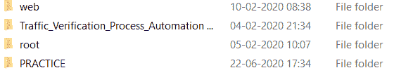

# 如何在 Python 中重命名文件/目录？

> 原文：<https://www.askpython.com/python/examples/rename-a-file-directory-python>

你好，希望你过得好！在本文中，我们将**用 Python** 重命名文件或目录。

* * *

## 使用操作系统模块在 Python 中重命名文件/目录

[Python 操作系统模块](https://www.askpython.com/python-modules/python-os-module-10-must-know-functions)提供各种功能来处理特定设备的底层操作系统并与之交互。

Python `os.rename() function`使我们能够直接从命令提示符或 IDE 中重命名文件或目录。函数的作用是:将源/输入/当前目录或文件的名称改为一个指定的/用户定义的名称。

因此，通过 Python os 模块，可以执行所有系统级交互。

现在，让我们来看看 Python os.rename()函数的语法。

* * *

### Python os.rename()函数的语法

看看下面的语法:

```py
import os
os.rename(source,destination)

```

为了使用 rename()函数，我们需要导入 Python os 模块。

此外，需要向 rename()函数提供以下参数:

*   `source`:文件或目录的当前名称。
*   `destination`:替换当前文件/目录名称的名称。

os.rename()函数**不返回**任何值。它只重命名指定的文件/目录。

理解了 rename()函数的工作原理和语法之后，现在让我们通过下一节中的例子来实现它。

* * *

### 通过实例实现 Python os.rename()函数

让我们尝试使用 os.rename 函数对目录进行重命名

**举例:**

```py
import os
os.chdir(r"C:/Users/HP/OneDrive/Desktop/")

os.rename("Programming","PRACTICE")

print("The Directory has been successfully renamed!")

```

`os.chdir() function`用于改变当前工作目录。

**输出:**

```py
The Directory has been successfully renamed!

```

**更新名称后的目录**:



**Directory Renamed As PRACTICE**

这里，我们使用 rename()函数将目录“Programming”重命名为“PRACTICE”。

现在，让我们尝试使用 Python os.rename()函数对文件进行重命名。

**举例:**

```py
import os

os.rename("C:/Users/HP/OneDrive/Desktop/New.txt","C:/Users/HP/OneDrive/Desktop/ss.txt")

print("The File has been successfully renamed!")

```

**输出:**

```py
The File has been successfully renamed!

```

**更新名称后的文件—**


**Python Rename File**

这里，我们使用 rename()函数将一个文件更新/重命名为 **ss.txt** 。

* * *

## 结论

到此，我们就结束了这个话题。如果你有任何疑问，请随时在下面评论。

更多关于 Python 的文章，请访问 [【电子邮件保护】](https://www.askpython.com/) 。

* * *

## 参考

*   Python 重命名目录— JournalDev