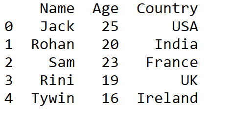
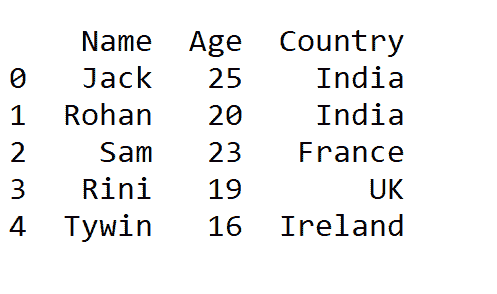
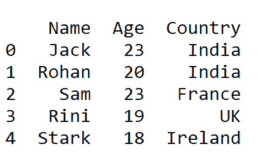

# 使用熊猫替换数据集中的多个值

> 原文：<https://www.askpython.com/python-modules/pandas/replace-multiple-values-dataframe>

在本教程中，我们将了解如何使用 pandas replace()方法更改数据集中的多个值。Pandas 是一个用于数据操作和分析的 python 库，它提供了广泛的特性以使数据集可用。

## 替换数据集中的多个值

按照下面的分步教程，使用 pandas 库替换数据集中的多个值。

### 1.进口熊猫

从在代码中导入熊猫开始。

```py
import pandas as pd

```

### 2.抽样资料

我们将使用下面的数据集作为示例，并在 Pandas 数据帧中实现它，其中“列”表示数据集的列标题，如数据帧中所定义的。

```py
import pandas as pd
data = pd.DataFrame([
    ['Jack',25,'USA'],
    ['Rohan',20,'India'],
    ['Sam',23,'France'],
    ['Rini',19,'UK'],
    ['Tywin',16,'Ireland']],

columns=['Name','Age', 'Country'])

```

当程序执行时，使用 print 方法打印数据帧，上述代码会产生以下输出——包含 3 列“姓名”、“年龄”、“国家”。

```py
print (data)

```



Sample Data To Replace Multiple Values

### 3.使用 replace()方法替换值

在 pandas 中使用 replace()方法将一个指定值替换为另一个指定值。在我们创建的样本数据集中，我们希望将****【国家】**列中的**美国改为印度**:**

```py
new_data = data.replace({'Country':{'USA':'India'}})

print (new_data) 
```

**

Replacing Single Value In Dataframe** 

**现在，如果我们尝试在一个数据帧中一次替换多个值，例如 25 到 23，年龄列中的 16 到 18，以及姓名列中的“Tywin”到“Stark ”,代码看起来会是这样的:**

```py
updated_data = new_data.replace({'Age': {25:23, 16:18}, 'Name':{'Tywin':'Stark'}})

print(updated_data) 
```

****改变期望值后的最终输出:****

**

Replacing Multiple Value In Dataframe** 

## **替换数据帧中多个值的完整代码**

**尝试下面的代码，看看 Python 中的 replace()方法是如何工作的。**

```py
import pandas as pd
data = pd.DataFrame([
    ['Jack',25,'USA'],
    ['Rohan',20,'India'],
    ['Sam',23,'France'],
    ['Rini',19,'UK'],
    ['Tywin',16,'Ireland']],

columns=['Name','Age', 'Country'])
print (data)

print('\n')

new_data = data.replace({'Country':{'USA':'India'}})

print (new_data)

updated_data = new_data.replace({'Age': {25:23, 16:18}, 'Name':{'Tywin':'Stark'}})

print('\n')
print(updated_data) 
```

## **结论**

**就是这样！对于本教程。希望你已经很好地学习了如何用 Python 替换熊猫数据帧中的多个值。请继续关注 AskPython 以获得更多这样的教程。**