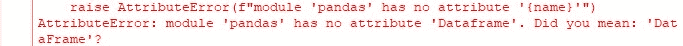
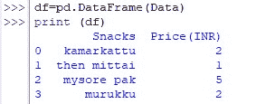
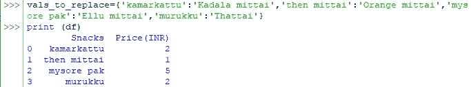
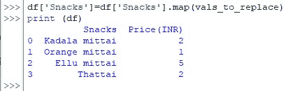

# 如何用熊猫替换多个值？

> 原文：<https://www.askpython.com/python-modules/pandas/replace-multiple-values-pandas>

当一个人可以使用 Python 分析数据时，它是否可以灵活地处理用于分析的输入数据？这就是本文要探讨的问题。我们将构建数据，并演示如何利用 Pandas 库的功能替换其中的多个值。

## 设置 Pandas 数据框架以替换多个值

让我们首先通过输入以下命令将 [Pandas 库](https://www.askpython.com/python-modules/pandas/python-pandas-module-tutorial)导入到活动的 Python 窗口中，

```py
import pandas as pd

```

现在让我们使用索引选项创建一个数据框。索引的作用是在创建数据时为每列数据提供一个标题。在这个例子中，我们将列出一些小吃的名称以及它们相应的价格。为此，需要构建以下代码。

```py
Data={'Snacks':('kamarkattu','then mittai','mysore pak','murukku'),'Price(INR)':[2,1,5,2]}

```

请记住，在上面的代码中使用花括号{}作为主括号，因为只有这样才能让 Python 明白我们是在提供数据集进行分析。

```py
df=pd.DataFrame(Data)

```

需要注意的是，在上面的代码中键入 DataFrame 时,“D”和“F”应该保持大写，否则可能会出现以下错误。



Data Frame Error

完成后，使用 print()命令查看输入的数据，如下所示。

```py
print (df)

```



Viewing The Dataset

## 替换熊猫数据帧中的多个值

现在让我们假设一个人似乎不喜欢上面列出的零食&想要在相同的价格范围内购买一些替代品来代替它们。这可以通过使用 vals_to_replace 函数来完成，其语法如下所示。

```py
vals_to_replace = {‘old value_1’:’new value_1’, ‘old value_2’:’new value_2’, ……..}

```

一旦输入了代码，再次点击 ENTER &查看通过 print()命令输入的数据，看看修改是如何完成的。



Values Not Replaced, but why?

通过要求 Python 用代码中给出的新值替换前面列出的每个值，已经完成了值替换&下一行中出现三个箭头的事实也告诉我们，在使用 print()命令查看数据之前没有错误。

***但是，没有做的是，被替代的值从来没有映射到数据帧上！使用下面的语法可以很好地做到这一点，***

```py
df[‘column header’]=df[‘column header’].map(vals_to_replace)

```

其中，列标题–索引期间给定的列的名称

将上述语法应用于所使用的数据集，很明显，要替换条目的列是“小吃”列。因此，相同的内容将被更新以构建如下所示的代码。

```py
df['Snacks']=df['Snacks'].map(vals_to_replace)

```

现在，点击 ENTER 键，使用 print()命令查看替换的值，如下图所示。



Multiple Values Replaced

* * *

## 摘要

既然我们已经到了本文的结尾，希望它已经详细阐述了如何在 Python 中使用 Pandas 替换多个值。这里有另一篇文章详细介绍了熊猫中 read_csv()中分隔符的[用法。在](https://www.askpython.com/python/read_csv-delimiters-using-pandas) [AskPython](https://www.askpython.com/) 中还有许多其他有趣的&文章，这些文章可能对那些想提高 Python 水平的人有很大帮助。*欢呼*！