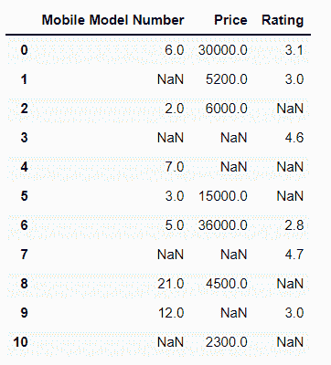
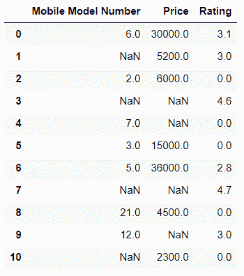
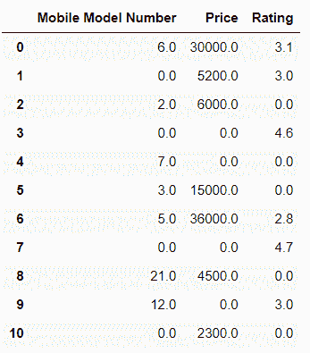
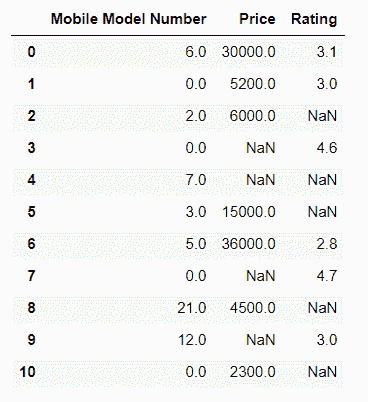
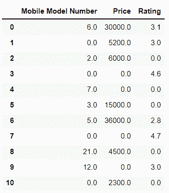

# 如何用 0 替换熊猫数据帧中的 NaN 值？

> 原文：<https://www.askpython.com/python-modules/pandas/replace-nan-values-with-zero>

在 Python 中，NaN 的意思是**而不是数字**。这表示具有 NaN 值的条目要么未定义，要么在数据集中缺失。它是浮点值，不能转换为任何其他数据类型。

NaN 值是不可取的，尤其是在机器学习模型中，因为它们可能导致训练不准确的模型。这些值可以由计算项代替，如平均值、中值或基于数据集的任何其他合适的值。

***也读:[如何用空字符串替换熊猫中的 NAN 值？](https://www.askpython.com/python-modules/pandas/replace-nan-values-with-empty-string)***

本教程将着眼于我们如何在 [Pandas 数据帧](https://www.askpython.com/python/pandas-dataframe-vs-numpy-arrays)中用 0 替换 NaN 值。让我们首先创建一个数据框。

* * *

## 创建熊猫数据框架

```py
import pandas as pd 
import numpy as np

data = {
    'Mobile Model Number': [6, np.nan, 2, np.nan, 7, 3, 5,
                            np.nan, 21, 12, np.nan],
    'Price': [30000, 5200, 6000, np.nan, np.nan, 15000, 36000,
              np.nan, 4500, np.nan, 2300], 
    'Rating': [3.1, 3.0, np.nan, 4.6, np.nan, np.nan, 2.8, 4.7, 
               np.nan, 3.0, np.nan]
}

df = pd.DataFrame(data)

df

```



Data Frame

上面是一个由 3 列组成的数据框:**手机型号**、**价格**和**评级**。到目前为止，所有这些列都包含一些 NaN 值。

* * *

## Python 函数替换 NaN 值

Python 中主要有两个函数可以用来替换 NaN 值:
1。`replace()`
2。`fillna()`

关于 **replace()** 函数可以参考[这篇](https://www.askpython.com/python/string/python-replace-function)了解更多，关于 **fillna()** 函数可以参考[这篇](https://www.askpython.com/python/pandas-fillna-method)文章了解更多。

* * *

## 用 0 替换 NaN 值的示例

让我们从几个替换 NaN 值的例子开始，并理解这在代码中是如何工作的。

### 使用 replace()函数:

#### a.使用 replace()将单个列中的 NaN 值替换为 0

```py
data = {
    'Mobile Model Number': [6, np.nan, 2, np.nan, 7, 3, 5,
                            np.nan, 21, 12, np.nan],
    'Price': [30000, 5200, 6000, np.nan, np.nan, 15000, 36000,
              np.nan, 4500, np.nan, 2300], 
    'Rating': [3.1, 3.0, np.nan, 4.6, np.nan, np.nan, 2.8, 4.7, 
               np.nan, 3.0, np.nan]
}

# applying the replace method on a single column
df['Rating'] = df['Rating'].replace(np.nan, 0)

df

```



replace(): Replace NaN in a Single Column With 0

在上面的代码中，我们应用了`replace()`函数，将 dataframe 的“Rating”列中的 NaN 值替换为 0。因此，该列现在用 0 代替了以前的 NaN 值。

#### b.使用 replace()将整个数据框中的 NaN 值替换为 0

```py
data = {
    'Mobile Model Number': [6, np.nan, 2, np.nan, 7, 3, 5,
                            np.nan, 21, 12, np.nan],
    'Price': [30000, 5200, 6000, np.nan, np.nan, 15000, 36000,
              np.nan, 4500, np.nan, 2300], 
    'Rating': [3.1, 3.0, np.nan, 4.6, np.nan, np.nan, 2.8, 4.7, 
               np.nan, 3.0, np.nan]
}

# applying the replace method on the entire dataframe
df = df.replace(np.nan, 0)

df

```



replace(): Replace NaN In the Entire Dataframe With 0

在这种情况下，我们将整个数据帧中的所有 NaN 值一次全部替换为 0。

* * *

### 使用 fillna()函数:

这个例子将使用我们之前探索过的 [fillna()函数](https://www.askpython.com/python/pandas-fillna-method)。

#### a.使用 fillna()将单个列中的 NaN 值替换为 0

```py
data = {
    'Mobile Model Number': [6, np.nan, 2, np.nan, 7, 3, 5,
                            np.nan, 21, 12, np.nan],
    'Price': [30000, 5200, 6000, np.nan, np.nan, 15000, 36000,
              np.nan, 4500, np.nan, 2300], 
    'Rating': [3.1, 3.0, np.nan, 4.6, np.nan, np.nan, 2.8, 4.7, 
               np.nan, 3.0, np.nan]
}

# applying the fillna method on a single column
df['Mobile Model Number'] = df['Mobile Model Number'].fillna(0)

df

```



fillna(): Replace NaN in a Single Column With 0

这里，我们将“评级”列中的所有 NaN 值替换为 0。

#### b.使用 fillna()将整个数据帧中的 NaN 值替换为 0

```py
data = {
    'Mobile Model Number': [6, np.nan, 2, np.nan, 7, 3, 5,
                            np.nan, 21, 12, np.nan],
    'Price': [30000, 5200, 6000, np.nan, np.nan, 15000, 36000,
              np.nan, 4500, np.nan, 2300], 
    'Rating': [3.1, 3.0, np.nan, 4.6, np.nan, np.nan, 2.8, 4.7, 
               np.nan, 3.0, np.nan]
}
# applying the fillna method on the entire dataframe
df.fillna(0)

df

```



fillna(): Replace NaN in the Entire Dataframe With 0

在这种情况下，我们使用`fillna()`函数将数据帧中的所有 NaN 值一次全部替换为 0。

* * *

## 摘要

因此，我们已经看到了如何在数据帧中用 0 替换 NaN 值。要了解更多关于熊猫和其他 Python 相关概念的信息，也请查看我们的其他博客！

* * *

## 参考

*   replace() [正式文档](https://pandas.pydata.org/docs/reference/api/pandas.DataFrame.replace.html)
*   fillna() [官方文档](https://pandas.pydata.org/docs/reference/api/pandas.DataFrame.fillna.html)