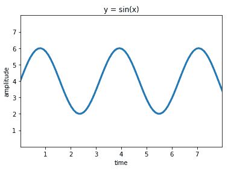
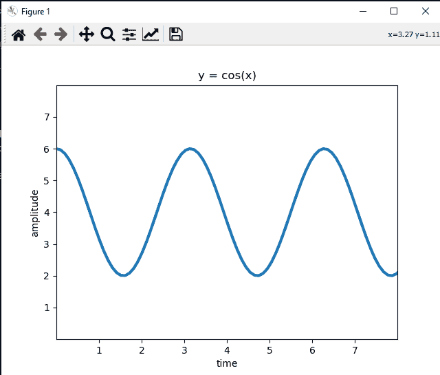
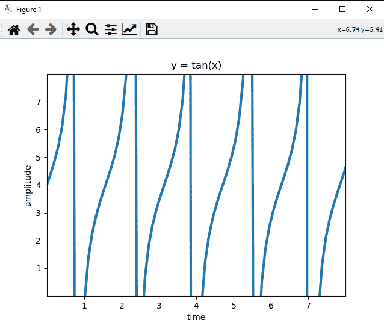
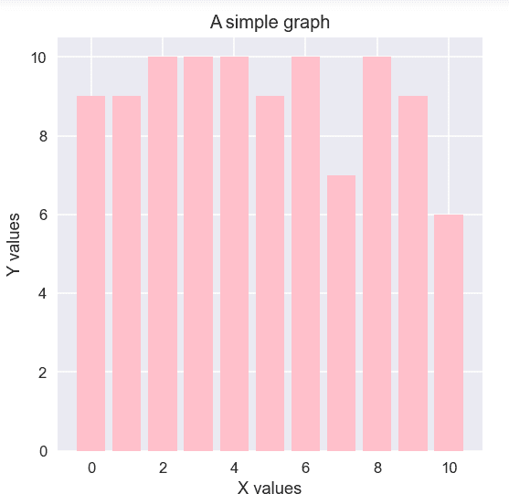
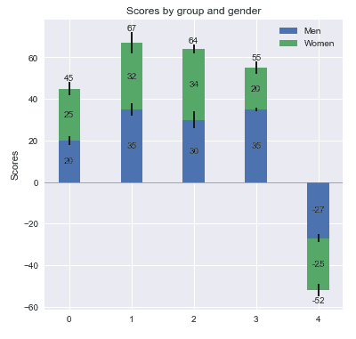
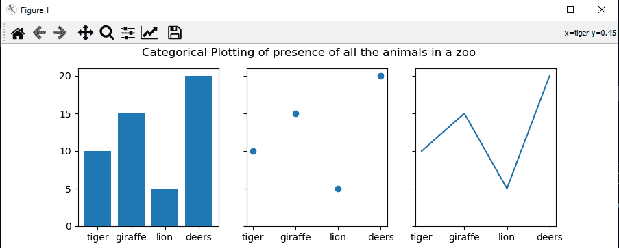

# 使用 figsize 调整 Matplotlib 中的情节和支线情节的大小

> 原文：<https://www.askpython.com/python-modules/matplotlib/resize-plots-and-subplots>

今天在这篇文章中，我们将学习使用 [Matplotlib](https://www.askpython.com/python-modules/matplotlib/python-matplotlib) 调整剧情和支线剧情的大小。我们都知道对于**数据可视化**的目的，Python 是最好的选择。它有一组可以在几乎所有系统上运行的模块。所以，在这个小教程中，我们的任务是温习这方面的知识。我们开始吧！

## 绘图基础

绘图基本上意味着为给定的数据框形成各种图形可视化。里面有各种类型:

1.  条形图:相对于 x-y 坐标上的某个实体，每个数据项的 2D 表示。
2.  散点图:代表 x-y 轴上的数据点的小点的绘图。
3.  柱状图
4.  饼图等

数据科学和计算任务中还使用了各种其他技术。

要了解更多关于绘图的信息，请查看 Matplotlib 中关于[绘图的教程。](https://www.askpython.com/python-modules/matplotlib/matplotlib-plotting-tips)

## 什么是支线剧情？

子绘图是一种数据可视化的分布式技术，其中在一个图中包含几个图。这使得我们的展示更加美观，并且易于理解各种数据点以及不同实体的分布。

阅读 Matplotlib 中关于[支线剧情的更多内容。](https://www.askpython.com/python-modules/matplotlib/matplotlib-subplots)

## 用于绘图的 Python 设置

1.  编程环境:Python 3.8.5
2.  IDE: Jupyter 笔记型电脑
3.  库/包:Matplotlib，Numpy

## 在 Matplotlib 中创建要调整大小的地块

让我们跳转到创建几个地块，我们可以稍后调整大小。

**代码:**

```py
from matplotlib import pyplot as plt
import numpy as np

x = np.linspace(0, 10, 100)
y = 4 + 2*np.sin(2*x)

fig, axs = plt.subplots()
plt.xlabel("time")
plt.ylabel("amplitude")
plt.title("y = sin(x)")
axs.plot(x, y, linewidth = 3.0)
axs.set(xlim=(0, 8), xticks=np.arange(1, 8),
       ylim=(0, 8), yticks=np.arange(1, 8))

plt.show()

```

**输出:**



Sine Wave Plot

这只是一个简单的正弦波图，显示了时间线性增加时的幅度变化。现在，我们将看到使事情变得更简单的**支线剧情**。

为了练习，我留下 cos(x)和 tan(x)的代码。看看代码是否有效。

**cos(x)的代码:**

```py
from matplotlib import pyplot as plt
import numpy as np

x = np.linspace(0, 10, 100)
y = 4 + 2*np.cos(2*x)

fig, axs = plt.subplots()
plt.xlabel("time")
plt.ylabel("amplitude")
plt.title("y = cos(x)")
axs.plot(x, y, linewidth = 3.0)
axs.set(xlim=(0, 8), xticks=np.arange(1, 8),
       ylim=(0, 8), yticks=np.arange(1, 8))

plt.show()

```

**输出:**



Plot for cos(x)

**tan(x)的代码:**

```py
from matplotlib import pyplot as plt
import numpy as np

x = np.linspace(0, 10, 100)
y = 4 + 2*np.tan(2*x)

fig, axs = plt.subplots()
plt.xlabel("time")
plt.ylabel("amplitude")
plt.title("y = tan(x)")
axs.plot(x, y, linewidth = 3.0)
axs.set(xlim=(0, 8), xticks=np.arange(1, 8),
            ylim=(0, 8), yticks=np.arange(1, 8))

plt.show()

```

**输出:**



Plot for tan(x)

Matplotlib 中的图形具有预定义的大小布局。所以，当我们需要改变它们的尺寸时，那么 **plot** 类有一个 **figure** 函数。该功能负责使视图与屏幕更加相关。用户完全有权编辑图的尺寸。我们将通过一个例子来理解这一点:

**代码:**

```py
import random
from matplotlib import pyplot as plt

plt.figure(figsize = (5, 5))
x = []
y = []
plt.xlabel("X values")
plt.ylabel("Y values")
plt.title("A simple graph")
N = 50
for i in range(N):
    x.append(random.randint(0, 10))
    y.append(random.randint(0, 10))

plt.bar(x, y, color = "pink")
plt.show()

```

**输出:**



A Simple Bar Plot

**说明:**

1.  在这段代码中，前两行代码导入 pyplot 和 random 库。
2.  在第二行代码中，我们使用了 figure()函数。在这种情况下，figsize 参数接受绘图布局的高度和宽度的元组。
3.  这有助于我们决定自己的身高。
4.  random 函数在两个列表 x，y 的每一个中插入范围从 1 到 10 的随机值。
5.  然后调用 bar()函数来创建条形图。

## 在 Matplotlib 中调整绘图大小

这个库是用来在单轴或多轴上创建支线剧情的。我们可以在上面实现各种条形图。它有助于创建统计数据显示的通用布局。

### 使用 figsize

**代码示例:**

```py
from matplotlib import pyplot as plt
import numpy as np

N = 5
menMeans = (20, 35, 30, 35, -27)
womenMeans = (25, 32, 34, 20, -25)
menStd = (2, 3, 4, 1, 2)
womenStd = (3, 5, 2, 3, 3)
ind = np.arange(N)    # the x locations for the groups
width = 0.35       # the width of the bars: can also be len(x) sequence

fig, ax = plt.subplots(figsize = (6, 6))

p1 = ax.bar(ind, menMeans, width, yerr=menStd, label='Men')
p2 = ax.bar(ind, womenMeans, width,
            bottom=menMeans, yerr=womenStd, label='Women')

ax.axhline(0, color='grey', linewidth=0.8)
ax.set_ylabel('Scores')
ax.set_title('Scores by group and gender')
ax.legend()

# Label with label_type 'center' instead of the default 'edge'
ax.bar_label(p1, label_type='center')
ax.bar_label(p2, label_type='center')
ax.bar_label(p2)

plt.show()

```

**输出:**



A bar subplot

**说明:**

1.  前两行是模块的导入语句。
2.  然后我们为男性和女性分布值定义两个元组。
3.  划分图表的标准划分是男性和女性。
4.  那么每个条的宽度被设置为 0.35。
5.  我们创建 plt.subplot()函数的两个对象 **fig 和 ax** 。
6.  该函数有一个参数 **figsize** 。它采用两个元素的元组来描述显示图像的分辨率**(宽度，高度)**。
7.  然后我们分配两个变量 p1 和 p2，并使用 **ax** 实例调用 bar()方法。
8.  最后，只需将标签分配到 x-y 轴，最后绘制它们。

### 使用支线剧情的分类绘图

使用 matplotlib 的子图也可以绘制分类数据——带标签的信息。我们可以使用这里的 **`figsize`** 参数将地块分成许多部分。

**举例:**

```py
from matplotlib import pyplot as plt

data = {'tiger': 10, 'giraffe': 15, 'lion': 5, 'deers': 20}
names = list(data.keys())
values = list(data.values())

fig, axs = plt.subplots(1, 3, figsize=(9, 3), sharey=True)
axs[0].bar(names, values)
axs[1].scatter(names, values)
axs[2].plot(names, values)
fig.suptitle('Categorical Plotting of presence of all the animals in a zoo')

```

**输出:**



Subplots of various types

**说明:**

1.  首先，我们创建一个包含所有键值对的字典。
2.  然后我们创建一个所有键的列表和一个单独的所有值的列表。
3.  之后，创建 subplots()类的一个简单实例。
4.  为了编写必要的参数，我们首先给出 1 来声明行数。3 .申报列数。因此，在一列中有三个图
5.  **在这里，figsize 等于(9，3)。**
6.  然后我们把每个图放在坐标轴上。使用列表功能，
    1.  ax[0] =条形图
    2.  ax[1] =散点图
    3.  ax[2] =一个简单的线图
7.  这些显示了动物园中所有动物的存在。

## 结论

所以，在这里我们学习了如何使用支线剧情让事情变得简单。使用 **figsize** 参数可以节省数据可视化的空间和时间。所以，希望这有帮助。更多关于这个话题。在那之前继续编码。