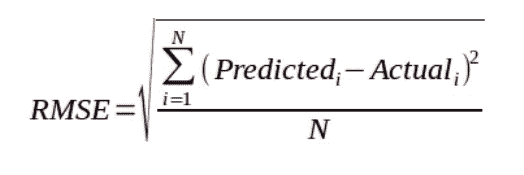

# RMSE——Python 中的均方根误差

> 原文：<https://www.askpython.com/python/examples/rmse-root-mean-square-error>

读者们好。在本文中，我们将重点关注如何在 Python 中实现 RMSE–**均方根误差**。所以，让我们开始吧！！

* * *

## Python 中的均方根误差(RMSE)是什么？

在深入研究 RMSE 的概念之前，让我们先了解一下 Python 中的错误度量。

**误差指标**使我们能够通过各种指标跟踪效率和准确性，如下所示——

*   **均方误差(MSE)**
*   **均方根误差(RMSE)**
*   **R 平方**
*   **精度**
*   **MAPE** 等。

均方差是一种这样的误差度量，用于判断回归问题的任何机器学习算法的精度和误差率。

因此， **MSE** 是一个风险函数，它帮助我们确定某个特性或变量的预测值和实际值之间的**均方差。**

RMSE 是**均方根误差**的首字母缩写，是从均方误差函数获得的值的**平方根。**

使用 RMSE，我们可以很容易地绘制出模型参数的估计值和实际值之间的差异。

由此，我们可以清楚地判断模型的效率。

通常，小于 180 的 RMSE 分数被认为是中等或工作良好的算法的好分数。如果 RMSE 值超过 180，我们需要对模型的参数进行特征选择和超参数调整。

现在，让我们在下一节中重点关注相同内容的实现。

* * *

## NumPy 模块的均方根误差

让我们看看下面的公式——



**RMSE**

因此，如上所述，均方根误差是变量/特征的估计值和实际值之间的平均平方差的平方根。

在下面的例子中，我们使用下面提到的 [NumPy 模块](https://www.askpython.com/python-modules/numpy/python-numpy-arrays)的函数实现了 RMSE 的概念

*   使用`numpy.subtract()`功能计算估计值和实际值之间的差值。
*   进一步，使用`numpy.square()` 函数计算上述结果的平方。
*   最后，使用`numpy.mean()`函数计算平方值的平均值。输出是 MSE 分数。
*   最后，使用`math.sqrt()`函数计算 MSE 的平方根，得到 RMSE 值。

**举例:**

```py
import math
y_actual = [1,2,3,4,5]
y_predicted = [1.6,2.5,2.9,3,4.1]

MSE = np.square(np.subtract(y_actual,y_predicted)).mean() 

RMSE = math.sqrt(MSE)
print("Root Mean Square Error:\n")
print(RMSE)

```

**输出:**

```py
Root Mean Square Error:

0.6971370023173351

```

* * *

## RMSE 用 **Python scikit 学习库**

在这个例子中，我们使用来自 **sklearn.metrics** 库的`mean_square_error()`函数计算了 MSE 分数。

此外，通过 MSE 的平方根计算了 RMSE 分数，如下所示:

**举例:**

```py
from sklearn.metrics import mean_squared_error
import math
y_actual = [1,2,3,4,5]
y_predicted = [1.6,2.5,2.9,3,4.1]

MSE = mean_squared_error(y_actual, y_predicted)

RMSE = math.sqrt(MSE)
print("Root Mean Square Error:\n")
print(RMSE)

```

**输出:**

```py
Root Mean Square Error:

0.6971370023173351

```

* * *

## 结论

到此，我们就结束了这个话题。如果你遇到任何问题，欢迎在下面评论。

更多与 Python 相关的帖子，敬请关注，在此之前，祝你学习愉快！！🙂